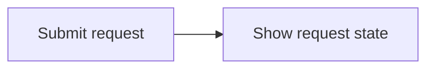

# TCW Request Lifecycle Flow

## Interaction Coverage

- [TCW-001-submit_request](../TCW-001-manage-test-requests/TCW-001-submit_request.md)
- [TCW-001-show_request_state](../TCW-001-manage-test-requests/TCW-001-show_request_state.md)

## Flow Overview

