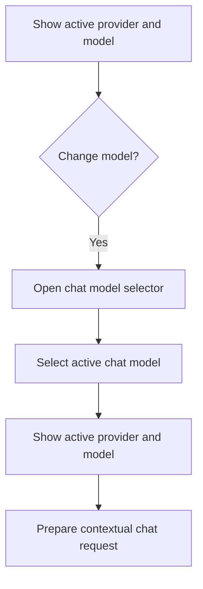

# CBW Chat Model Selection Flow

## Intent

`CBW-004`를 중심으로 Chat Field 내부의 model dropdown에서 현재 대화의 `active_model`을 확인하고, model catalog selector를 통해 다음 request부터 적용될 model selection을 바꾸는 흐름을 정리한다.

이 문서는 Chat Field 내부의 model dropdown을 중심으로 한 model selection journey를 다루며, Chat Field에는 선택된 model 이름만 표시한다. provider는 독립 selector 대상이 아니라 model catalog row를 구분하는 정보로만 취급한다. dropdown 단계에서는 runtime 실행 가능성을 확정하지 않고, 실제 request 실행 lifecycle은 [contextual_chat_request_flow](contextual_chat_request_flow.md)에서 다룬다.

## Contract References

- [model_selection_contract.toml](../contracts/model_selection_contract.toml)

## Interaction Coverage

- [CBW-004-show_active_chat_provider_and_model](../CBW-004-manage-active-chat-provider-model/CBW-004-show_active_chat_provider_and_model.md)
- [CBW-004-open_chat_model_selector](../CBW-004-manage-active-chat-provider-model/CBW-004-open_chat_model_selector.md)
- [CBW-004-select_active_chat_model](../CBW-004-manage-active-chat-provider-model/CBW-004-select_active_chat_model.md)
- [CBW-003-prepare_contextual_chat_request](../CBW-003-resolve-contextual-chat-requests/CBW-003-prepare_contextual_chat_request.md)
- [CBW-003-show_request_resolution_failure](../CBW-003-resolve-contextual-chat-requests/CBW-003-show_request_resolution_failure.md)

## Flow Overview

## Happy Path

1. [CBW-004-show_active_chat_provider_and_model](../CBW-004-manage-active-chat-provider-model/CBW-004-show_active_chat_provider_and_model.md)
   사용자는 현재 대화의 `active_model`을 Chat Field 내부의 model dropdown에서 먼저 확인한다.
2. [CBW-004-open_chat_model_selector](../CBW-004-manage-active-chat-provider-model/CBW-004-open_chat_model_selector.md)
   사용자가 model을 바꾸려는 경우 `model_selector_open` 상태로 selector를 열고 현재 후보를 본다.
3. [CBW-004-select_active_chat_model](../CBW-004-manage-active-chat-provider-model/CBW-004-select_active_chat_model.md)
   사용자가 새 `active_model` row를 고르면 결과 상태는 `model_selected`가 된다.
4. [CBW-004-show_active_chat_provider_and_model](../CBW-004-manage-active-chat-provider-model/CBW-004-show_active_chat_provider_and_model.md)
   Chat Field 내부의 model dropdown은 새 `active_model`을 다시 표시한다.
5. [CBW-003-prepare_contextual_chat_request](../CBW-003-resolve-contextual-chat-requests/CBW-003-prepare_contextual_chat_request.md)
   다음 request의 preparation은 현재 확정된 `model_selected`를 읽어 요청 입력을 구성한다.
6. [CBW-003-generate_contextual_chat_response](../CBW-003-resolve-contextual-chat-requests/CBW-003-generate_contextual_chat_response.md)
   provider 호출이 시작되고, selected model이 실제로 수용되는지는 이 호출 단계에서 판정된다.

## Alternate Paths

### Initial Auto Selection Path

1. [CBW-004-show_active_chat_provider_and_model](../CBW-004-manage-active-chat-provider-model/CBW-004-show_active_chat_provider_and_model.md)가 현재 대화의 active model이 비어 있고 catalog에 model row가 있으면 첫 번째 row를 active model로 자동 확정한다.
2. Chat Field 내부의 model dropdown은 자동 선택된 model 이름을 표시하고 결과 상태는 `model_selected`로 읽힌다.

### Restored Value Fallback Path

1. [CBW-004-show_active_chat_provider_and_model](../CBW-004-manage-active-chat-provider-model/CBW-004-show_active_chat_provider_and_model.md)가 저장된 active model을 현재 catalog에서 해석할 수 없고 catalog에 model row가 있으면 첫 번째 row를 active model로 자동 확정한다.
2. Chat Field 내부의 model dropdown은 fallback으로 선택된 model 이름을 표시하고 결과 상태는 `model_selected`로 읽힌다.

### Request Preparation Validation Failure Path

1. 사용자는 [CBW-004-select_active_chat_model](../CBW-004-manage-active-chat-provider-model/CBW-004-select_active_chat_model.md)에서 model을 고를 수 있지만, 그 선택 자체가 runtime 실행 가능성을 확정하지는 않는다.
2. 다음 request에서 [CBW-003-prepare_contextual_chat_request](../CBW-003-resolve-contextual-chat-requests/CBW-003-prepare_contextual_chat_request.md)가 현재 `active_model`을 포함한 요청 입력을 구성한다.
3. [CBW-003-generate_contextual_chat_response](../CBW-003-resolve-contextual-chat-requests/CBW-003-generate_contextual_chat_response.md)가 provider 호출을 시작한 뒤 selected model이 실제로 수용되지 않으면 model 관련 error를 반환한다.
4. [CBW-003-show_request_resolution_failure](../CBW-003-resolve-contextual-chat-requests/CBW-003-show_request_resolution_failure.md)가 그 실패 이유를 message area에 표시한다.

## Boundary Notes

- 이 문서의 `active_model`, `model_catalog`, `model_selector_open`, `model_selected`는 [model_selection_contract.toml](../contracts/model_selection_contract.toml)의 용어를 그대로 쓴다.
- chat 안의 선택은 model-centric이며 Chat Field에는 선택된 model 이름만 표시된다.
- provider는 model catalog row를 구분하는 정보로만 노출된다.
- model 변경은 next-request 적용이다. 현재 `processing` request에는 소급 적용되면 안 된다.
- active model이 비어 있으면 current model catalog의 첫 번째 row를 자동 선택한다.
- 저장된 active model을 현재 catalog에서 해석할 수 없고 catalog에 model row가 있으면 current model catalog의 첫 번째 row를 자동 선택한다.
- selector 안의 목록 표시와 provider 표시는 별도 display interaction으로 분리하지 않고 `open_chat_model_selector` / `select_active_chat_model` 흐름 안의 세부 동작으로 다룬다.
- dropdown 단계에서는 provider 연결 상태나 row-level blocked reason을 판정하지 않는다.
- provider 연결 관리 자체는 `SET-007`이 소유하며, selected model의 실제 실행 가능성 판정은 provider 호출이 시작되는 `CBW-003-generate_contextual_chat_response` 단계에서 드러난다.

## Source

- Category: `CBW`
- Related contracts: [model_selection_contract.toml](../contracts/model_selection_contract.toml)
