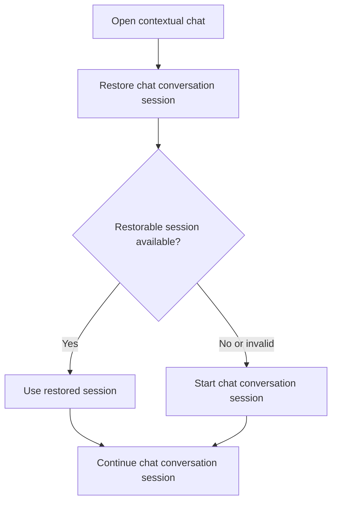

# CBW Chat Session Restore Flow

## Intent

`CBW-005`를 중심으로 chat surface 재진입 시 기존 chat session을 복원하고, 복원이 불가능하거나 현재 맥락과 맞지 않으면 `new_session`으로 자연스럽게 폴백하는 흐름을 정리한다.

이 문서는 session restore와 continuation journey를 다루며, 전체 request 제출 및 응답 처리 sequence는 [contextual_chat_request_flow](contextual_chat_request_flow.md)에서 다룬다.

## Contract References

- [chat_session_contract.toml](../contracts/chat_session_contract.toml)

## Interaction Coverage

- [CBW-001-open_contextual_chat](../CBW-001-manage-chat-request-lifecycle/CBW-001-open_contextual_chat.md)
- [CBW-005-restore_chat_conversation_session](../CBW-005-maintain-chat-conversation-session/CBW-005-restore_chat_conversation_session.md)
- [CBW-005-start_chat_conversation_session](../CBW-005-maintain-chat-conversation-session/CBW-005-start_chat_conversation_session.md)
- [CBW-005-continue_chat_conversation_session](../CBW-005-maintain-chat-conversation-session/CBW-005-continue_chat_conversation_session.md)

## Flow Overview

## Happy Path

1. [CBW-001-open_contextual_chat](../CBW-001-manage-chat-request-lifecycle/CBW-001-open_contextual_chat.md)
   사용자가 chat surface에 진입하면 기존 chat session 복원 가능 여부를 먼저 확인한다.
2. [CBW-005-restore_chat_conversation_session](../CBW-005-maintain-chat-conversation-session/CBW-005-restore_chat_conversation_session.md)
   복원 가능한 기록이 있으면 `restored_session`을 만들고 기존 turn history를 다시 사용한다.
3. 이후 사용자가 새 turn을 추가하면 [CBW-005-continue_chat_conversation_session](../CBW-005-maintain-chat-conversation-session/CBW-005-continue_chat_conversation_session.md)이 active chat session continuity를 유지한다.

## Alternate Paths

### Restore Fallback Path

1. [CBW-005-restore_chat_conversation_session](../CBW-005-maintain-chat-conversation-session/CBW-005-restore_chat_conversation_session.md)가 복원 가능한 session을 활성화할 수 없으면 기존 기록을 active session으로 두면 안 된다.
2. contract의 restore failure fallback 정책에 따라 [CBW-005-start_chat_conversation_session](../CBW-005-maintain-chat-conversation-session/CBW-005-start_chat_conversation_session.md)이 후속 경로로 이어져 `new_session`을 생성한다.
3. 이 fallback에는 복원 실패, 일부 history 손상, 현재 맥락과 맞지 않는 session record가 모두 포함된다.

### No Restorable Session Path

1. 복원 가능한 기록이 없으면 [CBW-005-restore_chat_conversation_session](../CBW-005-maintain-chat-conversation-session/CBW-005-restore_chat_conversation_session.md)은 기존 session을 활성화하지 않는다.
2. [CBW-005-start_chat_conversation_session](../CBW-005-maintain-chat-conversation-session/CBW-005-start_chat_conversation_session.md)이 기본 경로로 실행되어 `new_session`을 생성한다.

## Boundary Notes

- 이 문서의 `new_session`, `restored_session`은 모두 [chat_session_contract.toml](../contracts/chat_session_contract.toml)의 상태 이름을 그대로 쓴다.
- MVP에서는 session restore failure와 context mismatch를 별도 user-visible branch로 분리하지 않고 모두 `new_session` fallback으로 처리한다.
- single timeline rewrite strategy이므로 regenerate 이후 continuity 갱신은 branch session을 만들지 않고 현재 active chat session만 다시 정렬해야 한다. 이 후속 step은 [CBW-005-continue_chat_conversation_session](../CBW-005-maintain-chat-conversation-session/CBW-005-continue_chat_conversation_session.md)이 맡는다.
- 이 문서는 restore/continuation branch만 다루며, request 상태 전환과 response 생성은 [contextual_chat_request_flow](contextual_chat_request_flow.md)에서 이어진다.

## Source

- Category: `CBW`
- Related contracts: [chat_session_contract.toml](../contracts/chat_session_contract.toml)
