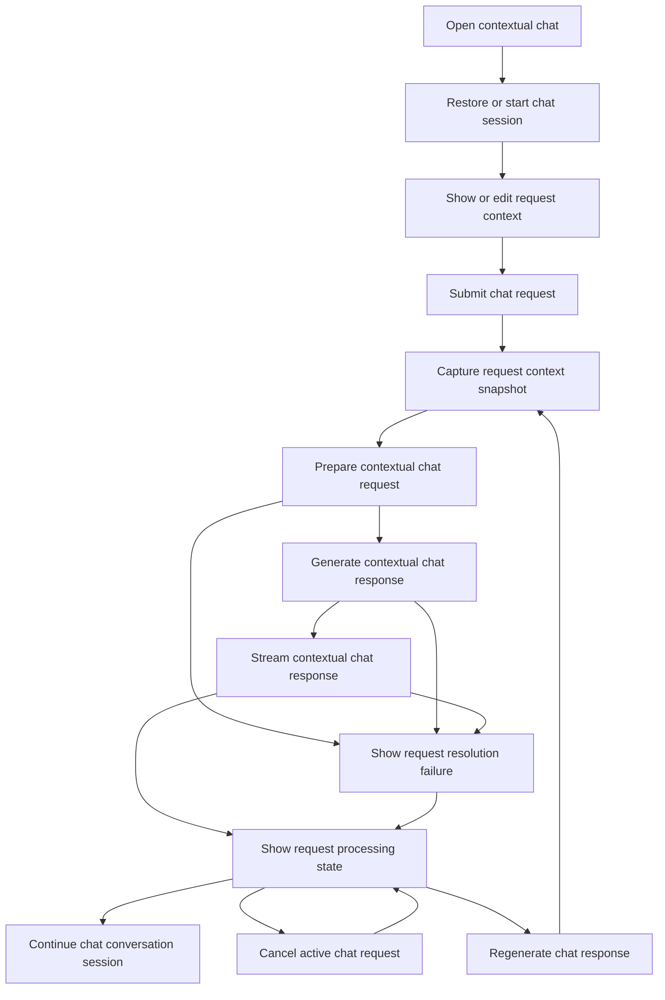

# CBW Contextual Chat Request Flow

## Intent

`CBW-001`, `CBW-002`, `CBW-003`, `CBW-005`가 함께 만드는 contextual chat의 고수준 request 제출 및 응답 처리 흐름을 카테고리 단위에서 정리한다.

세부적인 request context 조정, model selection, session restore branch는 각각 별도 flow 문서에서 다루며, 이 문서는 `request_message`, `context_snapshot`, `turn_history`, `chat_session`이 실제 실행 흐름에서 어떻게 합쳐지는지에 집중한다.

## Contract References

- [request_lifecycle.toml](../contracts/request_lifecycle.toml)
- [request_context_contract.toml](../contracts/request_context_contract.toml)
- [chat_session_contract.toml](../contracts/chat_session_contract.toml)

## Interaction Coverage

- [CBW-001-open_contextual_chat](../CBW-001-manage-chat-request-lifecycle/CBW-001-open_contextual_chat.md)
- [CBW-001-submit_chat_request](../CBW-001-manage-chat-request-lifecycle/CBW-001-submit_chat_request.md)
- [CBW-001-show_request_processing_state](../CBW-001-manage-chat-request-lifecycle/CBW-001-show_request_processing_state.md)
- [CBW-001-cancel_active_chat_request](../CBW-001-manage-chat-request-lifecycle/CBW-001-cancel_active_chat_request.md)
- [CBW-001-regenerate_chat_response](../CBW-001-manage-chat-request-lifecycle/CBW-001-regenerate_chat_response.md)
- [CBW-002-show_request_context](../CBW-002-manage-request-context/CBW-002-show_request_context.md)
- [CBW-002-capture_request_context_snapshot](../CBW-002-manage-request-context/CBW-002-capture_request_context_snapshot.md)
- [CBW-003-prepare_contextual_chat_request](../CBW-003-resolve-contextual-chat-requests/CBW-003-prepare_contextual_chat_request.md)
- [CBW-003-generate_contextual_chat_response](../CBW-003-resolve-contextual-chat-requests/CBW-003-generate_contextual_chat_response.md)
- [CBW-003-stream_contextual_chat_response](../CBW-003-resolve-contextual-chat-requests/CBW-003-stream_contextual_chat_response.md)
- [CBW-003-show_request_resolution_failure](../CBW-003-resolve-contextual-chat-requests/CBW-003-show_request_resolution_failure.md)
- [CBW-005-restore_chat_conversation_session](../CBW-005-maintain-chat-conversation-session/CBW-005-restore_chat_conversation_session.md)
- [CBW-005-start_chat_conversation_session](../CBW-005-maintain-chat-conversation-session/CBW-005-start_chat_conversation_session.md)
- [CBW-005-continue_chat_conversation_session](../CBW-005-maintain-chat-conversation-session/CBW-005-continue_chat_conversation_session.md)

## Flow Overview

## Happy Path

1. [CBW-001-open_contextual_chat](../CBW-001-manage-chat-request-lifecycle/CBW-001-open_contextual_chat.md)
   현재 맥락으로 Chat Mode에 진입한다.
2. [CBW-005-restore_chat_conversation_session](../CBW-005-maintain-chat-conversation-session/CBW-005-restore_chat_conversation_session.md) / [CBW-005-start_chat_conversation_session](../CBW-005-maintain-chat-conversation-session/CBW-005-start_chat_conversation_session.md)
   첫 요청 전에 현재 대화에 사용할 `chat_session`을 복원하거나 새로 만든다.
3. [CBW-002-show_request_context](../CBW-002-manage-request-context/CBW-002-show_request_context.md)
   요청에 들어갈 고정된 `current_context`(page·selection)와 별도 `added_attachments`를 확인하고, 필요한 경우 add/remove 경로로 조정한다.
4. [CBW-001-submit_chat_request](../CBW-001-manage-chat-request-lifecycle/CBW-001-submit_chat_request.md)
   새 request를 생성하고, 입력된 `request_message`를 해당 요청의 실행 입력으로 확정한 뒤 `processing` 상태로 전환한다.
5. [CBW-002-capture_request_context_snapshot](../CBW-002-manage-request-context/CBW-002-capture_request_context_snapshot.md)
   제출 시점의 `request_context`를 `context_snapshot`으로 고정한다.
6. [CBW-003-prepare_contextual_chat_request](../CBW-003-resolve-contextual-chat-requests/CBW-003-prepare_contextual_chat_request.md)
   `context_snapshot`, `request_message`, `turn_history`가 연결된 `chat_session`, active model selection과 그에 결합된 provider binding을 결합해 현재 request의 실행 준비를 확정한다.
7. [CBW-003-generate_contextual_chat_response](../CBW-003-resolve-contextual-chat-requests/CBW-003-generate_contextual_chat_response.md)
   응답 생성을 시작한다.
8. [CBW-003-stream_contextual_chat_response](../CBW-003-resolve-contextual-chat-requests/CBW-003-stream_contextual_chat_response.md)
   응답을 stream한다.
9. [CBW-001-show_request_processing_state](../CBW-001-manage-chat-request-lifecycle/CBW-001-show_request_processing_state.md)
   request 상태를 `processing`, `completed`, `failed`, `cancelled` 중 하나로 표시한다.
10. [CBW-005-continue_chat_conversation_session](../CBW-005-maintain-chat-conversation-session/CBW-005-continue_chat_conversation_session.md)
    방금 완료된 turn을 현재 `chat_session` continuity에 반영한다.

## Alternate Paths

### Cancel Path

1. request가 `processing` 상태일 때 [CBW-001-cancel_active_chat_request](../CBW-001-manage-chat-request-lifecycle/CBW-001-cancel_active_chat_request.md)를 호출한다.
2. request는 `cancelled` 상태로 전환된다.
3. [CBW-001-show_request_processing_state](../CBW-001-manage-chat-request-lifecycle/CBW-001-show_request_processing_state.md)가 `cancelled`를 표시한다.

### Regenerate Path

1. 기존 request가 속한 turn 안에서 재생성 기준으로 삼을 response가 식별 가능하고, 해당 request가 `completed` 또는 `failed` 상태여야 한다.
2. [CBW-001-regenerate_chat_response](../CBW-001-manage-chat-request-lifecycle/CBW-001-regenerate_chat_response.md)를 호출한다.
3. 같은 request와 turn에 새 response를 만들고 상태를 `processing`으로 전환한다.
4. 재생성 대상 request 뒤에 이어졌던 downstream turn이 있다면 active conversation에서 초기화하고 branch는 만들지 않는다.
5. 이후 흐름은 request preparation부터 다시 이어진다.

### Failure Path

1. [CBW-003-prepare_contextual_chat_request](../CBW-003-resolve-contextual-chat-requests/CBW-003-prepare_contextual_chat_request.md), [CBW-003-generate_contextual_chat_response](../CBW-003-resolve-contextual-chat-requests/CBW-003-generate_contextual_chat_response.md), 또는 [CBW-003-stream_contextual_chat_response](../CBW-003-resolve-contextual-chat-requests/CBW-003-stream_contextual_chat_response.md) 단계에서 terminal failure가 발생할 수 있다.
2. [CBW-003-show_request_resolution_failure](../CBW-003-resolve-contextual-chat-requests/CBW-003-show_request_resolution_failure.md)가 message area에 실패 이유와, 재시도 가능한 경우 같은 request를 다시 실행하는 regenerate 진입점을 표시한다.
3. [CBW-001-show_request_processing_state](../CBW-001-manage-chat-request-lifecycle/CBW-001-show_request_processing_state.md)가 해당 request를 `failed` 상태로 남긴다.

## Boundary Notes

- 상태 이름은 [request_lifecycle.toml](../contracts/request_lifecycle.toml)을 따른다.
- request context의 세부 조정과 `draft_context` / `empty_context` / `broken_reference` / `request_context_locked` semantics는 [request_context_management_flow](request_context_management_flow.md)와 [request_context_contract.toml](../contracts/request_context_contract.toml)을 따른다.
- `request_context` 안의 page·selection은 `current_context` 고정 그룹으로, 명시적으로 추가한 `attachment`는 별도 `added_attachments` 그룹으로 다룬다.
- request preparation 단계에서 실행 입력은 `request_message`, `context_snapshot`, `turn_history`가 연결된 `chat_session`, active model selection과 그에 결합된 provider binding의 조합으로 해석한다.
- 이 문서에서 submit은 draft 입력을 실행용 request로 확정하고 새 turn을 시작하는 action을 뜻한다.
- 이 문서에서 regenerate는 기존 request를 다시 실행해 같은 turn 안에 새 response를 만드는 action을 뜻한다.
- downstream turn은 재생성 기준 request 뒤에 이어지는 후속 turn을 뜻하며, regenerate path에서는 active conversation에서 제외된다.
- session 관련 상태 이름은 [chat_session_contract.toml](../contracts/chat_session_contract.toml)을 따른다.
- 첫 submit path는 [CBW-005-restore_chat_conversation_session](../CBW-005-maintain-chat-conversation-session/CBW-005-restore_chat_conversation_session.md) 또는 [CBW-005-start_chat_conversation_session](../CBW-005-maintain-chat-conversation-session/CBW-005-start_chat_conversation_session.md)으로 `chat_session`이 먼저 준비된 뒤 request preparation으로 이어진다.
- model selection과 `model_selected`, `model_selection_required`, `model_unavailable` semantics는 [chat_provider_model_selection_flow](chat_provider_model_selection_flow.md)에서 별도로 다룬다.
- session 복원과 `new_session` fallback branch는 [chat_session_restore_flow](chat_session_restore_flow.md)에서 별도로 다룬다.
- 이 문서는 sequence와 branch semantics를 설명하며, 상태 vocabulary 자체는 contract를 다시 정의하지 않는다.

## Source

- Category: `CBW`
- Related contracts: [request_lifecycle.toml](../contracts/request_lifecycle.toml), [request_context_contract.toml](../contracts/request_context_contract.toml), [chat_session_contract.toml](../contracts/chat_session_contract.toml)
