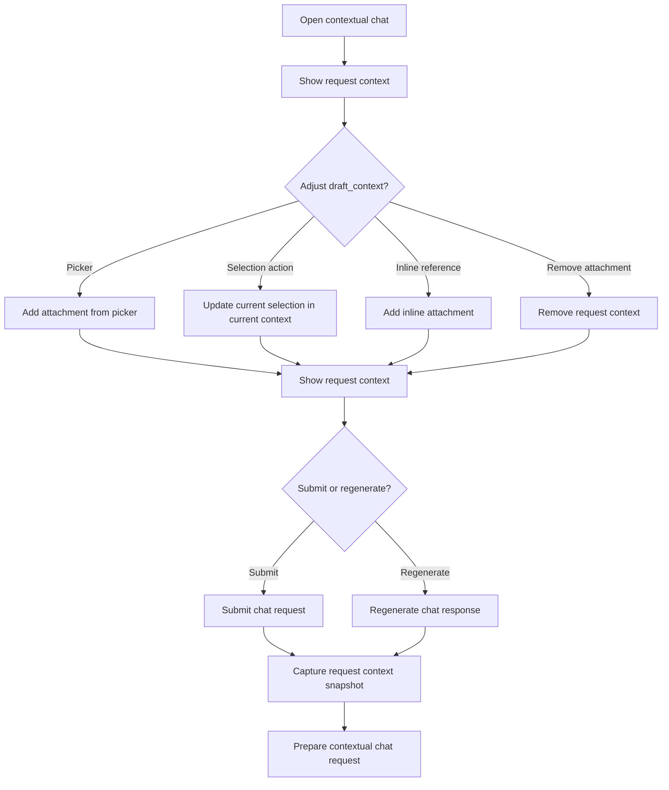

# CBW Request Context Management Flow

## Intent

`CBW-001-open_contextual_chat`가 준비한 `current_context`와 `CBW-002`가 보강하는 `added_attachments`를 현재 request의 `request_context` 안에서 조정하고, 제출 또는 regenerate 시점에 `request_context_locked`로 고정해 다음 request preparation 단계로 넘기는 흐름을 정리한다.

이 문서는 request context의 세부 조정 journey를 다루며, 전체 request 실행 lifecycle 자체는 [contextual_chat_request_flow](contextual_chat_request_flow.md)에서 다룬다.

## Contract References

- [request_context_contract.toml](../contracts/request_context_contract.toml)
- [request_lifecycle.toml](../contracts/request_lifecycle.toml)

## Interaction Coverage

- [CBW-001-open_contextual_chat](../CBW-001-manage-chat-request-lifecycle/CBW-001-open_contextual_chat.md)
- [CBW-002-show_request_context](../CBW-002-manage-request-context/CBW-002-show_request_context.md)
- [CBW-002-add_attachment_from_picker](../CBW-002-manage-request-context/CBW-002-add_attachment_from_picker.md)
- [CBW-002-add_selection_to_context](../CBW-002-manage-request-context/CBW-002-add_selection_to_context.md)
- [CBW-002-add_inline_attachment](../CBW-002-manage-request-context/CBW-002-add_inline_attachment.md)
- [CBW-002-remove_request_context](../CBW-002-manage-request-context/CBW-002-remove_request_context.md)
- [CBW-002-capture_request_context_snapshot](../CBW-002-manage-request-context/CBW-002-capture_request_context_snapshot.md)
- [CBW-001-submit_chat_request](../CBW-001-manage-chat-request-lifecycle/CBW-001-submit_chat_request.md)
- [CBW-001-regenerate_chat_response](../CBW-001-manage-chat-request-lifecycle/CBW-001-regenerate_chat_response.md)
- [CBW-003-prepare_contextual_chat_request](../CBW-003-resolve-contextual-chat-requests/CBW-003-prepare_contextual_chat_request.md)

## Flow Overview

## Happy Path

1. [CBW-001-open_contextual_chat](../CBW-001-manage-chat-request-lifecycle/CBW-001-open_contextual_chat.md)
   현재 page와 현재 selection이 해석 가능하면 Chat Field 안의 고정된 `current_context` 위치에 초기 request context seed가 준비되고, 아무 seed도 만들 수 없으면 `empty_context` 후보 상태로 진입한다.
2. [CBW-002-show_request_context](../CBW-002-manage-request-context/CBW-002-show_request_context.md)
   사용자는 고정된 `current_context`와 별도 영역의 `added_attachments`, 그리고 request message 안의 inline attachment token을 함께 확인해 현재 `request_context`가 `draft_context`인지, 비어 있는지, 깨진 항목이 있는지 먼저 파악한다.
3. [CBW-002-add_attachment_from_picker](../CBW-002-manage-request-context/CBW-002-add_attachment_from_picker.md) / [CBW-002-add_inline_attachment](../CBW-002-manage-request-context/CBW-002-add_inline_attachment.md) / [CBW-002-add_selection_to_context](../CBW-002-manage-request-context/CBW-002-add_selection_to_context.md)
   사용자는 필요한 context를 보강한다. picker는 명시적 `attachment`를 `added_attachments`에 추가하고, inline reference는 명시적 `attachment`를 `draft_context`에 등록하되 visible 표현은 request message 안의 inline token으로 유지하며, selection action은 고정된 `current_context` 안의 단일 selection chip 상태를 갱신한다.
4. [CBW-002-remove_request_context](../CBW-002-manage-request-context/CBW-002-remove_request_context.md)
   사용자는 제출 전 명시적으로 추가한 `attachment`를 제거하고 필요하면 add 경로로 다시 추가해 정제하되, `current_context`는 attachment-like chip으로 다루지 않는다.
5. [CBW-002-show_request_context](../CBW-002-manage-request-context/CBW-002-show_request_context.md)
   조정 결과가 최신 `draft_context` 기준으로 다시 표시된다.
6. [CBW-001-submit_chat_request](../CBW-001-manage-chat-request-lifecycle/CBW-001-submit_chat_request.md) 또는 [CBW-001-regenerate_chat_response](../CBW-001-manage-chat-request-lifecycle/CBW-001-regenerate_chat_response.md)
   request 실행이 시작되면 현재 `draft_context`가 고정 준비 상태로 넘어간다.
7. [CBW-002-capture_request_context_snapshot](../CBW-002-manage-request-context/CBW-002-capture_request_context_snapshot.md)
   현재 `request_context`가 `current_context`와 `added_attachments` 구성을 포함한 request-scoped `context_snapshot`으로 고정되어 `request_context_locked` 상태가 된다.
8. [CBW-003-prepare_contextual_chat_request](../CBW-003-resolve-contextual-chat-requests/CBW-003-prepare_contextual_chat_request.md)
   request preparation은 방금 고정된 `context_snapshot`만 읽는다.

## Alternate Paths

### Empty Context Path

1. [CBW-001-open_contextual_chat](../CBW-001-manage-chat-request-lifecycle/CBW-001-open_contextual_chat.md) 시점에 현재 page나 selection을 seed로 만들 수 없고, 이후 [CBW-002-remove_request_context](../CBW-002-manage-request-context/CBW-002-remove_request_context.md)로 명시적으로 추가한 `attachment`도 모두 제거되면 `request_context`는 `empty_context`로 전환된다.
2. [CBW-002-show_request_context](../CBW-002-manage-request-context/CBW-002-show_request_context.md)는 별도 empty chip이나 placeholder row를 렌더링하지 않고, current context와 attachment item이 모두 없는 상태만 유지한다.
3. `empty_context`는 허용 상태이므로 사용자는 그대로 submit할 수도 있고, 다시 `attachment`를 추가하거나 selection action으로 `draft_context`로 되돌릴 수도 있다.

### Broken Reference Path

1. [CBW-002-show_request_context](../CBW-002-manage-request-context/CBW-002-show_request_context.md)가 현재 `draft_context` 안의 `added_attachments`에서 접근 불가 `attachment` 또는 기타 explicit entry를 발견하면 `broken_reference`를 표시한다.
2. 사용자는 [CBW-002-remove_request_context](../CBW-002-manage-request-context/CBW-002-remove_request_context.md)로 깨진 항목을 제거하고, 필요하면 add 경로로 올바른 항목을 다시 추가할 수 있다.
3. 정책상 `broken_reference`도 submit 자체를 막지는 않으므로, 그대로 submit하면 [CBW-002-capture_request_context_snapshot](../CBW-002-manage-request-context/CBW-002-capture_request_context_snapshot.md)가 해당 상태를 포함한 채 `request_context_locked`로 전환할 수 있다.

### Request Context Locked Path

1. [CBW-002-capture_request_context_snapshot](../CBW-002-manage-request-context/CBW-002-capture_request_context_snapshot.md) 이후 현재 request는 `request_context_locked` 상태가 된다.
2. 같은 request 안에서는 [CBW-002-remove_request_context](../CBW-002-manage-request-context/CBW-002-remove_request_context.md)와 [CBW-002-add_selection_to_context](../CBW-002-manage-request-context/CBW-002-add_selection_to_context.md)가 in-place mutation을 만들면 안 된다.
3. 이후 context를 바꾸려면 새 draft request를 만들거나 regenerate 전 draft 단계로 다시 진입해야 한다.

## Boundary Notes

- 이 문서에서 `request_context`, `context_entry`, `context_snapshot`, `draft_context`, `empty_context`, `broken_reference`, `request_context_locked`는 모두 [request_context_contract.toml](../contracts/request_context_contract.toml)의 용어를 그대로 쓴다.
- 이 흐름에서 `context_entry`는 `current_context` 안의 page-derived entry, selection-derived entry와 `added_attachments` 안의 attachment-derived entry를 모두 포함한다.
- `current_context`는 Chat Field 안의 고정된 위치에서 보여야 하며 attachment chip과 같은 affordance로 표현하지 않는다.
- current selection은 `current_context` 안에서 여러 item chip으로 풀어지지 않고, 현재 selection 상태를 요약하는 단일 selection chip으로 표현한다.
- inline reference로 추가된 attachment는 `request_context`에 포함되지만 `added_attachments` group에 중복 렌더링하지 않고 request message token으로만 표시한다.
- `snapshot_capture_trigger`는 `submit_or_regenerate`이므로 context 고정은 임의의 배경 저장이 아니라 submit / regenerate 직전 step으로만 이해해야 한다.
- 이 문서는 context 조정과 snapshot 고정만 다루며, 실제 request 상태 전환 이후의 응답 생성은 [contextual_chat_request_flow](contextual_chat_request_flow.md)에서 이어진다.

## Source

- Category: `CBW`
- Related contracts: [request_context_contract.toml](../contracts/request_context_contract.toml), [request_lifecycle.toml](../contracts/request_lifecycle.toml)
