# EVM Entry View Management Flow

## Intent

Page navigation, Entries View configuration, selection, and split Content Pane behavior를 하나의 Entry View Management 흐름으로 정리한다.

## Contract References

- [evm_contract.toml](../contracts/evm_contract.toml)

## Interaction Coverage

- [EVM-001-navigate_pages](../EVM-001-navigate_pages/EVM-001-navigate_pages.md)
- [EVM-001-go_page_history_back](../EVM-001-navigate_pages/EVM-001-go_page_history_back.md)
- [EVM-001-forward_page_history](../EVM-001-navigate_pages/EVM-001-forward_page_history.md)
- [EVM-001-show_page_history](../EVM-001-navigate_pages/EVM-001-show_page_history.md)
- [EVM-001-go_to_enclosing_directory](../EVM-001-navigate_pages/EVM-001-go_to_enclosing_directory.md)
- [EVM-001-view_current_page_title](../EVM-001-navigate_pages/EVM-001-view_current_page_title.md)
- [EVM-001-reload_directory_page_on_external_change](../EVM-001-navigate_pages/EVM-001-reload_directory_page_on_external_change.md)
- [EVM-002-set_entries_view_as_list_table](../EVM-002-configure_entries_view/EVM-002-set_entries_view_as_list_table.md)
- [EVM-002-set_entries_view_as_icon_grid](../EVM-002-configure_entries_view/EVM-002-set_entries_view_as_icon_grid.md)
- [EVM-002-set_entries_view_as_column](../EVM-002-configure_entries_view/EVM-002-set_entries_view_as_column.md)
- [EVM-002-set_entries_view_as_graph](../EVM-002-configure_entries_view/EVM-002-set_entries_view_as_graph.md)
- [EVM-002-group_entries_by_property](../EVM-002-configure_entries_view/EVM-002-group_entries_by_property.md)
- [EVM-002-sort_entrires_by_property](../EVM-002-configure_entries_view/EVM-002-sort_entrires_by_property.md)
- [EVM-002-show_hide_hidden_entry](../EVM-002-configure_entries_view/EVM-002-show_hide_hidden_entry.md)
- [EVM-002-customize_list_view_column](../EVM-002-configure_entries_view/EVM-002-customize_list_view_column.md)
- [EVM-002-view_entry_counts_in_current_page](../EVM-002-configure_entries_view/EVM-002-view_entry_counts_in_current_page.md)
- [EVM-002-show_selected_entry_counts](../EVM-002-configure_entries_view/EVM-002-show_selected_entry_counts.md)
- [EVM-002-update_entry_selection](../EVM-002-configure_entries_view/EVM-002-update_entry_selection.md)
- [EVM-003-split_content_pane_vertically_horizontally](../EVM-003-split_content_pane/EVM-003-split_content_pane_vertically_horizontally.md)
- [EVM-003-convert_split_pane_orientation](../EVM-003-split_content_pane/EVM-003-convert_split_pane_orientation.md)
- [EVM-003-seprated_splited_content_pane](../EVM-003-split_content_pane/EVM-003-seprated_splited_content_pane.md)
- [EVM-003-adjust_splited_content_pane_size](../EVM-003-split_content_pane/EVM-003-adjust_splited_content_pane_size.md)
- [EVM-003-switch_focus_between_split_panes](../EVM-003-split_content_pane/EVM-003-switch_focus_between_split_panes.md)

## Flow Overview

```mermaid
flowchart TD
  A1[Navigate Pages] --> A2[Go Page History Back]
  A2[Go Page History Back] --> A3[Forward Page History]
  A3[Forward Page History] --> A4[Show Page History]
  A4[Show Page History] --> A5[Go to Enclosing Directory]
  A5[Go to Enclosing Directory] --> A6[View Current Page Title]
  A6[View Current Page Title] --> A7[Reload Directory Page on External Change]
  A7[Reload Directory Page on External Change] --> A8[Set Entries View as List]
  A8[Set Entries View as List] --> A9[Set Entries View as Icon]
  A9[Set Entries View as Icon] --> A10[Set Entries View as Column]
  A10[Set Entries View as Column] --> A11[Set Entries View as Graph]
  A11[Set Entries View as Graph] --> A12[Group Entries by Property]
  A12[Group Entries by Property] --> A13[Sort Entrires by Property]
  A13[Sort Entrires by Property] --> A14[Show/Hide Hidden Entry]
  A14[Show/Hide Hidden Entry] --> A15[Customize List View Column]
  A15[Customize List View Column] --> A16[View Entry Counts in Current Page]
  A16[View Entry Counts in Current Page] --> A17[Show Selected Entry Counts]
  A17[Show Selected Entry Counts] --> A18[Update Entry Selection]
  A18[Update Entry Selection] --> A19[Split Content Pane Vertically/Horizontally]
  A19[Split Content Pane Vertically/Horizontally] --> A20[Convert Split Pane Orientation]
  A20[Convert Split Pane Orientation] --> A21[Seprated Splited Content Pane]
  A21[Seprated Splited Content Pane] --> A22[Adjust Splited Content Pane Size]
  A22[Adjust Splited Content Pane Size] --> A23[Switch Focus between Split Panes]
```

## Happy Path

1. [EVM-001-navigate_pages](../EVM-001-navigate_pages/EVM-001-navigate_pages.md)는 Content Pane에서 Entry 클릭하거나 선택해 현재 Content Tab Page를 새 Page로 전환 흐름을 담당한다.
2. [EVM-001-go_page_history_back](../EVM-001-navigate_pages/EVM-001-go_page_history_back.md)는 현재 Content Tab Page History 상 이전 Page로 전환 흐름을 담당한다.
3. [EVM-001-forward_page_history](../EVM-001-navigate_pages/EVM-001-forward_page_history.md)는 현재 Content Tab Page History 상 다음 Page로 전환 흐름을 담당한다.
4. [EVM-001-show_page_history](../EVM-001-navigate_pages/EVM-001-show_page_history.md)는 현재 Content Tab의 페이지 히스토리를 드랍다운 리스트로 표시 흐름을 담당한다.
5. [EVM-001-go_to_enclosing_directory](../EVM-001-navigate_pages/EVM-001-go_to_enclosing_directory.md)는 현재 Page가 표시하는 디렉토리의 상위 디렉토리로 이동 흐름을 담당한다.
6. [EVM-001-view_current_page_title](../EVM-001-navigate_pages/EVM-001-view_current_page_title.md)는 현재 Page의 제목을 표시 흐름을 담당한다.
7. [EVM-001-reload_directory_page_on_external_change](../EVM-001-navigate_pages/EVM-001-reload_directory_page_on_external_change.md)는 외부 파일시스템 변경이 발생했을 때 현재 디렉토리 페이지를 다시 불러와 최신 엔트리 목록 상태를 반영 흐름을 담당한다.
8. [EVM-002-set_entries_view_as_list_table](../EVM-002-configure_entries_view/EVM-002-set_entries_view_as_list_table.md)는 Entries View를 리스트 레이아웃으로 전환하고, 리스트 열 구성 설정에 따라 컬럼 순서와 표시를 반영 흐름을 담당한다.
9. [EVM-002-set_entries_view_as_icon_grid](../EVM-002-configure_entries_view/EVM-002-set_entries_view_as_icon_grid.md)는 Entries View를 아이콘 레이아웃으로 전환해 동일한 Entry 데이터를 시각적으로 표시 흐름을 담당한다.
10. [EVM-002-set_entries_view_as_column](../EVM-002-configure_entries_view/EVM-002-set_entries_view_as_column.md)는 Entries View를 왼쪽에서 오른쪽으로 상위 디렉토리에서 하위 디렉토리로 내려가는 3개의 세로 열로 구획된 레이아웃으로 전환 흐름을 담당한다.
11. [EVM-002-set_entries_view_as_graph](../EVM-002-configure_entries_view/EVM-002-set_entries_view_as_graph.md)는 Entries View를 각 Entry 간 관계를 노드와 엣지 구조로 표현하는 레이아웃으로 전환 흐름을 담당한다.
12. [EVM-002-group_entries_by_property](../EVM-002-configure_entries_view/EVM-002-group_entries_by_property.md)는 Entries View에서 선택한 Property 값으로 Entries를 그룹화해 섹션 헤더 아래에 표시하며, 그룹 라벨·색상은 동일한 규칙에 따라 표현 흐름을 담당한다.
13. [EVM-002-sort_entrires_by_property](../EVM-002-configure_entries_view/EVM-002-sort_entrires_by_property.md)는 Entries View에서 선택한 Property를 기준으로 Entries 표시 순서를 정렬함 흐름을 담당한다.
14. [EVM-002-show_hide_hidden_entry](../EVM-002-configure_entries_view/EVM-002-show_hide_hidden_entry.md)는 Entries View에서 숨김 설정된 Entry의 Entry 목록 상에 보이게 하거나, 보이지 않도록 토글 흐름을 담당한다.
15. [EVM-002-customize_list_view_column](../EVM-002-configure_entries_view/EVM-002-customize_list_view_column.md)는 List View에서 리스트 열 구성의 표시 여부와 순서를 설정 흐름을 담당한다.
16. [EVM-002-view_entry_counts_in_current_page](../EVM-002-configure_entries_view/EVM-002-view_entry_counts_in_current_page.md)는 현재 Page에 존재하는 Entry의 총 개수를 표시 흐름을 담당한다.
17. [EVM-002-show_selected_entry_counts](../EVM-002-configure_entries_view/EVM-002-show_selected_entry_counts.md)는 현재 Page에서 선택된 Entry의 개수를 표시함 흐름을 담당한다.
18. [EVM-002-update_entry_selection](../EVM-002-configure_entries_view/EVM-002-update_entry_selection.md)는 선택된 Entry 집합을 갱신 흐름을 담당한다.
19. [EVM-003-split_content_pane_vertically_horizontally](../EVM-003-split_content_pane/EVM-003-split_content_pane_vertically_horizontally.md)는 현재 Content Pane을 수직 또는 수평으로 분할하여 두 개의 독립 뷰를 동시에 표시합니다 흐름을 담당한다.
20. [EVM-003-convert_split_pane_orientation](../EVM-003-split_content_pane/EVM-003-convert_split_pane_orientation.md)는 기존 분할된 Content Pane의 방향을 수직↔수평으로 전환합니다. 흐름을 담당한다.
21. [EVM-003-seprated_splited_content_pane](../EVM-003-split_content_pane/EVM-003-seprated_splited_content_pane.md)는 두 분할 Pane의 세션/네비게이션을 분리하여 서로 다른 페이지/경로를 독립적으로 탐색합니다. 흐름을 담당한다.
22. [EVM-003-adjust_splited_content_pane_size](../EVM-003-split_content_pane/EVM-003-adjust_splited_content_pane_size.md)는 분할된 Pane 사이의 디바이더를 드래그해 각 Pane의 크기를 조절합니다. 흐름을 담당한다.
23. [EVM-003-switch_focus_between_split_panes](../EVM-003-split_content_pane/EVM-003-switch_focus_between_split_panes.md)는 키보드 포커스를 좌/우(또는 상/하) Pane 사이에서 전환합니다. 흐름을 담당한다.

## Alternate Paths

- 사용자가 이미 적용된 상태를 다시 호출하면, 앱은 중복 상태 변경을 만들지 않고 현재 상태를 유지한다.
- 대상 Entry, Page, selection, 권한, 파일 시스템 조건이 유효하지 않으면 상태를 부분 반영하지 않고 실패 피드백을 표시한다.
- background interaction은 사용자의 현재 포커스와 명시적 selection을 보존하면서 최신 상태만 갱신한다.

## Boundary Notes

- 이 flow는 EVM category의 공통 contract 상태 어휘를 기준으로 interaction 순서와 책임을 정리한다.
- Covered features는 `EVM-001 Navigate Pages`, `EVM-002 Configure Entries View`, `EVM-003 Split Content Pane`이다.
- 구현 세부 이벤트 순서보다 사용자에게 보이는 Page, Entry, selection, action 결과를 우선한다.

## Source

- Category: `EVM`
- Related contract: [evm_contract.toml](../contracts/evm_contract.toml)
