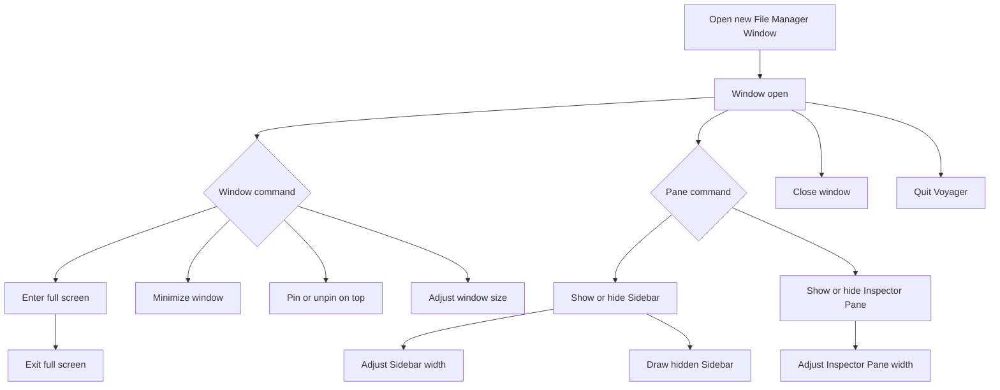

# FMW File Manager Window Control Flow

## Intent

File Manager Window를 생성·종료·표시 모드 전환·크기 조정하고, Sidebar와 Inspector Pane의 표시 상태를 조정하는 기본 창 제어 흐름을 정리한다.

이 문서는 FMW 카테고리의 공통 창/패인 상태를 다루며, 페이지 탐색이나 엔트리 조작처럼 창 내부 콘텐츠가 수행하는 도메인 작업은 각 카테고리 흐름에서 이어진다.

## Contract References

- [file_manager_window_contract.toml](../contracts/file_manager_window_contract.toml)

## Interaction Coverage

- [FMW-001-quit_voyager](../FMW-001-control_file_manager_window/FMW-001-quit_voyager.md)
- [FMW-001-open_new_file_manager_window](../FMW-001-control_file_manager_window/FMW-001-open_new_file_manager_window.md)
- [FMW-001-close_file_manager_window](../FMW-001-control_file_manager_window/FMW-001-close_file_manager_window.md)
- [FMW-001-enter_full_screen_for_file_manager_window](../FMW-001-control_file_manager_window/FMW-001-enter_full_screen_for_file_manager_window.md)
- [FMW-001-exit_full_screen_for_file_manager_window](../FMW-001-control_file_manager_window/FMW-001-exit_full_screen_for_file_manager_window.md)
- [FMW-001-minimize_file_manager_window](../FMW-001-control_file_manager_window/FMW-001-minimize_file_manager_window.md)
- [FMW-001-keep_file_manager_window_on_top](../FMW-001-control_file_manager_window/FMW-001-keep_file_manager_window_on_top.md)
- [FMW-001-adjust_file_manager_window_size](../FMW-001-control_file_manager_window/FMW-001-adjust_file_manager_window_size.md)
- [FMW-002-show_sidebar](../FMW-002-manage_file_manager_window_panes/FMW-002-show_sidebar.md)
- [FMW-002-hide_sidebar](../FMW-002-manage_file_manager_window_panes/FMW-002-hide_sidebar.md)
- [FMW-002-adjust_sidebar_width](../FMW-002-manage_file_manager_window_panes/FMW-002-adjust_sidebar_width.md)
- [FMW-002-draw_hidden_sidebar](../FMW-002-manage_file_manager_window_panes/FMW-002-draw_hidden_sidebar.md)
- [FMW-002-show_inspector_pane](../FMW-002-manage_file_manager_window_panes/FMW-002-show_inspector_pane.md)
- [FMW-002-hide_inspector_pane](../FMW-002-manage_file_manager_window_panes/FMW-002-hide_inspector_pane.md)
- [FMW-002-adjust_inspector_pane_width](../FMW-002-manage_file_manager_window_panes/FMW-002-adjust_inspector_pane_width.md)

## Flow Overview

## Happy Path

1. [FMW-001-open_new_file_manager_window](../FMW-001-control_file_manager_window/FMW-001-open_new_file_manager_window.md)
   사용자가 `file_menu` 또는 `⌘N`으로 새 창을 열면 새 File Manager Window가 생성되고 `window_open` 상태가 된다.
2. [FMW-001-adjust_file_manager_window_size](../FMW-001-control_file_manager_window/FMW-001-adjust_file_manager_window_size.md)
   사용자는 창 크기를 허용된 최소·최대 범위 안에서 조정하며, 조정 결과는 `window_resized` 상태로 기록된다.
3. [FMW-002-show_sidebar](../FMW-002-manage_file_manager_window_panes/FMW-002-show_sidebar.md)와 [FMW-002-show_inspector_pane](../FMW-002-manage_file_manager_window_panes/FMW-002-show_inspector_pane.md)
   사용자는 필요한 보조 패인을 고정 표시해 각각 `sidebar_visible`, `inspector_visible` 상태로 전환한다.
4. [FMW-002-adjust_sidebar_width](../FMW-002-manage_file_manager_window_panes/FMW-002-adjust_sidebar_width.md)와 [FMW-002-adjust_inspector_pane_width](../FMW-002-manage_file_manager_window_panes/FMW-002-adjust_inspector_pane_width.md)
   표시 중인 패인은 허용 범위 안에서만 너비가 바뀌며, 각각 `sidebar_resized`, `inspector_resized` 상태로 기록된다.
5. [FMW-001-close_file_manager_window](../FMW-001-control_file_manager_window/FMW-001-close_file_manager_window.md)
   사용자가 활성 창을 닫으면 해당 창만 `window_closing`을 거쳐 `window_closed` 상태가 되고, 다른 File Manager Window는 유지된다.

## Alternate Paths

### Full Screen Path

1. [FMW-001-enter_full_screen_for_file_manager_window](../FMW-001-control_file_manager_window/FMW-001-enter_full_screen_for_file_manager_window.md)는 활성 창을 `full_screen` 상태로 전환한다.
2. [FMW-001-exit_full_screen_for_file_manager_window](../FMW-001-control_file_manager_window/FMW-001-exit_full_screen_for_file_manager_window.md)는 같은 창을 `windowed` 상태로 되돌린다.
3. 전체 화면 전환은 Sidebar와 Inspector Pane의 표시 여부를 새로 결정하지 않고, 기존 패인 상태를 창 표시 모드 안에서 보존한다.

### Minimize And Pin Path

1. [FMW-001-minimize_file_manager_window](../FMW-001-control_file_manager_window/FMW-001-minimize_file_manager_window.md)는 활성 창을 `minimized` 상태로 보내며 창 내부 세션을 종료하지 않는다.
2. [FMW-001-keep_file_manager_window_on_top](../FMW-001-control_file_manager_window/FMW-001-keep_file_manager_window_on_top.md)은 같은 창의 z-order 고정 여부를 토글해 `pinned` 또는 `unpinned` 상태로 만든다.
3. pin 상태는 창 표시 우선순위만 바꾸며 창 크기, 전체 화면 상태, 패인 표시 상태를 직접 변경하지 않는다.

### Sidebar Drawer Path

1. [FMW-002-hide_sidebar](../FMW-002-manage_file_manager_window_panes/FMW-002-hide_sidebar.md)로 Sidebar가 `sidebar_hidden` 상태가 된 뒤에도 사용자는 [FMW-002-draw_hidden_sidebar](../FMW-002-manage_file_manager_window_panes/FMW-002-draw_hidden_sidebar.md)를 호출할 수 있다.
2. drawer는 고정 표시가 아니라 `sidebar_transient` 상태이며, 포커스 이탈이나 명시적 닫기 후 `sidebar_hidden` 상태로 돌아간다.
3. drawer 상태에서 [FMW-002-show_sidebar](../FMW-002-manage_file_manager_window_panes/FMW-002-show_sidebar.md)가 실행되면 Sidebar는 고정 표시로 전환되어 `sidebar_visible` 상태가 된다.

### Quit Path

1. [FMW-001-quit_voyager](../FMW-001-control_file_manager_window/FMW-001-quit_voyager.md)는 단일 창 닫기가 아니라 앱 전체 종료 흐름이다.
2. 종료가 확정되면 모든 File Manager Window가 닫히며, 사용자에게 보이는 앱 상태는 `app_terminating`으로 전환된다.
3. 저장되지 않은 변경이나 진행 중 작업이 있는 창은 종료 전 확인 또는 차단 피드백을 먼저 제공해야 한다.

## Boundary Notes

- `file_manager_window`는 창 단위 세션과 표시 상태의 기준이다. 특정 페이지, 엔트리, 컬렉션 결과는 FMW contract가 아니라 해당 카테고리 contract가 소유한다.
- `sidebar`와 `inspector_pane`의 표시 상태는 독립적이다. Sidebar를 숨기거나 표시해도 Inspector Pane 상태를 자동으로 바꾸지 않는다.
- `sidebar_transient`는 `sidebar_visible`과 다르다. transient drawer는 임시 노출 상태이며, 고정 표시 상태로 간주하지 않는다.
- `pane_width_clamped_to_allowed_range` 정책에 따라 창과 패인의 resize interaction은 허용 범위를 넘는 값을 저장하지 않는다.
- `quit_terminates_all_windows` 정책에 따라 Quit Voyager는 현재 활성 창만 닫는 [FMW-001-close_file_manager_window](../FMW-001-control_file_manager_window/FMW-001-close_file_manager_window.md)와 구분된다.

## Source

- Category: `FMW`
- Related contract: [file_manager_window_contract.toml](../contracts/file_manager_window_contract.toml)
- Covered features: `FMW-001 Control File Manager Window`, `FMW-002 Manage File Manager Window Panes`
