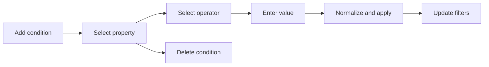

# RCL Collection Condition Editing Flow

## Intent

`RCL-005`는 사용자가 Collection Filter Composer 안에서 condition을 수동으로 추가·수정·삭제하고, registry 기반 property/operator/value 규칙에 맞춰 검색 payload를 안정적으로 구성하는 흐름을 정의한다.

## Contract References

- 이 흐름은 `condition`, `property`, `filter` 객체 vocabulary와 registry 기반 condition validation 정책을 사용한다.

## Interaction Coverage

- [RCL-005-add_collection_condition](../RCL-005-edit_collection_conditions/RCL-005-add_collection_condition.md)
- [RCL-005-change_collection_condition_property](../RCL-005-edit_collection_conditions/RCL-005-change_collection_condition_property.md)
- [RCL-005-change_collection_condition_operator](../RCL-005-edit_collection_conditions/RCL-005-change_collection_condition_operator.md)
- [RCL-005-change_collection_condition_value](../RCL-005-edit_collection_conditions/RCL-005-change_collection_condition_value.md)
- [RCL-005-delete_collection_condition](../RCL-005-edit_collection_conditions/RCL-005-delete_collection_condition.md)

## Flow Overview

## Happy Path

1. 사용자가 condition을 추가하면 property 선택 가능한 draft condition이 만들어진다.
2. property를 선택하면 registry가 허용하는 operator와 value UI kind가 계산된다.
3. operator를 선택하면 arity와 value type에 맞는 value editor가 표시된다.
4. value commit은 정규화와 인코딩을 통과한 뒤 filter payload에 포함된다.
5. condition 변경은 필요한 경우 `RCL-003` filter apply 흐름으로 이어진다.

## Alternate Paths

### Validation Failure

1. 빈 값, 숫자/날짜 파싱 실패, range 역전은 condition chip 안에서 오류로 표시한다.
2. 실패한 condition은 검색 payload에 포함하지 않는다.

### Duplicate Property

1. 이미 추가된 property를 다시 추가하려 하면 중복 condition을 만들지 않는다.
2. 사용자에게 기존 condition을 수정하라는 안내를 제공한다.

## Boundary Notes

- condition 편집은 filter 의미를 만드는 surface이며 결과 검색 실행은 `RCL-003`이 소유한다.
- unknown key는 appliedFilters 반영 중 비활성 condition으로 남을 수 있지만, 새 condition 생성 후보로 취급하지 않는다.

## Source

- Category: `RCL`
- Covered feature: `RCL-005 Edit Collection Conditions`
