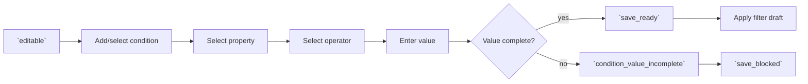

# RCL Collection Condition Editing Flow

## Intent

`RCL-005`는 사용자가 Collection Filter Composer 안에서 condition을 수동으로 추가·수정·삭제하고, registry 기반 property/operator/value 규칙과 `collection_filter_editing_contract`의 저장 가능 상태를 함께 만족시키는 흐름을 정의한다.

## Contract References

- [collection_filter_editing_contract.toml](../contracts/collection_filter_editing_contract.toml)

## Interaction Coverage

- [RCL-005-add_collection_condition](../RCL-005-edit_collection_conditions/RCL-005-add_collection_condition.md)
- [RCL-005-change_collection_condition_property](../RCL-005-edit_collection_conditions/RCL-005-change_collection_condition_property.md)
- [RCL-005-change_collection_condition_operator](../RCL-005-edit_collection_conditions/RCL-005-change_collection_condition_operator.md)
- [RCL-005-change_collection_condition_value](../RCL-005-edit_collection_conditions/RCL-005-change_collection_condition_value.md)
- [RCL-005-delete_collection_condition](../RCL-005-edit_collection_conditions/RCL-005-delete_collection_condition.md)

## Flow Overview

## Happy Path

1. 사용자가 condition을 추가하면 property 선택 가능한 draft condition이 만들어지고 Composer는 `editable` 상태를 유지한다.
2. property를 선택하면 registry가 허용하는 operator와 value UI kind가 계산된다.
3. operator를 선택하면 arity와 value type에 맞는 value editor가 표시된다.
4. [`RCL-005-change_collection_condition_value`](../RCL-005-edit_collection_conditions/RCL-005-change_collection_condition_value.md)는 값을 정규화·인코딩하고, 조건이 완성되면 `save_ready`로 이어지는 filter definition을 만든다.
5. condition 변경은 필요한 경우 `RCL-003` filter apply 흐름으로 이어진다.

## Alternate Paths

### Incomplete Value

1. Date range의 한쪽 값만 입력됐거나 operator가 요구하는 값 개수가 충족되지 않으면 `condition_value_incomplete` 상태를 유지한다.
2. 사용자가 save를 시도하면 RCL-002 save 흐름이 `save_blocked`로 처리하고, 빈 condition을 저장하지 않는다.
3. 누락 값을 채우거나 operator/property를 바꿔 조건이 완성되면 다시 `editable` 또는 `save_ready`로 돌아간다.

### Date Value Editing

1. 단일 Date 조건은 absolute date, relative date, `Is today` operator를 허용한다.
2. v1 Date range는 absolute date pair만 저장 가능하며, relative date pair는 아직 저장 가능한 range 값으로 확장하지 않는다.
3. range 역전이나 날짜 파싱 실패는 condition chip 안에서 수정 가능한 오류로 표시한다.

### Assisted Value Entry

1. Recents 또는 Tags 후보는 `assisted_value_entry`로 값을 빠르게 채우는 보조 입력 경로다.
2. 후보 목록이 비어 있거나 로딩에 실패해도 직접 입력은 유지되며, 보조 입력 실패가 manual input을 대체하거나 차단하지 않는다.

### Validation Failure

1. 빈 값, 숫자/날짜 파싱 실패, range 역전은 condition chip 안에서 오류로 표시한다.
2. 실패한 condition은 검색 payload와 저장 가능한 filter definition에 포함하지 않는다.

### Duplicate Property

1. 이미 추가된 property를 다시 추가하려 하면 중복 condition을 만들지 않는다.
2. 사용자에게 기존 condition을 수정하라는 안내를 제공한다.

## Boundary Notes

- condition 편집은 filter 의미를 만드는 surface이며 결과 검색 실행은 `RCL-003`이 소유한다.
- 저장 가능/차단/실패 상태는 RCL-002 collection management 흐름이 소유하지만, `RCL-005-change_collection_condition_value`는 `condition_value_incomplete`와 `save_ready`의 입력 조건을 만든다.
- unknown key는 appliedFilters 반영 중 비활성 condition으로 남을 수 있지만, 새 condition 생성 후보로 취급하지 않는다.

## Source

- Category: `RCL`
- Covered feature: `RCL-005 Edit Collection Conditions`
- Related contracts: [collection_filter_editing_contract.toml](../contracts/collection_filter_editing_contract.toml)
