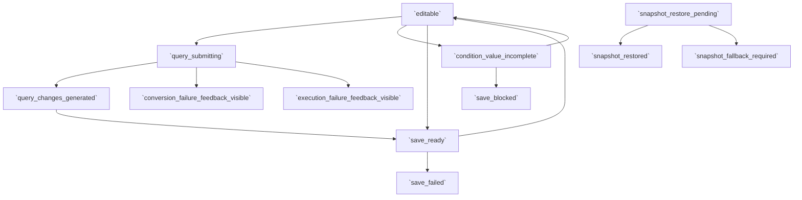

# Collection Filter Editing Flow

## Intent

VOY-267 Phase 2 범위에서 Collection Filter Composer 기반의 query 제출, 구조화된 조건 반영, 개별 조건 값 편집, 저장, 저장된 결과 복원 판단 경계를 하나의 연속된 편집 흐름으로 설명한다. 이 문서는 Phase 1 scope editing이 아니라 현재 필터 조건 구성을 바꾸고 다시 여는 Phase 2 편집 루프만 다룬다.

## Contract References

- [collection_filter_editing_contract.toml](../contracts/collection_filter_editing_contract.toml)

## Interaction Coverage

- [RCL-004-type_collection_filter_query](../RCL-004-compose_collection_filter/RCL-004-type_collection_filter_query.md)
- [RCL-004-submit_collection_filter_query](../RCL-004-compose_collection_filter/RCL-004-submit_collection_filter_query.md)
- [RCL-004-generate_filter_changes_from_query](../RCL-004-compose_collection_filter/RCL-004-generate_filter_changes_from_query.md)
- [RCL-004-apply_generated_filter_changes](../RCL-004-compose_collection_filter/RCL-004-apply_generated_filter_changes.md)
- [RCL-004-show_query_conversion_failure_feedback](../RCL-004-compose_collection_filter/RCL-004-show_query_conversion_failure_feedback.md)
- [RCL-004-show_query_execution_failure_feedback](../RCL-004-compose_collection_filter/RCL-004-show_query_execution_failure_feedback.md)
- [RCL-004-coalesce_repeated_query_failure_feedback](../RCL-004-compose_collection_filter/RCL-004-coalesce_repeated_query_failure_feedback.md)
- [RCL-005-change_collection_condition_value](../RCL-005-edit_collection_conditions/RCL-005-change_collection_condition_value.md)
- [RCL-002-save_collection_filter_changes](../RCL-002-manage_retrieval_collections/RCL-002-save_collection_filter_changes.md)
- [RCL-002-open_saved_collection](../RCL-002-manage_retrieval_collections/RCL-002-open_saved_collection.md)
- [RCL-002-restore_saved_collection_snapshot](../RCL-002-manage_retrieval_collections/RCL-002-restore_saved_collection_snapshot.md)

## Flow Overview

## Happy Path

1. 사용자는 [`RCL-004-type_collection_filter_query`](../RCL-004-compose_collection_filter/RCL-004-type_collection_filter_query.md)로 현재 입력창 내용을 조정하며, 실패 피드백 이후에도 같은 Composer 문맥에서 다시 입력을 이어갈 수 있다.
2. 사용자가 Collection Filter Composer에서 query를 제출하면 [`RCL-004-submit_collection_filter_query`](../RCL-004-compose_collection_filter/RCL-004-submit_collection_filter_query.md)가 현재 편집 문맥을 가장 최근 제출 기준의 `query_submitting` 상태에 둔다.
3. [`RCL-004-generate_filter_changes_from_query`](../RCL-004-compose_collection_filter/RCL-004-generate_filter_changes_from_query.md)가 제출된 query를 구조화된 조건 변경 결과로 해석하고, 성공 결과를 `query_changes_generated` 상태로 확정한다.
4. [`RCL-004-apply_generated_filter_changes`](../RCL-004-compose_collection_filter/RCL-004-apply_generated_filter_changes.md)가 구조화된 조건 변경 결과를 현재 필터 조건 구성에 반영해 다시 `editable` 문맥으로 돌려놓고, 저장 가능한 미저장 변경이면 `save_ready` 상태를 만든다.
5. 사용자는 필요하면 [`RCL-005-change_collection_condition_value`](../RCL-005-edit_collection_conditions/RCL-005-change_collection_condition_value.md)로 각 condition value를 추가 보정한다. Date 조건은 absolute / relative / `Is today`를 포함해 편집하되, range는 v1에서 absolute pair가 모두 채워져야 한다.
6. 저장 가능한 상태에서는 [`RCL-002-save_collection_filter_changes`](../RCL-002-manage_retrieval_collections/RCL-002-save_collection_filter_changes.md)가 현재 필터 조건 구성을 collection 파일에 저장한다.
7. 이후 다시 열기가 시작되면 [`RCL-002-open_saved_collection`](../RCL-002-manage_retrieval_collections/RCL-002-open_saved_collection.md)가 조건 구성과 저장된 결과 정보·관련 메타데이터를 함께 읽는 `snapshot_restore_pending` 상태를 연다.
8. 이어서 [`RCL-002-restore_saved_collection_snapshot`](../RCL-002-manage_retrieval_collections/RCL-002-restore_saved_collection_snapshot.md)가 즉시 복원 가능한 저장 결과인지 판단해 즉시 복원 또는 조건 구성 기준 재검색 경로를 정한다.

## Alternate Paths

### Query 해석 실패

1. 제출된 query가 해석되지 않으면 [`RCL-004-show_query_conversion_failure_feedback`](../RCL-004-compose_collection_filter/RCL-004-show_query_conversion_failure_feedback.md)가 `conversion_failure_feedback_visible` 상태를 띄운다.
2. 이 실패는 가벼운 인라인 안내로만 다루며, 사용자는 같은 입력 필드에서 즉시 다시 수정하거나 곧바로 재제출할 수 있다.
3. 동일 메시지가 짧은 시간 안에 반복되면 [`RCL-004-coalesce_repeated_query_failure_feedback`](../RCL-004-compose_collection_filter/RCL-004-coalesce_repeated_query_failure_feedback.md)가 중복 노출을 합친다.

### Query 성공 후 실행 실패

1. 조건 변경 결과 생성 자체는 성공했지만 반영 이후 실행 경로가 실패하면 [`RCL-004-show_query_execution_failure_feedback`](../RCL-004-compose_collection_filter/RCL-004-show_query_execution_failure_feedback.md)가 `execution_failure_feedback_visible` 상태를 띄운다.
2. 이 경로도 blocking modal이 아니라 가벼운 인라인 안내를 유지하며, 입력 수정이나 즉시 재제출 흐름이 계속 허용된다.
3. 동일 실패의 과도한 반복 노출은 [`RCL-004-coalesce_repeated_query_failure_feedback`](../RCL-004-compose_collection_filter/RCL-004-coalesce_repeated_query_failure_feedback.md)가 억제한다.

### Manual value edit와 save 차단

1. 사용자가 Date range의 한쪽 값만 채우거나 operator 요구사항을 만족하지 못하면 [`RCL-005-change_collection_condition_value`](../RCL-005-edit_collection_conditions/RCL-005-change_collection_condition_value.md)가 `condition_value_incomplete` 상태를 유지한다.
2. 이 상태에서 save를 시도하면 [`RCL-002-save_collection_filter_changes`](../RCL-002-manage_retrieval_collections/RCL-002-save_collection_filter_changes.md)가 저장을 진행하지 않고 `save_blocked` 피드백으로 복귀시킨다.
3. Recents/Tags 보조 입력이 비어 있거나 실패해도 직접 입력은 계속 가능해야 하며, 보조 경로 부재 자체가 별도 실패 경로가 되지 않는다.

### Reopen snapshot fallback

1. 다시 열기 시 저장된 결과 정보·관련 메타데이터가 즉시 복원 가능하면 [`RCL-002-restore_saved_collection_snapshot`](../RCL-002-manage_retrieval_collections/RCL-002-restore_saved_collection_snapshot.md)가 `snapshot_restored` 상태로 결과를 먼저 보여준다.
2. 저장된 결과가 즉시 복원에 적합하지 않으면 열기 자체를 실패로 끝내지 않고 `snapshot_fallback_required`로 전환해 조건 구성 기준의 재검색 경로를 이어간다.

## Boundary Notes

- Phase 1의 scope editing contract/flow는 reference-only이며, 이 문서는 scope selector나 exclusions를 다루지 않는다.
- 실질 변경 없음과 기존 조건 구성 유지는 query 성공의 내부 분기이며, 변환 실패로 승격하지 않는다.
- 저장 실패와 다시 열기 대체 경로는 `RCL-002` 경계에서 다루지만, 현재 필터 조건 구성의 편집 의미는 동일 contract vocabulary를 그대로 사용한다.
- `VOY-266` observability는 cross-cutting layer이며, 여기서는 각 spec의 Observability / Analytics 절에서 필요한 checkpoint만 정의한다.

## Source

- Category: `RCL`
- Related contracts: [collection_filter_editing_contract.toml](../contracts/collection_filter_editing_contract.toml)
