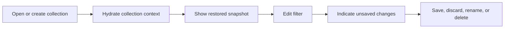

# RCL Collection Management Flow

## Intent

`RCL-002`는 현재 Composer filter를 `.voycoll` collection file로 저장하고, 저장된 collection을 열기·복원·변경·삭제하는 흐름을 소유한다.

## Contract References

- 이 흐름은 `.voycoll` collection file과 Composer state 동기화 정책을 다루며 별도 category contract 없이 `collection`, `filter`, `scope`, `condition` 객체 vocabulary를 사용한다.

## Interaction Coverage

- [RCL-002-open_saved_collection](../RCL-002-manage_retrieval_collections/RCL-002-open_saved_collection.md)
- [RCL-002-restore_saved_collection_snapshot](../RCL-002-manage_retrieval_collections/RCL-002-restore_saved_collection_snapshot.md)
- [RCL-002-show_restored_collection_snapshot](../RCL-002-manage_retrieval_collections/RCL-002-show_restored_collection_snapshot.md)
- [RCL-002-save_current_filter_as_new_collection](../RCL-002-manage_retrieval_collections/RCL-002-save_current_filter_as_new_collection.md)
- [RCL-002-indicate_unsaved_collection_filter_changes](../RCL-002-manage_retrieval_collections/RCL-002-indicate_unsaved_collection_filter_changes.md)
- [RCL-002-discard_collection_filter_changes](../RCL-002-manage_retrieval_collections/RCL-002-discard_collection_filter_changes.md)
- [RCL-002-save_collection_filter_changes](../RCL-002-manage_retrieval_collections/RCL-002-save_collection_filter_changes.md)
- [RCL-002-rename_collection](../RCL-002-manage_retrieval_collections/RCL-002-rename_collection.md)
- [RCL-002-delete_collection](../RCL-002-manage_retrieval_collections/RCL-002-delete_collection.md)
- [RCL-002-alert_unsasved_collection_filter_changes](../RCL-002-manage_retrieval_collections/RCL-002-alert_unsasved_collection_filter_changes.md)

## Flow Overview

## Happy Path

1. 사용자는 현재 filter를 새 `.voycoll` collection으로 저장하거나 기존 collection file을 연다.
2. 저장된 collection을 열면 query, scopes, conditions, 표시 상태, 마지막 결과 snapshot을 복원한다.
3. 사용자가 filter를 변경하면 미저장 변경 표시가 title affordance에 나타난다.
4. Save는 현재 collection file을 갱신하고, Save As는 새 collection file을 만든다.
5. Rename/Delete는 현재 collection file identity를 갱신하거나 제거한 뒤 열린 page 상태를 정리한다.

## Alternate Paths

### Unsaved Exit

1. 미저장 변경이 있는 상태에서 page를 닫거나 다른 위치로 이동하려 하면 경고를 표시한다.
2. 사용자는 저장, 폐기, 취소 중 하나를 선택할 수 있다.
3. 취소하면 현재 collection page와 draft filter를 유지한다.

### Restore First

1. 저장된 collection을 다시 열면 마지막 snapshot을 먼저 보여준다.
2. 필요한 경우에만 후속 refresh가 `RCL-003` retrieval 흐름으로 이어진다.

## Boundary Notes

- Collection 저장은 검색 실행이 아니라 검색 context와 표시 상태 보존이다.
- 검색/필터 요청이 진행 중이면 불완전 payload 저장을 막는다.
- `.voycoll` package format과 legacy single-file 호환은 collection file client 경계에서 처리한다.

## Source

- Category: `RCL`
- Covered feature: `RCL-002 Manage Retrieval Collections`
