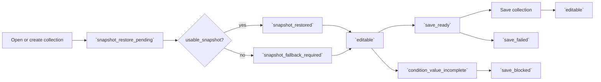

# RCL Collection Management Flow

## Intent

`RCL-002`는 현재 Composer filter를 `.voycoll` collection file로 저장하고, 저장된 collection을 열기·복원·변경·삭제하면서 `collection_filter_editing_contract`의 save/snapshot 상태를 유지하는 흐름을 소유한다.

## Contract References

- [collection_filter_editing_contract.toml](../contracts/collection_filter_editing_contract.toml)

## Interaction Coverage

- [RCL-002-open_saved_collection](../RCL-002-manage_retrieval_collections/RCL-002-open_saved_collection.md)
- [RCL-002-restore_saved_collection_snapshot](../RCL-002-manage_retrieval_collections/RCL-002-restore_saved_collection_snapshot.md)
- [RCL-002-show_restored_collection_snapshot](../RCL-002-manage_retrieval_collections/RCL-002-show_restored_collection_snapshot.md)
- [RCL-002-save_current_filter_as_new_collection](../RCL-002-manage_retrieval_collections/RCL-002-save_current_filter_as_new_collection.md)
- [RCL-002-indicate_unsaved_collection_filter_changes](../RCL-002-manage_retrieval_collections/RCL-002-indicate_unsaved_collection_filter_changes.md)
- [RCL-002-discard_collection_filter_changes](../RCL-002-manage_retrieval_collections/RCL-002-discard_collection_filter_changes.md)
- [RCL-002-save_collection_filter_changes](../RCL-002-manage_retrieval_collections/RCL-002-save_collection_filter_changes.md)
- [RCL-002-rename_collection](../RCL-002-manage_retrieval_collections/RCL-002-rename_collection.md)
- [RCL-002-delete_collection](../RCL-002-manage_retrieval_collections/RCL-002-delete_collection.md)
- [RCL-002-alert_unsaved_collection_filter_changes](../RCL-002-manage_retrieval_collections/RCL-002-alert_unsaved_collection_filter_changes.md)

## Flow Overview

## Happy Path

1. 사용자는 현재 filter를 새 `.voycoll` collection으로 저장하거나 기존 collection file을 연다.
2. [`RCL-002-open_saved_collection`](../RCL-002-manage_retrieval_collections/RCL-002-open_saved_collection.md)은 저장된 definition과 snapshot/meta를 읽는 `snapshot_restore_pending` 상태를 연다.
3. [`RCL-002-restore_saved_collection_snapshot`](../RCL-002-manage_retrieval_collections/RCL-002-restore_saved_collection_snapshot.md)은 `usable_snapshot`이 있으면 `snapshot_restored`로 즉시 표시 가능한 결과를 복원한다.
4. 사용자가 filter를 변경해 유효한 definition이 되면 `save_ready` 상태와 미저장 변경 표시가 title affordance에 나타난다.
5. [`RCL-002-save_collection_filter_changes`](../RCL-002-manage_retrieval_collections/RCL-002-save_collection_filter_changes.md)는 현재 collection file을 갱신하고 성공 후 Composer를 `editable` 상태로 되돌린다.
6. Rename/Delete는 현재 collection file identity를 갱신하거나 제거한 뒤 열린 page 상태를 정리한다.

## Alternate Paths

### Save Blocked

1. `condition_value_incomplete` 상태에서 save를 시도하면 `save_blocked`로 처리하고, 불완전 condition 또는 빈 filter definition을 `.voycoll`에 저장하지 않는다.
2. 사용자가 누락 값을 채우거나 condition을 삭제해 filter definition을 완성하면 다시 `save_ready`가 될 수 있다.

### Save Failed

1. storage 오류, conflict, 권한 문제로 save가 실패하면 `save_failed` 상태를 표시한다.
2. 실패 시 dirty change와 현재 collection page를 유지하고, 사용자는 다시 save하거나 query/condition을 수정할 수 있다.

### Unsaved Exit

1. 미저장 변경이 있는 상태에서 page를 닫거나 다른 위치로 이동하려 하면 경고를 표시한다.
2. 사용자는 저장, 폐기, 취소 중 하나를 선택할 수 있다.
3. 취소하면 현재 collection page와 draft filter를 유지한다.

### Restore Fallback

1. 저장된 collection을 다시 열었지만 `usable_snapshot`이 없으면 `snapshot_fallback_required` 상태로 definition-first fallback을 시작한다.
2. fallback은 저장된 scope/query/conditions definition을 먼저 복원한 뒤 필요한 refresh를 `RCL-003` retrieval 흐름으로 넘긴다.

## Boundary Notes

- Collection 저장은 검색 실행이 아니라 검색 context, filter definition, 표시 상태, snapshot/meta 보존이다.
- 검색/필터 요청이 진행 중이거나 condition이 불완전하면 `save_blocked`로 저장을 막는다.
- `.voycoll` package format과 legacy single-file 호환은 collection file client 경계에서 처리한다.
- snapshot 이후의 결과 refresh와 stale 판단은 `RCL-003` retrieval 흐름이 소유한다.

## Source

- Category: `RCL`
- Covered feature: `RCL-002 Manage Retrieval Collections`
- Related contracts: [collection_filter_editing_contract.toml](../contracts/collection_filter_editing_contract.toml)
