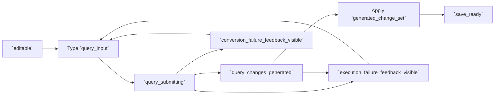

# RCL Collection Query Composition Flow

## Intent

`RCL-004`는 자연어 `query_input`을 구조화된 `generated_change_set`으로 변환하고, 변환/실행 실패를 Collection Filter Composer 안에서 회복 가능한 피드백으로 표시하는 흐름을 정의한다.

## Contract References

- [collection_filter_editing_contract.toml](../contracts/collection_filter_editing_contract.toml)

## Interaction Coverage

- [RCL-004-type_collection_filter_query](../RCL-004-compose_collection_filter/RCL-004-type_collection_filter_query.md)
- [RCL-004-submit_collection_filter_query](../RCL-004-compose_collection_filter/RCL-004-submit_collection_filter_query.md)
- [RCL-004-generate_filter_changes_from_query](../RCL-004-compose_collection_filter/RCL-004-generate_filter_changes_from_query.md)
- [RCL-004-apply_generated_filter_changes](../RCL-004-compose_collection_filter/RCL-004-apply_generated_filter_changes.md)
- [RCL-004-show_query_conversion_failure_feedback](../RCL-004-compose_collection_filter/RCL-004-show_query_conversion_failure_feedback.md)
- [RCL-004-show_query_execution_failure_feedback](../RCL-004-compose_collection_filter/RCL-004-show_query_execution_failure_feedback.md)
- [RCL-004-coalesce_repeated_query_failure_feedback](../RCL-004-compose_collection_filter/RCL-004-coalesce_repeated_query_failure_feedback.md)

## Flow Overview

## Happy Path

1. 사용자가 query field에 입력하면 [`RCL-004-type_collection_filter_query`](../RCL-004-compose_collection_filter/RCL-004-type_collection_filter_query.md)가 Composer를 `editable` 상태로 유지하면서 `query_input` draft를 갱신한다.
2. Enter 제출 시 [`RCL-004-submit_collection_filter_query`](../RCL-004-compose_collection_filter/RCL-004-submit_collection_filter_query.md)가 가장 최근 제출만 유효한 `query_submitting` 상태를 시작한다.
3. [`RCL-004-generate_filter_changes_from_query`](../RCL-004-compose_collection_filter/RCL-004-generate_filter_changes_from_query.md)는 현재 scope/condition draft와 `query_input`을 해석해 `generated_change_set`을 만들고 `query_changes_generated` 상태로 전환한다.
4. [`RCL-004-apply_generated_filter_changes`](../RCL-004-compose_collection_filter/RCL-004-apply_generated_filter_changes.md)는 suggestion 대기 상태 없이 `generated_change_set`을 현재 filter draft에 일괄 반영하고, 유효한 변경이면 `save_ready`로 이어지는 저장 가능 상태를 만든다.
5. 적용된 filter는 `RCL-003` retrieval 흐름으로 전달되지만, collection 저장은 `RCL-002`가 소유한다.

## Alternate Paths

### Unchanged Or Fallback Success

1. 변환 요청이 성공했지만 현재 filter definition 대비 실질 변경이 없으면 `unchanged_result`로 취급하고 실패 피드백을 표시하지 않는다.
2. 새 해석 대신 직전 유효 definition 또는 내부 fallback rule을 재사용하면 `fallback_reuse`로 취급하고 conversion failure로 기록하지 않는다.
3. 두 경우 모두 사용자는 `editable` 상태에서 query나 condition을 계속 수정할 수 있다.

### Conversion Failure

1. query 해석이 실패하면 [`RCL-004-show_query_conversion_failure_feedback`](../RCL-004-compose_collection_filter/RCL-004-show_query_conversion_failure_feedback.md)이 현재 filter draft를 비우지 않고 `conversion_failure_feedback_visible` 상태를 표시한다.
2. 사용자는 Composer를 벗어나지 않고 query를 수정해 다시 `query_submitting`으로 제출할 수 있다.

### Execution Failure

1. 구조화 변경은 생성됐지만 적용 또는 검색 실행 경계에서 실패하면 [`RCL-004-show_query_execution_failure_feedback`](../RCL-004-compose_collection_filter/RCL-004-show_query_execution_failure_feedback.md)이 `execution_failure_feedback_visible` 상태를 표시한다.
2. 이 피드백은 conversion failure와 구분되며, 부분 적용된 결과처럼 표시하지 않는다.

### Repeated Failure

1. 같은 conversion/execution failure가 짧은 시간 안에 반복되면 [`RCL-004-coalesce_repeated_query_failure_feedback`](../RCL-004-compose_collection_filter/RCL-004-coalesce_repeated_query_failure_feedback.md)이 새 toast를 누적하지 않고 현재 `conversion_failure_feedback_visible` 또는 `execution_failure_feedback_visible` 내용을 최신 reason으로 갱신한다.

## Boundary Notes

- 취소된 suggestion 기반 interactions는 현재 기본 구현 흐름에서 노출하지 않으며, `generated_suggestions`와 `suggestion_pending`은 이 contract에서 금지된 상태다.
- query 변환은 filter draft 변경을 만들 뿐, collection 저장은 `RCL-002` collection management 흐름이 소유한다.
- 결과 row rendering과 retrieval request lifecycle은 `RCL-003` retrieval 흐름이 소유한다.

## Source

- Category: `RCL`
- Covered feature: `RCL-004 Compose Collection Filter`
- Related contracts: [collection_filter_editing_contract.toml](../contracts/collection_filter_editing_contract.toml)
