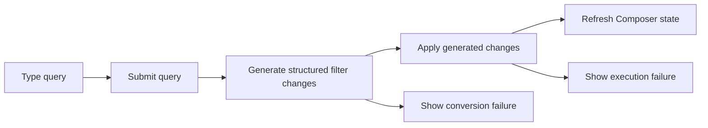

# RCL Collection Query Composition Flow

## Intent

`RCL-004`는 자연어 query 입력을 구조화 filter 변경으로 변환하고, 변환/실행 실패를 Composer 안에서 회복 가능한 피드백으로 표시하는 흐름을 정의한다.

## Contract References

- 이 흐름은 `filter`, `scope`, `condition` 객체 vocabulary와 Composer feedback policy를 사용한다.

## Interaction Coverage

- [RCL-004-type_collection_filter_query](../RCL-004-compose_collection_filter/RCL-004-type_collection_filter_query.md)
- [RCL-004-submit_collection_filter_query](../RCL-004-compose_collection_filter/RCL-004-submit_collection_filter_query.md)
- [RCL-004-generate_filter_changes_from_query](../RCL-004-compose_collection_filter/RCL-004-generate_filter_changes_from_query.md)
- [RCL-004-apply_generated_filter_changes](../RCL-004-compose_collection_filter/RCL-004-apply_generated_filter_changes.md)
- [RCL-004-show_query_conversion_failure_feedback](../RCL-004-compose_collection_filter/RCL-004-show_query_conversion_failure_feedback.md)
- [RCL-004-show_query_execution_failure_feedback](../RCL-004-compose_collection_filter/RCL-004-show_query_execution_failure_feedback.md)
- [RCL-004-coalesce_repeated_query_failure_feedback](../RCL-004-compose_collection_filter/RCL-004-coalesce_repeated_query_failure_feedback.md)

## Flow Overview

## Happy Path

1. 사용자가 query field에 입력하면 Composer query draft가 즉시 갱신된다.
2. Enter 제출 시 현재 scope/condition draft와 함께 변환 요청을 시작한다.
3. 변환 결과는 suggestion 대기 상태가 아니라 현재 filter draft에 일괄 반영된다.
4. 적용된 filter는 `RCL-003` retrieval 흐름으로 이어져 결과 state를 갱신한다.

## Alternate Paths

### Conversion Failure

1. query 해석이 실패하면 현재 filter draft를 비우지 않는다.
2. Composer 안에 가벼운 failure feedback을 표시하고 사용자는 query를 수정해 다시 제출할 수 있다.

### Repeated Failure

1. 같은 failure가 짧은 시간 안에 반복되면 별도 toast를 계속 누적하지 않는다.
2. 기존 feedback을 최신 reason 중심으로 갱신한다.

## Boundary Notes

- 취소된 suggestion 기반 interactions는 현재 기본 구현 흐름에서 노출하지 않는다.
- query 변환은 filter draft 변경을 만들 뿐, collection 저장은 `RCL-002`가 소유한다.

## Source

- Category: `RCL`
- Covered feature: `RCL-004 Compose Collection Filter`
