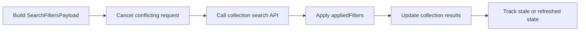

# RCL Collection Retrieval Flow

## Intent

`RCL-003`은 Composer가 만든 query, scopes, conditions를 검색 payload로 변환하고, 서버가 반환한 `appliedFilters`를 UI state에 다시 반영해 collection 결과를 최신 상태로 유지하는 흐름을 정의한다.

## Contract References

- 이 흐름은 `filter`, `scope`, `condition`, `collection` 객체 vocabulary와 Composer search lifecycle 정책을 사용한다.

## Interaction Coverage

- [RCL-003-execute_filtered_collection_retrieval](../RCL-003-retrieve_entries_with_filters/RCL-003-execute_filtered_collection_retrieval.md)
- [RCL-003-update_collection_results_on_filter_change](../RCL-003-retrieve_entries_with_filters/RCL-003-update_collection_results_on_filter_change.md)
- [RCL-003-apply_deterministic_filters](../RCL-003-retrieve_entries_with_filters/RCL-003-apply_deterministic_filters.md)
- [RCL-003-refresh_collection_results](../RCL-003-retrieve_entries_with_filters/RCL-003-refresh_collection_results.md)
- [RCL-003-mark_collection_results_as_stale](../RCL-003-retrieve_entries_with_filters/RCL-003-mark_collection_results_as_stale.md)
- [RCL-003-refresh_stale_collection_results_on_reopen](../RCL-003-retrieve_entries_with_filters/RCL-003-refresh_stale_collection_results_on_reopen.md)
- [RCL-003-invalidate_closed_collection_staleness_on_external_change](../RCL-003-retrieve_entries_with_filters/RCL-003-invalidate_closed_collection_staleness_on_external_change.md)
- [RCL-003-mark_open_collection_as_stale_on_external_change](../RCL-003-retrieve_entries_with_filters/RCL-003-mark_open_collection_as_stale_on_external_change.md)

## Flow Overview

## Happy Path

1. Composer state에서 active scope와 condition만 골라 `SearchFiltersPayload`를 만든다.
2. query submit은 filter 요청을 취소하고, filter apply는 search 요청을 취소해 마지막 요청만 유효하게 만든다.
3. API 응답의 `appliedFilters`를 registry 기준으로 canonical/legacy/unknown 상태로 보정한다.
4. 보정된 filter state와 결과 snapshot을 collection page에 반영한다.
5. 외부 변경이 있으면 즉시 결과를 버리지 않고 stale 상태를 기록해 refresh 경로로 연결한다.

## Alternate Paths

### Empty Conditions

1. filter apply 시 condition payload가 비어 있으면 네트워크 요청을 만들지 않는다.
2. 진행 중인 filter request는 취소되고 loading state가 해제된다.

### Unknown Applied Filter

1. 서버가 알 수 없는 property key를 반환하면 condition을 제거하지 않는다.
2. UI에는 `Unknown (<key>)` label의 비활성 condition으로 남겨 사용자가 원인을 확인할 수 있게 한다.

## Boundary Notes

- 실제 결과 row rendering은 Entry View가 소유하고, 이 흐름은 payload, request lifecycle, appliedFilters 반영을 소유한다.
- lexical/semantic hybrid ranking은 아이디어 상태이며 현재 구현 완료 흐름에 포함하지 않는다.

## Source

- Category: `RCL`
- Covered feature: `RCL-003 Retrieve Entries with Filters`
