# RCL Collection Scope Editing Flow

## Intent

`RCL-001`을 중심으로 Collection Filter Composer 안에서 현재 콜렉션 범위를 이해하고, 명시적 기준 범위를 추가·제거하거나 예외와 하위 폴더 포함 규칙을 조정해 현재 `scope` 의미를 편집하는 흐름을 정리한다.

이 문서는 scope 편집 journey 자체를 다루며, 편집된 scope가 실제 결과 집합 계산과 freshness 판단에 어떻게 반영되는지는 `RCL-003` retrieval 흐름에서 이어진다.

## Contract References

- [collection_scope_contract.toml](../contracts/collection_scope_contract.toml)

## Interaction Coverage

- [RCL-001-open_collection_filter_composer](../RCL-001-define_collection_scope/RCL-001-open_collection_filter_composer.md)
- [RCL-001-collapse_collection_filter_composer](../RCL-001-define_collection_scope/RCL-001-collapse_collection_filter_composer.md)
- [RCL-001-show_collection_scope_summary](../RCL-001-define_collection_scope/RCL-001-show_collection_scope_summary.md)
- [RCL-001-open_collection_scope_menu](../RCL-001-define_collection_scope/RCL-001-open_collection_scope_menu.md)
- [RCL-001-search_collection_scope_candidates](../RCL-001-define_collection_scope/RCL-001-search_collection_scope_candidates.md)
- [RCL-001-show_collection_scope_candidate_disambiguation](../RCL-001-define_collection_scope/RCL-001-show_collection_scope_candidate_disambiguation.md)
- [RCL-001-add_directory_to_collection_scope](../RCL-001-define_collection_scope/RCL-001-add_directory_to_collection_scope.md)
- [RCL-001-remove_directory_from_collection_scope](../RCL-001-define_collection_scope/RCL-001-remove_directory_from_collection_scope.md)
- [RCL-001-exclude_directory_from_collection_scope](../RCL-001-define_collection_scope/RCL-001-exclude_directory_from_collection_scope.md)
- [RCL-001-restore_directory_to_collection_scope](../RCL-001-define_collection_scope/RCL-001-restore_directory_to_collection_scope.md)
- [RCL-001-toggle_collection_scope_subfolder_inclusion](../RCL-001-define_collection_scope/RCL-001-toggle_collection_scope_subfolder_inclusion.md)
- [RCL-001-show_collection_scope_exceptions](../RCL-001-define_collection_scope/RCL-001-show_collection_scope_exceptions.md)
- [RCL-001-show_collection_scope_change_feedback](../RCL-001-define_collection_scope/RCL-001-show_collection_scope_change_feedback.md)
- [RCL-001-undo_collection_filter_changes](../RCL-001-define_collection_scope/RCL-001-undo_collection_filter_changes.md)
- [RCL-001-redo_collection_filter_changes](../RCL-001-define_collection_scope/RCL-001-redo_collection_filter_changes.md)

## Flow Overview

```mermaid
flowchart LR
  A[Open collection filter composer] --> B[Show current scope summary]
  B --> C[Open collection scope menu]
  C --> D[Show default candidates]
  D --> E[Search scope candidates]
  E --> F[Show candidate disambiguation]
  F --> G[Add scope]
  G --> H[Show scope summary]
  H --> I[Exclude or restore exception]
  I --> J[Show scope exceptions]
  J --> K[Show scope change feedback]
  K --> L[Undo scope change]
  L --> M[Redo scope change]
```

## Happy Path

1. [RCL-001-open_collection_filter_composer](../RCL-001-define_collection_scope/RCL-001-open_collection_filter_composer.md)
   사용자는 Collection Filter Composer를 열고 현재 범위와 조건 편집 상태에 진입한다.
2. [RCL-001-show_collection_scope_summary](../RCL-001-define_collection_scope/RCL-001-show_collection_scope_summary.md)
   현재 콜렉션 범위는 root-only, 단일 명시적 스코프, 다중 명시적 스코프, 예외 포함 상태 중 하나로 요약된다. root-only는 빈 상태가 아니라 현재 페이지/콜렉션 문맥이 제공하는 기본 적용 범위를 뜻한다.
3. [RCL-001-open_collection_scope_menu](../RCL-001-define_collection_scope/RCL-001-open_collection_scope_menu.md)
   사용자는 현재 스코프 요약에서 스코프 편집창으로 진입한다.
4. [RCL-001-search_collection_scope_candidates](../RCL-001-define_collection_scope/RCL-001-search_collection_scope_candidates.md)
   검색어가 비어 있으면 기본 후보가 보이고, 검색어를 입력하면 검색 결과 상태로 전환된다.
5. [RCL-001-add_directory_to_collection_scope](../RCL-001-define_collection_scope/RCL-001-add_directory_to_collection_scope.md)
   사용자가 새 후보를 선택하면 add 흐름으로 해석되어 현재 기준 범위 목록이 갱신된다.
6. [RCL-001-show_collection_scope_change_feedback](../RCL-001-define_collection_scope/RCL-001-show_collection_scope_change_feedback.md)
   최근 변경 1건 기준의 변경 피드백이 표시된다. 결과 갱신이 늦으면 지연 상태를 거쳐 최종 반영 또는 실패 상태로 전환된다.
7. [RCL-001-undo_collection_filter_changes](../RCL-001-define_collection_scope/RCL-001-undo_collection_filter_changes.md)
   필요하면 사용자는 즉시 직전 상태로 되돌릴 수 있다.

## Search Path

1. 스코프 편집창이 열리면 기본 후보 상태가 먼저 보인다.
2. 검색어를 입력하면 검색 결과 상태로 전환된다.
3. [RCL-001-show_collection_scope_candidate_disambiguation](../RCL-001-define_collection_scope/RCL-001-show_collection_scope_candidate_disambiguation.md)
   같은 이름의 후보가 여러 개 있으면 이름 뒤에 최소 하나의 위치 식별 정보가 붙어야 한다.
4. 검색 결과가 없으면 `no_results` 상태로 전환된다.
5. 사용자가 검색어를 지우면 다시 기본 후보 상태로 복귀한다.

## Exception Path

1. 사용자는 현재 기준 범위를 유지한 채 특정 하위 범위를 제외할 수 있다.
2. [RCL-001-exclude_directory_from_collection_scope](../RCL-001-define_collection_scope/RCL-001-exclude_directory_from_collection_scope.md)
   제외된 항목은 예외로 current scope에 반영된다.
3. [RCL-001-show_collection_scope_exceptions](../RCL-001-define_collection_scope/RCL-001-show_collection_scope_exceptions.md)
   예외 목록은 기준 범위 아래 인라인 보조 정보로 표시된다.
4. [RCL-001-restore_directory_to_collection_scope](../RCL-001-define_collection_scope/RCL-001-restore_directory_to_collection_scope.md)
   예외 항목에서 복원 흐름으로 이어질 수 있다.
5. 예외 변경 직후에는 [RCL-001-show_collection_scope_change_feedback](../RCL-001-define_collection_scope/RCL-001-show_collection_scope_change_feedback.md)로 최근 변경 1건 기준 피드백이 표시되고, 필요하면 [RCL-001-undo_collection_filter_changes](../RCL-001-define_collection_scope/RCL-001-undo_collection_filter_changes.md)로 직전 상태를 복원할 수 있다.
6. 여러 기준 범위가 함께 존재하면 현재 스코프는 그 기준 범위들의 합집합으로 계산되고, 예외는 그 합집합 아래에 속하는 하위 범위만 제거한다.
7. include-subfolders 규칙은 기준 범위 해석에 먼저 적용되고, 예외는 그 이후 결과 집합에서 제외된다.

## Include Subfolders Path

1. [RCL-001-toggle_collection_scope_subfolder_inclusion](../RCL-001-define_collection_scope/RCL-001-toggle_collection_scope_subfolder_inclusion.md)
   사용자는 하위 폴더 자동 포함 규칙을 켜거나 끌 수 있다.
2. ON 상태에서는 하위 폴더가 기본 포함으로 해석된다.
3. OFF 상태에서는 기준 범위 자체만 포함으로 해석된다.
4. 다중 기준 범위 상태에서는 각 기준 범위에 같은 규칙이 적용된 뒤 하나의 합집합으로 계산된다.
5. 예외는 include-subfolders 해석이 끝난 뒤 최종 결과 집합에서 제외된다.
6. 이 상태 전환은 현재 범위 요약, 예외 표시, 변경 피드백에 함께 반영된다.

## Undo / Redo Path

1. [RCL-001-show_collection_scope_change_feedback](../RCL-001-define_collection_scope/RCL-001-show_collection_scope_change_feedback.md)
   최근 변경 1건 기준으로 무엇이 바뀌었는지, 결과가 왜 달라졌는지, undo 가능 여부를 함께 보여준다. 결과가 아직 반영 중이면 지연 상태를, 실패하면 실패 상태를 보여줘야 한다.
2. [RCL-001-undo_collection_filter_changes](../RCL-001-define_collection_scope/RCL-001-undo_collection_filter_changes.md)
   undo는 최근 1건만 되돌리고, 현재 범위 의미와 결과 해석을 직전 상태로 복원한다.
3. [RCL-001-redo_collection_filter_changes](../RCL-001-define_collection_scope/RCL-001-redo_collection_filter_changes.md)
   redo는 가장 최근 undo 1건을 다시 적용한다.

## Collapse / Exit Path

1. [RCL-001-collapse_collection_filter_composer](../RCL-001-define_collection_scope/RCL-001-collapse_collection_filter_composer.md)
   사용자는 Collection Filter Composer shared shell을 닫고 페이지 타이틀 바 기본 상태로 복귀할 수 있다.
2. Composer를 닫더라도 현재 미저장 변경과 진행 중 파이프라인 상태는 유지된다.
3. 이 경로는 scope 의미를 새로 계산하거나 취소하는 흐름이 아니라, 현재 편집 surface의 표시 상태만 닫는 종료 경로로 읽혀야 한다.

## Boundary Notes

- 이 문서에서 `root_only`, `single_explicit_scope`, `multi_explicit_scope`, `exception_present`, `default_candidates`, `search_results`, `no_results`, `change_feedback_delayed`, `change_feedback_failed`, `change_feedback_visible`, `undo_available`, `redo_available`는 모두 [collection_scope_contract.toml](../contracts/collection_scope_contract.toml)의 상태 이름을 그대로 쓴다.
- `scope`는 빈 상태를 허용하지 않으며, 명시적 범위가 없을 때도 현재 페이지 또는 현재 콜렉션 문맥이 제공하는 `root_only` 기본 범위를 가진다.
- 현재 scope 평가는 `기준 범위 합집합 → include-subfolders 해석 → exception 차감` 순서를 따른다.
- `show_collection_scope_change_feedback`가 다루는 delayed/failed는 scope 의미 자체가 비어 있거나 롤백되었다는 뜻이 아니라, 최근 변경의 반영 상태와 사용자 피드백 상태를 구분해 보여주는 seam이다.
- 이 문서는 scope 의미 편집과 피드백까지만 다루며, 변경된 scope를 바탕으로 결과 집합을 재계산하거나 stale 여부를 판정하는 책임은 `RCL-003` 경계에서 이어진다.

## Source

- Category: `RCL`
- Related contract: [collection_scope_contract.toml](../contracts/collection_scope_contract.toml)
- Covered feature: `RCL-001 Define Collection Scope`
