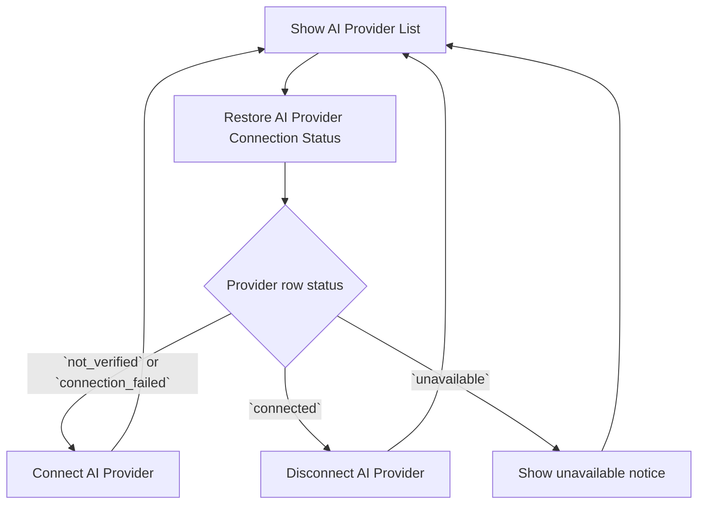

# SET AI Provider Connection Flow

## Intent

`SET-007`을 중심으로 Settings AI 탭의 `provider_catalog`를 표시하고, 각 `provider` row의 연결 상태를 복원한 뒤 `Connect`, `Disconnect`, `Reconnect`를 통해 상태를 관리하는 흐름을 정리한다.

이 문서는 설정 화면의 provider connection journey만 다루며, chat 안의 model selection이나 request 실행은 다루지 않는다.

## Contract References

- [ai_provider_connection_contract.toml](../contracts/ai_provider_connection_contract.toml)

## Interaction Coverage

- [SET-007-show_ai_provider_list](../SET-007-manage_ai_connections/SET-007-show_ai_provider_list.md)
- [SET-007-restore_ai_provider_connection_status](../SET-007-manage_ai_connections/SET-007-restore_ai_provider_connection_status.md)
- [SET-007-connect_ai_provider](../SET-007-manage_ai_connections/SET-007-connect_ai_provider.md)
- [SET-007-disconnect_ai_provider](../SET-007-manage_ai_connections/SET-007-disconnect_ai_provider.md)

## Flow Overview

## Happy Path

1. [SET-007-show_ai_provider_list](../SET-007-manage_ai_connections/SET-007-show_ai_provider_list.md)
   사용자가 Settings AI 탭에 진입하면 현재 빌드 기준 `provider_catalog`가 표시되고, 각 row는 이름, 지원 연결 방식, 현재 status badge, primary action 영역을 함께 준비한다.
2. [SET-007-restore_ai_provider_connection_status](../SET-007-manage_ai_connections/SET-007-restore_ai_provider_connection_status.md)
   각 `provider` row는 먼저 `checking_status`를 거쳐 최종적으로 `connected`, `not_verified`, `connection_failed`, `unavailable` 중 하나로 정리된다.
3. [SET-007-connect_ai_provider](../SET-007-manage_ai_connections/SET-007-connect_ai_provider.md)
   사용자가 `not_verified` 또는 `connection_failed` row에서 `Connect` 또는 `Reconnect`를 실행하면 row는 `connect_in_progress`를 거쳐 성공 시 `connected`로 바뀐다.
4. [SET-007-show_ai_provider_list](../SET-007-manage_ai_connections/SET-007-show_ai_provider_list.md)
   목록은 같은 row 안에서 새 status badge와 primary action을 다시 표시하고, 연결된 provider row를 목록에서 제거하지 않는다.
5. [SET-007-disconnect_ai_provider](../SET-007-manage_ai_connections/SET-007-disconnect_ai_provider.md)
   사용자가 `connected` row에서 `Disconnect`를 확정하면 row는 `disconnect_in_progress`를 거쳐 성공 시 `not_verified`로 돌아간다.

## Alternate Paths

### Connection Failure Path

1. [SET-007-connect_ai_provider](../SET-007-manage_ai_connections/SET-007-connect_ai_provider.md) 또는 [SET-007-restore_ai_provider_connection_status](../SET-007-manage_ai_connections/SET-007-restore_ai_provider_connection_status.md)가 연결 검증에 실패하면 해당 row는 `connection_failed`로 정리된다.
2. [SET-007-show_ai_provider_list](../SET-007-manage_ai_connections/SET-007-show_ai_provider_list.md)는 실패 row에 긴 오류 문구 대신 failure badge와 `Reconnect` action을 표시한다.
3. 사용자가 다시 연결을 시도하면 같은 row는 [SET-007-connect_ai_provider](../SET-007-manage_ai_connections/SET-007-connect_ai_provider.md)로 재진입해 `connect_in_progress`부터 다시 시작한다.

### Unavailable Path

1. [SET-007-restore_ai_provider_connection_status](../SET-007-manage_ai_connections/SET-007-restore_ai_provider_connection_status.md)가 현재 빌드 메타데이터 기준으로 해당 provider를 연결 surface에 노출할 수 없다고 판단하면 row는 `unavailable`로 정리된다.
2. [SET-007-show_ai_provider_list](../SET-007-manage_ai_connections/SET-007-show_ai_provider_list.md)는 해당 row를 정상 연결 가능 상태처럼 보이게 하면 안 되며, `Unavailable in this build` 안내와 비활성화된 action 상태만 보여준다.

### Disconnect Cancel Or Failure Path

1. [SET-007-disconnect_ai_provider](../SET-007-manage_ai_connections/SET-007-disconnect_ai_provider.md)에서 사용자가 확인 모달을 취소하면 row는 `connected`를 유지한다.
2. 해제 실행이 실패해도 row가 실제로 끊긴 것처럼 `not_verified`로 바뀌면 안 되며, 최종 표시는 다시 `connected`로 돌아와야 한다.
3. 사용자는 같은 row에서 다시 `Disconnect`를 시도하거나, 현재 연결이 유지된 상태로 작업을 계속할 수 있다.

## Boundary Notes

- 이 문서의 `provider`, `provider_catalog`, `checking_status`, `connected`, `not_verified`, `connect_in_progress`, `disconnect_in_progress`, `connection_failed`, `unavailable`는 [ai_provider_connection_contract.toml](../contracts/ai_provider_connection_contract.toml)의 용어를 그대로 쓴다.
- 현재 빌드에서 `provider_catalog`에 노출되는 provider는 `ChatGPT Codex`, `OpenAI`, `Anthropic` 세 가지다.
- 현재 빌드에서는 `ChatGPT Codex`는 `OAuth`만 허용하고, `OpenAI`와 `Anthropic`은 `API key`만 허용한다.
- Settings AI 탭은 explicit default provider 선택 surface를 제공하지 않으며, 마지막으로 사용한 provider 정보도 별도 badge나 보조 라벨로 노출하지 않는다.
- 사용자는 provider를 고르며 연결을 시작하고, 연결 방식 선택 자체를 위한 별도 picker는 노출하지 않는다. row 메타데이터가 허용한 방식에 따라 OAuth 진입 또는 inline API key 입력으로 이어진다.
- chat과 request 실행은 이 흐름의 결과로 계산된 provider availability를 읽을 수 있지만, provider 연결 관리 자체는 `SET-007`의 Settings AI 탭이 소유한다.

## Source

- Category: `SET`
- Related contracts: [ai_provider_connection_contract.toml](../contracts/ai_provider_connection_contract.toml)
