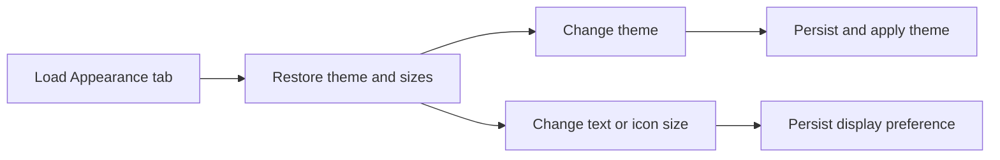

# SET Appearance Settings Flow

## Intent

`SET-003`은 theme, Entries View icon size, Entries View text size, hidden files 표시 설정을 로드·변경·저장하는 Appearance settings 흐름을 정의한다.

## Contract References

- 이 흐름은 UserDefaults-backed appearance settings와 AppearanceSettingsClient side effect를 다루며 별도 category contract 없이 `settings_window.settings_body.tab_appearance` IA region을 기준으로 정렬한다.

## Interaction Coverage

- [SET-003-swtich_theme_mode](../SET-003-configure_appearance_settings/SET-003-swtich_theme_mode.md)
- [SET-003-adjust_text_size](../SET-003-configure_appearance_settings/SET-003-adjust_text_size.md)
- [SET-003-adjust_icon_size](../SET-003-configure_appearance_settings/SET-003-adjust_icon_size.md)

## Flow Overview

## Happy Path

1. Appearance tab load 시 저장된 theme, list/grid icon size, list/grid text size, hidden-files 표시 값을 복원한다.
2. theme 변경은 UserDefaults 저장과 `applyTheme` side effect를 함께 실행한다.
3. text/icon size 변경은 해당 UserDefaults key에 저장되어 Entries View preference로 재사용된다.
4. hidden-files 표시 변경은 Entry View 표시 정책에 반영될 수 있도록 저장된다.

## Alternate Paths

### Missing Saved Value

1. 저장된 size 값이 없으면 AppearanceSettingsDefaults 값을 유지한다.
2. 저장된 theme 값이 유효하지 않으면 기본 theme으로 복구한다.

## Boundary Notes

- Appearance tab은 현재 구현 기준 General tab과 독립적으로 로드된다.
- 개별 Entry View가 새 preference를 언제 다시 읽는지는 Entry View state 경계에서 처리한다.

## Source

- Category: `SET`
- Covered feature: `SET-003 Configure Appearance Settings`
