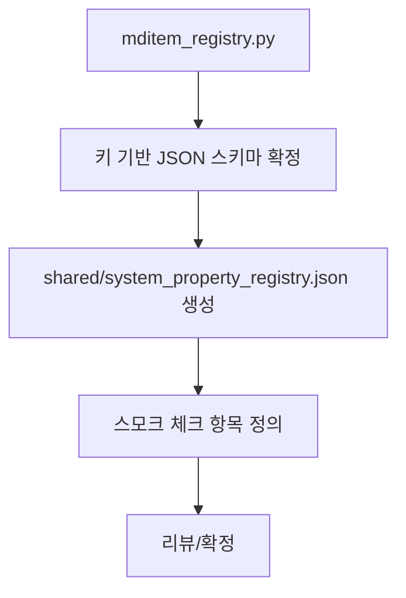

# VOY-112 Phase 1 — 레지스트리 JSON 도입

## 목표
- `shared/system_property_registry.json`을 **키 기반 구조**로 추가하고,
  기존 Python 레지스트리 정의를 JSON으로 이관한다.

## 상세 태스크
1) JSON 스키마 확정
   - 최상위: `version`, `mditem_registry`, `property_key_registry`
   - `mditem_registry`: MDItem 키 기반 dict 구조
     - 필수 필드: `type`, `description`, `search_aliases`, `category`
     - 선택 필드: `db_field`, `examples`, `key`
   - `property_key_registry`: propertyKey 기반 dict 구조
     - 필수 필드: `value_type`, `supported_operators`
     - 선택 필드: `db_field`, `json_path`, `property_key`
2) 레지스트리 이관
   - `mditem_registry.py`의 MDITEM_REGISTRY/PROPERTY_KEY_REGISTRY를 참조
   - 키/타입/연산자/설명/예시를 JSON에 반영
3) 공유 경로 정착
   - `shared/` 디렉토리에 JSON 파일 추가
4) 스모크 체크 항목 정의
   - 최소 키 3~5개(예: size, extension, modifiedAt, addedAt) 존재 확인

## 산출물
- `shared/system_property_registry.json`
- 스모크 체크 기준(문서/노트 형태)

## 사이드이펙트 고려
- JSON 구조가 확정되면 이후 Phase의 로더/번들이 동일 포맷을 전제로 함
- JSON 필드 누락 시 후속 단계에서 로딩 실패 가능

## 검증
- JSON 파일을 열어 키 기반 구조가 유지되는지 확인
- 필수 키/필드 존재 여부 확인

## 커밋 분리
- `chore(shared): add system_property_registry.json`

## Mermaid (Phase 1 흐름)

