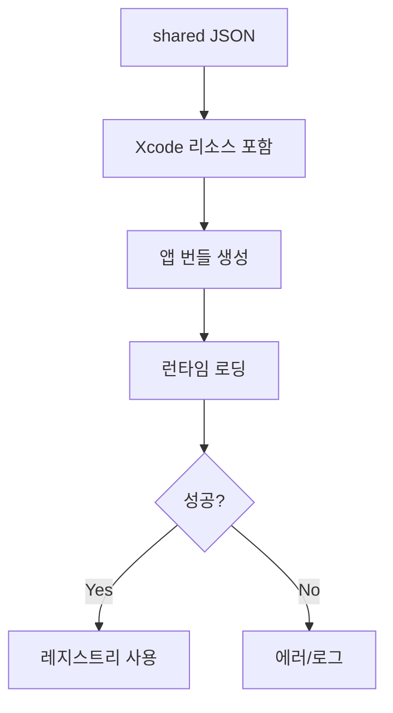

# VOY-112 Phase 3 — Swift 번들 포함 및 로딩 경로 정리

## 목표
- Swift 앱 번들에 `shared/system_property_registry.json`을 포함하고,
  런타임에서 해당 리소스를 로딩한다.

## 상세 태스크
1) 리소스 포함
   - shared JSON을 `apps/macos/Voyager/Shared`에 심볼릭 링크로 배치
   - Xcode 리소스에 자동 포함되는지 확인
   - 빌드 산출물에 포함되는지 확인
2) 런타임 로딩 경로 확정
   - `Bundle.main.url(forResource:)` 기반 로딩
   - 번들 미포함 시 project root(`shared/`) 폴백
   - 로딩 실패 시 사용자/로그 처리 정의
3) 클라이언트 참조 업데이트
   - 기존 프로퍼티/오퍼레이터 매핑 로직이 있다면 레지스트리 기반으로 전환 준비
4) 빌드 단계 검증
   - Build Phases(“Copy Bundle Resources”)에 파일 포함 확인
   - CI/로컬 빌드에서 리소스 누락 여부 체크

## 산출물
- 번들 리소스 포함 설정
- Swift 로딩 로직(경로/에러 처리)
 - 빌드 단계 검증 결과

## 사이드이펙트 고려
- 번들 누락 시 런타임 로딩 실패
- 리소스 이름 변경 시 로딩 경로 불일치
 - CI/로컬 빌드에서 리소스 포함 누락 가능성

## 검증
- 빌드 결과물에 JSON 포함 여부 확인
- 런타임에서 로딩 성공 확인
 - Build Phases 리소스 목록 확인

## 커밋 분리
- `feat(macos): bundle system_property_registry.json`

## Mermaid (Phase 3 흐름)

