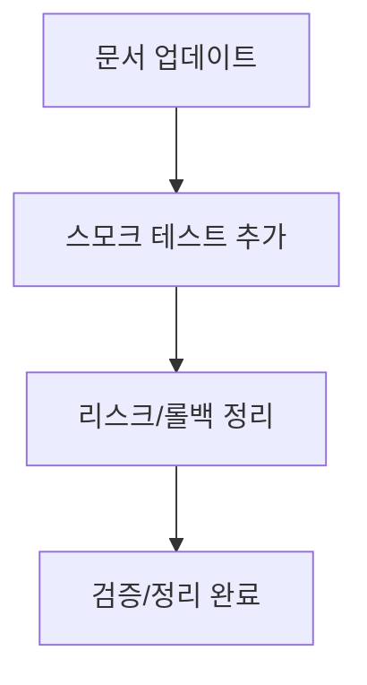

# VOY-112 Phase 4 — 문서/테스트 정리

## 목표
- 문서와 테스트를 정리해 변경 사항을 명확히 하고,
  레지스트리 로딩을 최소 스모크 테스트로 보장한다.

## 상세 태스크
1) 문서 업데이트
   - `1. SYSTEM_PROPERTY_REGISTRY_REFACTOR.md` 신규 작성/최신화
   - `1.1. SEARCH_DSL_SPEC.md` 신규 작성/연동 포인트 명시
2) 스모크 테스트 추가
   - 레지스트리 파일 존재 여부 확인
   - 로더를 통해 기본 키 로딩 확인
3) 롤백/리스크 문서화
   - 로딩 실패 대응, 경로 해석 문제, 번들 누락 리스크

## 산출물
- 문서 업데이트
- 스모크 테스트(필요 시)

## 사이드이펙트 고려
- 문서/코드 불일치 시 온보딩 혼선 발생 가능

## 검증
- 문서 내용 최신화 확인
- 스모크 테스트 통과 확인

## 커밋 분리
- `docs: update registry refactor docs`
- `test: add registry load smoke check` (필요 시 분리)

## Mermaid (Phase 4 흐름)

