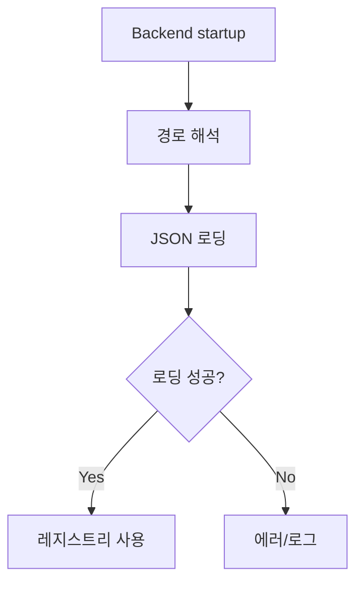

# VOY-112 Phase 2 — 백엔드 로더 전환

## 목표
- 백엔드가 `shared/system_property_registry.json`,
  `shared/property_key_registry.json`을 로딩하여 레지스트리 데이터로 사용하도록 전환한다.

## 상세 태스크
1) 로더 구현
   - JSON 파일 읽기 및 dict 로드
   - 로딩 실패 시 명확한 에러/로그 출력
2) 경로 해석 처리
   - repo root 탐색 또는 `REGISTRY_PATH` 환경변수 지원
   - `__file__`/`argv[0]`/`cwd` 기준 상위 경로에서 `shared/` 탐색
3) 기존 레지스트리 참조 전환
   - `mditem_registry.py` 내부에서 JSON 기반 구조로 전환
4) 하위 모듈 영향 확인
   - `core/llm`, `core/search` 등 레지스트리 참조부 검증
5) 빌드/배포 포함 확인
   - 백엔드 배포/패키징 경로에 `shared/system_property_registry.json` 포함 확인
   - 백엔드 배포/패키징 경로에 `shared/property_key_registry.json` 포함 확인
   - Nuitka 빌드 옵션에 데이터 파일 포함 설정
   - 배포 스크립트/경로 변경 필요 여부 점검
6) Source/Bundled 모드 검증
   - `source`(로컬 uv 실행)와 `bundled`(배포 바이너리) 모두에서 로딩 확인

## 산출물
- JSON 로더 코드
- 경로 해석 로직
 - 배포 경로 포함 확인 사항
 - source/bundled 모드 확인 결과

## 사이드이펙트 고려
- 백엔드 실행 경로가 `apps/backend`일 때 상대경로 실패 위험
- 레지스트리 구조 불일치 시 런타임 로딩 오류 가능
- 배포 산출물에 레지스트리 누락 위험
 - source/bundled 환경별 경로 차이로 로딩 실패 가능

## 검증
- 로더가 JSON을 정상 파싱하는지 확인
- 핵심 키 조회가 가능함을 확인
- 로딩 실패 시 에러 메시지 확인
- 배포 산출물에 레지스트리 포함 여부 확인
 - source/bundled 각각에서 로딩 확인

## 커밋 분리
- `feat(backend): load registry from shared JSON`

## Mermaid (Phase 2 흐름)

