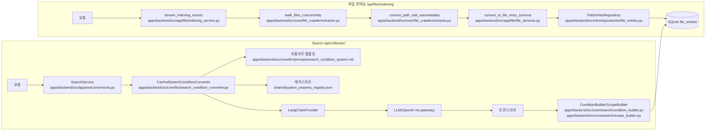

# Backend 파일 API + LLM 연결 구조 보고서

이 문서는 backend의 파일 관련 API가 실제로 어떻게 구성되어 있고 LLM이 어디에 연결되는지
빠르게 파악하기 위한 보고서입니다. 현재 파일 API는 대부분 디버깅/내부 확인 용도로 사용됩니다.

## 전체 흐름 요약

### Mermaid 다이어그램



### 1) 파일 인덱싱(내부/임시)

```
POST /api/files/indexing
  -> apps/backend/src/app/file/indexing_service.py (stream_indexing_events)
     -> apps/backend/src/core/file_crawler/extractor.py (walk_files_concurrently)
     -> apps/backend/src/core/file_crawler/extractor.py (convert_path_stat_osxmetadata)
     -> apps/backend/src/app/file/file_services.py (convert_to_file_entry_schema)
     -> apps/backend/src/infra/repositories/file_entries.py (FileEntriesRepository)
     -> SQLite file_entries 저장
```

- NDJSON 스트리밍으로 진행 상황을 반환합니다.
- 제외 경로는 `apps/backend/src/app/file/indexing_service.py`의 기본값과 요청 `exclude`로 제어합니다.

### 2) 파일 목록/단순 조회

```
GET /api/files/*
  -> apps/backend/src/app/file/routes.py
  -> apps/backend/src/infra/schemas/file_entry_schema.py 기반 조회
```

- 목록, 상세, 통계, 이름 contains 검색 등 단순 조회 중심입니다.

### 3) LLM 기반 자연어 → 조건 배열 (Search API)

```
POST /api/collection
  -> apps/backend/src/app/search/services.py (SearchService)
     -> apps/backend/src/core/llm/search_condition_converter.py
        -> apps/backend/src/core/llm/prompts/search_condition_system.md
        -> shared/system_property_registry.json
     -> apps/backend/src/core/search/condition_builder.py / scope_builder.py
     -> SQL 실행
```

- `/api/collection/filters`는 LLM 없이 조건을 그대로 적용합니다.

## API 요약

| 구분   | 메서드 | 경로                      | LLM 사용 | 목적/비고                             |
| ------ | ------ | ------------------------- | -------- | ------------------------------------- |
| Files  | GET    | `/api/files/`             | X        | 파일 목록 (페이지네이션, 확장자 필터) |
| Files  | GET    | `/api/files/db-size`      | X        | DB 파일 크기/레코드 수 (디버그용)     |
| Files  | GET    | `/api/files/stats`        | X        | 전체/확장자 통계 (디버그용)           |
| Files  | GET    | `/api/files/collection`   | X        | name_full contains 검색               |
| Files  | GET    | `/api/files/{file_id}`    | X        | 단일 파일 상세                        |
| Files  | POST   | `/api/files/indexing`     | X        | 인덱싱 NDJSON 스트림 (내부용)         |
| Search | POST   | `/api/collection`         | O        | 자연어 → 조건/스코프 (LLM)            |
| Search | POST   | `/api/collection/filters` | X        | 조건/스코프 직접 적용                 |

## LLM 구성 요소

- Provider 인터페이스: `apps/backend/src/core/llm/llm_provider.py`
- LangChain 래퍼: `apps/backend/src/core/llm/langchain_provider.py`
    - 기본 provider: `openai`
    - base_url: `apps/backend/src/app/config.py`의 `PUBLIC_GATEWAY_URL` 기반 (`/gateway/openai/v1`)
    - 기본 모델: `gpt-5-mini-2025-08-07`
- 조건 배열 생성기: `apps/backend/src/core/llm/search_condition_converter.py`
    - propertyKey, operator, value, scopes를 구조화 출력으로 생성
- 캐시 래퍼
    - `apps/backend/src/core/llm/search_condition_converter.py` 내 `CachedSearchConditionConverter`
      (query → 조건/스코프, 기본 100, 기존 조건/스코프가 있으면 캐시 미사용)

## 데이터/레지스트리

- 테이블: `file_entries`
    - 스키마: `apps/backend/src/infra/schemas/file_entry_schema.py`
    - 저장소: `apps/backend/src/infra/repositories/file_entries.py`
- 레지스트리 JSON
    - 기본 위치: `shared/system_property_registry.json`, `shared/property_condition_registry.json`
    - 환경변수 `REGISTRY_PATH`로 재정의 가능
    - 로더: `apps/backend/src/core/metadata/registry_loader.py`

## 주요 파일 위치

- 라우터
    - `apps/backend/src/app/file/routes.py`
    - `apps/backend/src/app/search/routes.py`
- 서비스/유틸
    - `apps/backend/src/app/file/indexing_service.py`
    - `apps/backend/src/app/file/file_services.py`
    - `apps/backend/src/app/search/services.py`
- LLM
    - `apps/backend/src/core/llm/`
    - `apps/backend/src/core/llm/prompts/`
- 레지스트리/메타데이터
    - `apps/backend/src/core/metadata/registry_loader.py`
    - `shared/*.json`
- 크롤러/메타데이터 수집
    - `apps/backend/src/core/file_crawler/`
    - `apps/backend/src/osxmetadata/`

## 주의 사항 (디버그/내부 용도 표시)

- `/api/files/indexing`은 `apps/backend/src/app/file/routes.py`에서
  “내부 테스트용 임시 엔드포인트”로 표기되어 있습니다.
- 파일 관련 API에는 LLM이 연결되어 있지 않고, LLM은 `/api/collection`에서만 사용됩니다.
