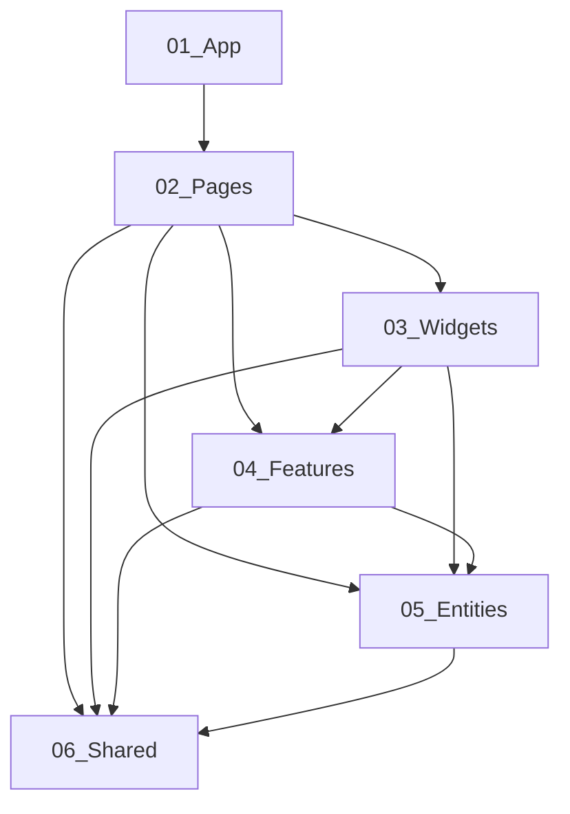
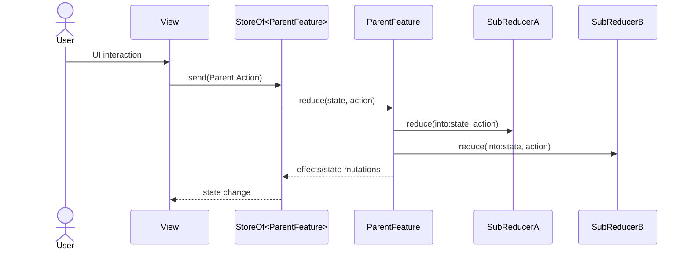

# macOS 앱 구조 (Voyager 타깃)

Voyager 타깃은 메인 프론트엔드 앱입니다. TCA를 기반으로 하되, 폴더 구성은 FSD(Feature-Sliced Design) 스타일을 차용합니다.

## 구조 원칙

- **TCA 중심**: Reducer/State/Action/Dependency를 기준으로 기능을 구성
- **FSD 차용**: 앱/페이지/피처/엔티티/공유 레이어로 분리
- **도메인 응집**: 같은 목적의 화면과 로직을 함께 묶음

## 레이어/세그먼트 정의 (프로젝트 기준)

- 레이어
    - App: 앱 진입점, 전역 커맨드/수명주기
    - Pages: 윈도우/스크린 컨테이너, 하위 레이어 조합/오케스트레이션
    - Widgets: 페이지 내부 섹션을 재사용 가능한 단위로 캡슐화
    - Features: 유즈케이스 단위 기능
    - Entities: 도메인 타입, 인프라
    - Shared: 공용 유틸/로직/디자인 시스템/아토믹 컴포넌트
- Slice: 비즈니스 영역 단위 (App/Shared는 단일 Slice)
- Segment: 도메인 내부 역할 구분 (예: `Entry/Ui`, `Composer/Reducer`)

## 주요 디렉터리

- `01_App/`: 앱 엔트리포인트, 앱 라이프사이클
- `02_Pages/`: 화면 단위 기능
- `04_Features/`: 범용 기능 모듈
- `05_Entities/`: 핵심 도메인 모델/리듀서/뷰
- `06_Shared/`: 공통 UI/유틸

## TCA → FSD 매핑 규칙

- Views → `Ui/` (NSViewRepresentable까지)
- 컨트롤러/코디네이터/델리게이트 → `Lib/`
- Clients → `Api/` (Environment 계열은 `01_App/Api` 또는 `06_Shared/Api`)
- Models → `Model/`
- Features(TCA Reducer) → `Reducer/`
- Utils → `Lib/` (Extension 방식, `{Domain}+{Category}.swift` 네이밍)

### 세그먼트별 책임(실전 기준)

세그먼트를 "폴더만 나누는 규칙"로 쓰기보다, 아래처럼 역할 경계를 명확히 잡는 것을 목표로 합니다.

- `Ui/`: SwiftUI 뷰 (가능하면 순수 렌더링 + 최소한의 이벤트 라우팅)
- `Reducer/`: `@Reducer`의 조립/오케스트레이션 (child `Scope` 구성, cancellation ID, effect routing)
- `Model/`: 도메인 타입(State/Action 포함), 화면/도메인 모델
- `Api/`: TCA Dependencies 클라이언트 (`DependencyKey`/`DependencyValues`, `liveValue`/`testValue`)
- `Lib/`: 유틸/헬퍼/확장
- `Config/`: 설정/디자인 토큰/상수 (예: `apps/macos/Voyager/Voyager/06_Shared/Config/VoyagerDS.swift`)

### 파일 네이밍(코딩 표준과 일치)

네이밍은 `docs/architecture/coding-standards.md`의 Swift 규칙을 따릅니다.

- Reducer: `*Feature.swift` (예: `apps/macos/Voyager/Voyager/02_Pages/Onboarding/Reducer/OnboardingFeature.swift`)
- Client: `*Client.swift` (예: `apps/macos/Voyager/Voyager/04_Features/Composer/Api/SearchClient.swift`)
- View: `*View.swift` (예: `apps/macos/Voyager/Voyager/05_Entities/Entry/Ui/EntryListView.swift`)
- Utils/Extension: `*Utils.swift` 또는 `Domain+Category.swift` (예: `EntryTagUtils.swift`, `EntryContextMenuContent+Sections.swift`)

## FSD 레이어 매핑 (실제 경로 기준)

아래는 `apps/macos/Voyager/Voyager` 내부의 현재 폴더 구조를 기준으로 한 매핑입니다.

| FSD Layer | 베이스 경로                               | 관측된 세그먼트                                                | 대표 TCA/파일 예시                                                                                                                                                                                                                                        |
| --------- | ----------------------------------------- | -------------------------------------------------------------- | --------------------------------------------------------------------------------------------------------------------------------------------------------------------------------------------------------------------------------------------------------- |
| App       | `apps/macos/Voyager/Voyager/01_App/`      | `Config/`, `Ui/`, `Lib/`, `Reducer/`, `Api/`                   | `apps/macos/Voyager/Voyager/01_App/Ui/VoyagerApp.swift`, `apps/macos/Voyager/Voyager/01_App/Reducer/AppLifecycleFeature.swift`                                                                                                                            |
| Pages     | `apps/macos/Voyager/Voyager/02_Pages/`    | 페이지별 `Api/`, `Lib/`, `Model/`, `Reducer/`, `Ui/`           | `apps/macos/Voyager/Voyager/02_Pages/FileManager/Reducer/FileManagerFeature.swift`, `apps/macos/Voyager/Voyager/02_Pages/Onboarding/Reducer/OnboardingFeature.swift`, `apps/macos/Voyager/Voyager/02_Pages/Settings/Reducer/SettingsFeature.swift`        |
| Widgets   | `apps/macos/Voyager/Voyager/03_Widgets/`  | 위젯별 `Api?`, `Lib/`, `Model/`, `Reducer/`, `Ui/`              | `apps/macos/Voyager/Voyager/03_Widgets/EntryViewLayout/Reducer/EntryViewLayoutFeature.swift`, `apps/macos/Voyager/Voyager/03_Widgets/EntryViewLayout/Ui/EntryListView.swift`                                                                              |
| Features  | `apps/macos/Voyager/Voyager/04_Features/` | 기능별 `Api/`, `Lib/`, `Model/`, `Reducer/`, `Ui/`             | `apps/macos/Voyager/Voyager/04_Features/Composer/Reducer/ComposerFeature.swift`, `apps/macos/Voyager/Voyager/04_Features/UpdateVersion/Reducer/UpdaterFeature.swift`, `apps/macos/Voyager/Voyager/04_Features/BetaAccess/Reducer/BetaAccessFeature.swift` |
| Entities  | `apps/macos/Voyager/Voyager/05_Entities/` | 엔티티별 `Api/`, `Lib/`, `Model/`, `Reducer/`, `Ui/`/`Config/` | `apps/macos/Voyager/Voyager/05_Entities/Entry/Reducer/EntriesFeature.swift`, `apps/macos/Voyager/Voyager/05_Entities/Collection/Reducer/CollectionFeature.swift`                                                                                          |
| Shared    | `apps/macos/Voyager/Voyager/06_Shared/`   | `Api/`, `Config/`, `Lib/`, `Model/`, `Assets/`                 | `apps/macos/Voyager/Voyager/06_Shared/Api/UserDefaultsClient.swift`, `apps/macos/Voyager/Voyager/06_Shared/Config/VoyagerDS.swift`                                                                                                                        |

## 레이어 간 의존성 규칙

레이어가 늘어도 구조가 무너지지 않게, 의존성 방향을 아래처럼 고정합니다.

- 원칙: 위 레이어는 아래 레이어에 의존할 수 있지만, 역방향 의존은 금지합니다.
- `01_App`/`02_Pages`는 오케스트레이션 레이어로 유지하고, 실제 도메인 로직은 `04_Features`/`05_Entities`로 내려보냅니다.

의존성 방향의 의미(명확화)

- `A -> B`는 "A 레이어 코드가 B 레이어 타입/함수/리듀서를 import/참조해 조립할 수 있다"는 의미입니다.
- 반대로 `B -> A` 참조가 생기면 역방향 의존 위반으로 봅니다.

레이어 순서(상위 -> 하위)

- `01_App` -> `02_Pages` -> `03_Widgets` -> `04_Features` -> `05_Entities` -> `06_Shared`

여기서 `04_Features`는 이름이 "기능"이라 상위로 들릴 수 있지만, FSD 레이어 정의에서는 `03_Widgets`보다 하위(더 기초/재사용) 레이어입니다.
따라서 `Widgets -> Features`는 허용, `Features -> Widgets`는 금지 방향입니다.

추가 규칙(강권)

- 같은 레이어의 서로 다른 slice 간 참조는 피합니다.
  - 예: `02_Pages/A` -> `02_Pages/B` 직접 참조 대신, 공통 로직/타입을 `06_Shared` 또는 더 하위 레이어로 내리기
- `01_App`/`06_Shared`는 예외적으로 slice 없이 세그먼트로 구성되는 레이어로 취급하며, 내부 세그먼트 간 의존은 허용합니다.

참고

- 아래 그래프는 "대표적인" 의존 관계만 표시합니다. 원칙상 `01_App`는 하위 레이어(`03_Widgets`/`04_Features`/`05_Entities`/`06_Shared`)를 직접 참조할 수 있습니다.

권장 의존성 방향



레이어별 역할/금지 사항 (요약)

- `01_App`: 앱 엔트리포인트/전역 커맨드/라이프사이클만; 비즈니스 로직을 쌓지 않기
- `02_Pages`: 화면 컨테이너/네비게이션/하위 레이어 조립; 엔티티의 세부 로직을 직접 구현하지 않기
- `03_Widgets`: 페이지 내부 재사용 UI 섹션; `Api/`를 두지 않고, 네트워크/스토리지는 상위에서 주입받기
- `04_Features`: 유즈케이스/흐름(검색/업데이트 등) 중심; 특정 페이지(UI 컨테이너)에 의존하지 않기
- `05_Entities`: 도메인(Entry/Collection 등) 중심; Page/Feature 의존 금지
- `06_Shared`: 공용 토큰/유틸/클라이언트; 프로젝트 어디서든 재사용 가능해야 함

### 모듈(슬라이스) 간 의존성 체크

Swift는 폴더가 "모듈 경계"를 강제하진 않지만, 코드 리뷰/리팩터링 비용을 낮추려면 아래 규칙을 지키는 것이 중요합니다.

- Slice 단위로 "상위 레이어가 하위 레이어를 조립"하도록 유지합니다.
    - 예: `02_Pages/FileManager`는 `05_Entities/Entry`, `05_Entities/Collection`, `04_Features/Composer`를 조립/연결합니다.
- `05_Entities/*`가 `04_Features/*`나 `02_Pages/*`에 의존(임포트)하지 않도록 유지합니다.
- `06_Shared/*`는 어디서든 가져다 쓸 수 있어야 하므로, 상위 레이어를 참조하지 않습니다.

현재 코드베이스에서 발견된 예외(정리 필요)

- `apps/macos/Voyager/Voyager/05_Entities/Entry/Lib/EntryDropDelegate.swift`의 `init(store: StoreOf<FileManagerFeature>, ...)`는 Entities 레이어가 Pages 타입(`FileManagerFeature`)을 직접 참조합니다.
  - 문서/규칙과의 정합성을 위해, 이 convenience initializer를 Pages 레이어로 옮기거나(Page에서 onDrop/isDropTarget 등을 조립), Entities 쪽에서는 `init(item:onDrop:isDropTarget:draggingPaths:)` 형태만 사용하도록 정리하는 것을 권장합니다.

## Widgets 레이어 가이드

`03_Widgets/`는 “페이지 내부 섹션을 재사용 가능한 단위로 캡슐화”하기 위한 레이어입니다.

권장 기준

- Widget으로 두기 좋은 것
    - 페이지 내부에서 반복되는 UI 섹션(예: Inspector pane 섹션, Sidebar 섹션 등)
    - 화면 조립을 단순화하는 View + 최소한의 프레젠테이션 로직
- Widget으로 두기 애매한 것(다른 레이어 권장)
    - 범용 컴포넌트/디자인 토큰: `06_Shared/`
    - 유즈케이스/네트워크/비동기 효과: `04_Features/`
    - 엔티티 도메인의 UI/모델: `05_Entities/<Domain>/Ui` 또는 `Model`

현재 상태

- `apps/macos/Voyager/Voyager/03_Widgets/`는 현재 `.gitkeep`만 존재합니다.
- Widget을 추가할 때는 “해당 Widget이 어느 Page/Feature의 반복 패턴을 줄이는지”를 먼저 정의하고 파일을 만듭니다.

## Reducer 설계 패턴 (향후 컨벤션)

현재 코드는 대부분 `@Reducer` 내부에 `State`/`Action`을 중첩 타입으로 정의합니다.
향후 확장성을 위해 아래 패턴을 컨벤션으로 채택합니다.

### State/Action 분리 + typealias 주입

목표

- `Reducer/`는 “리듀서 조립/오케스트레이션”에 집중
- `Model/`은 “도메인 타입(State/Action 포함)”을 담당
- 파일 길이/중첩이 커지는 문제를 구조적으로 해결

권장 파일 배치(예)

- `apps/macos/Voyager/Voyager/02_Pages/FileManager/Model/FileManagerState.swift`
- `apps/macos/Voyager/Voyager/02_Pages/FileManager/Model/FileManagerAction.swift`
- `apps/macos/Voyager/Voyager/02_Pages/FileManager/Reducer/FileManagerFeature.swift`

구현 스케치

```swift
import ComposableArchitecture

@ObservableState
struct FileManagerState: Equatable {
  // state...
}

@CasePathable
enum FileManagerAction: Sendable {
  // action...
}

@Reducer
struct FileManagerFeature {
  typealias State = FileManagerState
  typealias Action = FileManagerAction

  var body: some ReducerOf<Self> {
    Reduce { state, action in
      switch action {
      default:
        return .none
      }
    }
  }
}
```

주의사항

- `@Reducer`가 중첩 `Action`에 자동 적용하던 `@CasePathable`은 typealias 방식에서는 자동 주입이 어려우므로, 외부 `Action` enum에 `@CasePathable` 적용을 권장합니다.
- `@ObservableState` 역시 외부 `State`에 명시적으로 부여해야 합니다.

### 대형 Feature 분해: 부모(오케스트레이터) + 하위 리듀서 주입

문제

- Feature가 커질수록 `Feature+Something.swift` 형태의 extension 파일이 급증
- View/Reducer 결합이 느슨해지는 대신, “어디에 로직이 있는지” 추적이 어려워짐

해결: 오케스트레이터(부모) 리듀서 패턴

- 상위 부모 리듀서가 단일 진입점(Controller 역할)
- 하위 리듀서(서비스/컨트롤러 역할)를 init으로 주입받아 처리
- View는 부모 `Action`만 send (또는 부모 액션으로 래핑된 형태만 사용)

구현 스케치(개념)

```swift
import ComposableArchitecture

struct FileManagerNavigationReducer {
  func reduce(into state: inout FileManagerState, action: FileManagerAction) -> Effect<FileManagerAction> {
    // navigation concerns...
    return .none
  }
}

struct FileManagerSidebarReducer {
  func reduce(into state: inout FileManagerState, action: FileManagerAction) -> Effect<FileManagerAction> {
    // sidebar concerns...
    return .none
  }
}

@Reducer
struct FileManagerFeature {
  typealias State = FileManagerState
  typealias Action = FileManagerAction

  let navigation: FileManagerNavigationReducer
  let sidebar: FileManagerSidebarReducer

  init(
    navigation: FileManagerNavigationReducer = .init(),
    sidebar: FileManagerSidebarReducer = .init()
  ) {
    self.navigation = navigation
    self.sidebar = sidebar
  }

  var body: some ReducerOf<Self> {
    Reduce { state, action in
      .merge(
        navigation.reduce(into: &state, action: action),
        sidebar.reduce(into: &state, action: action)
      )
    }
  }
}
```

Mermaid로 보는 액션 흐름



## 네비게이션/라우팅 (윈도우/플로우)

Voyager는 macOS 특성상 "화면 전환"이 단일 NavigationStack만으로 끝나지 않고, 윈도우/패널/메뉴 커맨드 등으로 확장됩니다.

### App → Onboarding 흐름

- 앱 수명주기 리듀서가 런치 이후 온보딩 윈도우를 노출합니다.
    - 예시: `apps/macos/Voyager/Voyager/01_App/Reducer/AppLifecycleFeature.swift`
    - `didFinishLaunching`에서 `onboardingWindowClient.showIfNeeded()` 호출

### Onboarding → FileManager 윈도우 전환

- 온보딩 완료 시점에 `fileManagerWindowClient.openWindow(path)`로 메인 윈도우를 열고, 성공하면 온보딩 윈도우를 닫습니다.
    - 예시: `apps/macos/Voyager/Voyager/02_Pages/Onboarding/Reducer/OnboardingFeature.swift`

### FileManager 내부 라우팅(상태 기반)

- `FileManagerFeature.State.navigationState`로 현재 컨텍스트를 단일 값으로 유지합니다.
    - 예시: `apps/macos/Voyager/Voyager/02_Pages/FileManager/Reducer/FileManagerFeature.swift`
    - 케이스 예: `.folder`, `.recents`, `.tags`, `.computer`, `.collection`

권장 기준

- 라우팅 상태는 단일 소스(State)로 유지하고, 뷰는 state를 읽어 렌더링만 담당합니다.
- 윈도우 오픈/클로즈 같은 AppKit 연동은 `Api/*Client.swift`로 캡슐화한 뒤 `@Dependency`로 호출합니다.

## 사이드이펙트(Effect)와 취소(Cancellation)

### Effect 작성 원칙

- 비동기/IO는 `.run { send in ... }`로 감싸고, 성공/실패를 `Action`으로 되돌립니다.
- 장기 실행/반복 스트림은 cancellation ID를 부여해 수명주기에서 정리합니다.

실전 예시

- Helper 모니터링: `.cancellable(id: CancelID.helperMonitor, cancelInFlight: true)` + 종료 시 `.cancel(id:)`
  - `apps/macos/Voyager/Voyager/01_App/Reducer/AppLifecycleFeature.swift`
- 콜렉션 파일 열기: `.cancellable(id: CancelID.openCollectionFile, cancelInFlight: true)`
  - `apps/macos/Voyager/Voyager/02_Pages/FileManager/Reducer/FileManagerFeature.swift`

### CancelID 네이밍

- Feature 내부에 `enum CancelID: Hashable, Sendable`(또는 `private enum`)로 묶어서, 충돌/누수를 방지합니다.
- `cancelInFlight`는 "사용자가 동일 액션을 연속 실행할 수 있는지"를 기준으로 결정합니다.

## 의존성 주입(Dependencies) 실전 패턴

Voyager는 TCA Dependencies 패턴으로 "외부 세계"를 캡슐화합니다.

### Client 정의 위치

- 도메인에 가까운 클라이언트는 해당 Slice의 `Api/`에 둡니다.
    - 예: `apps/macos/Voyager/Voyager/04_Features/Composer/Api/SearchClient.swift`
    - 예: `apps/macos/Voyager/Voyager/05_Entities/Collection/Api/RegistryClient.swift`

### Client 도입 판정 기준(중요)

아래 중 하나라도 해당하면 Client(`Api/*Client.swift`)로 캡슐화합니다.

- 시스템 API/IO/외부 통신/프로세스 경계 접근
    - 파일시스템 읽기/쓰기/이동/삭제, 디렉토리 스캔, 메타데이터 조회
    - 권한/시스템 상태(Full Disk Access, Launch at Login, System Settings)
    - IPC/XPC/Helper 프로세스, 네트워크 호출
    - OS 전역 서비스(NSWorkspace, pasteboard, 전역 Notification)
- 비결정 값/환경 의존 값
    - 시간, UUID, 랜덤, 타이머/스케줄러
- 테스트에서 fake/stub로 대체해야 안정적으로 검증 가능한 의존성

아래는 기본적으로 Client 대상이 아닙니다.

- 순수 계산/정렬/필터링 같은 도메인 로직
- 외부 경계 없는 로컬 UI 상태/레이아웃/렌더링

### live/test 값 제공

- `DependencyKey`를 채택하고 `static let liveValue`를 제공합니다.
- 테스트 편의가 필요한 경우 `TestDependencyKey` + `testValue`를 추가합니다.

### 의존성 주입 사용처

- Reducer/View는 `@Dependency(\.fooClient)`로 접근합니다.
- 테스트에서는 `TestStore(... ) withDependencies: { $0.fooClient = ... }`로 오버라이드합니다.

## 테스트 (XCTest + TCA TestStore)

### 기본 원칙

- UI 없이 검증 가능한 로직은 `VoyagerTests/`에서 `TestStore`로 상태/액션/이펙트를 검증합니다.
- 네트워크/파일/윈도우 같은 외부 의존성은 반드시 fake로 주입합니다.

권장 패턴

- 상태 변화는 `store.send(...) { state in ... }`로 단언
- 이펙트 결과는 `store.receive(\.<case>)`로 단언

## 권장 패턴 vs 금지 패턴

| 주제              | 권장                                                             | 금지                                                                |
| ----------------- | ---------------------------------------------------------------- | ------------------------------------------------------------------- |
| 액션 설계         | View는 `StoreOf<ParentFeature>`에만 `send(Parent.Action)`        | View가 내부 세부 리듀서(서비스/헬퍼)의 액션을 직접 발화             |
| 대형 Feature 분해 | 부모(오케스트레이터)에서 `Scope`/서브리듀서 주입으로 관심사 분리 | `Feature+Something.swift` 확장이 무제한으로 늘어나 로직 위치가 분산 |
| 외부 의존성       | `Api/*Client.swift` + `@Dependency`로 캡슐화                     | 전역 싱글톤/정적 함수로 외부 호출을 흩뿌리기                        |
| Effect 수명       | `.cancellable(id:)`로 취소 가능한 구조                           | 장기 실행 Task/Notification 스트림을 방치                           |
| 레이어 의존성     | `App/Pages`는 조립, `Features/Entities`에 로직 집중              | `Entities`가 `Pages`에 의존하거나 `Shared`가 상위 레이어를 참조     |

### 새 모듈 추가 체크리스트

- 어디에 속하는가? (Page/Feature/Entity/Shared/Widget)
- Slice 이름은 도메인 기준으로 명확한가?
- Segment 분리(Api/Model/Reducer/Ui/Lib/Config)가 과도하지 않은가?
- State/Action 분리(typealias) 시, `@ObservableState`/`@CasePathable` 누락이 없는가?
- 부모 리듀서가 오케스트레이션만 하고, 하위 리듀서로 관심사를 위임하는가?

## 엔트리포인트

- `apps/macos/Voyager/Voyager/01_App/Ui/VoyagerApp.swift`
- `apps/macos/Voyager/Voyager/01_App/Reducer/AppLifecycleFeature.swift`

## TCA 구성 예시

- Reducer: `@Reducer`, `@ObservableState` 중심
- Dependency: `@Dependency`로 주입
- Effect: 구조적 동시성 + 취소

## 참고

- Helper/Backend 통합: `docs/macos/voyager-helper.md`

### 관련 문서

- 코딩 표준(네이밍/테스트): `docs/architecture/coding-standards.md`
- 소스 트리(폴더/세그먼트 정의): `docs/architecture/source-tree.md`
