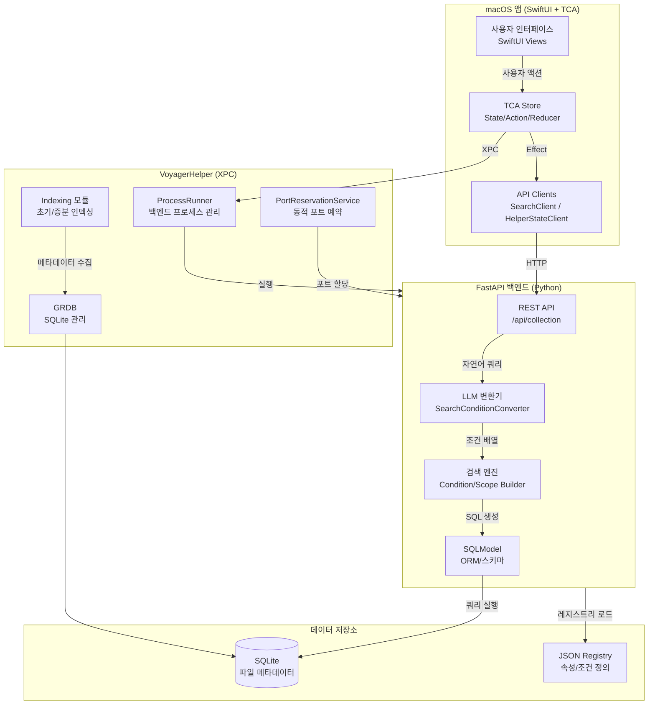
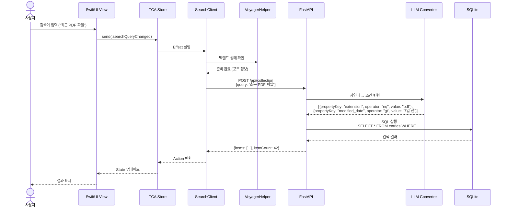
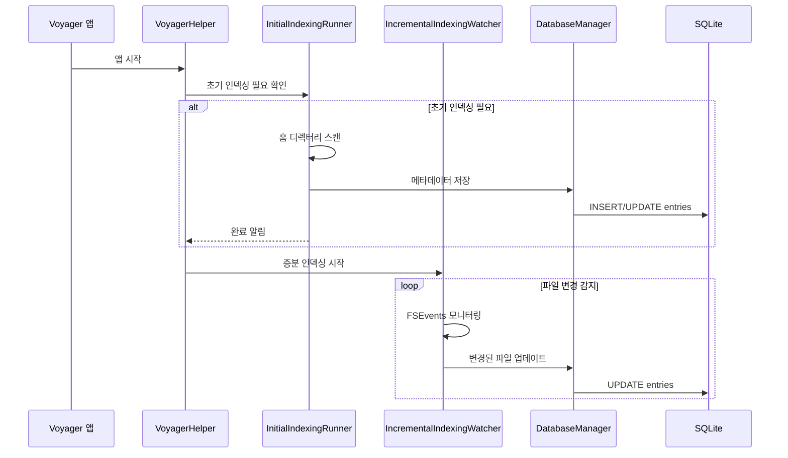
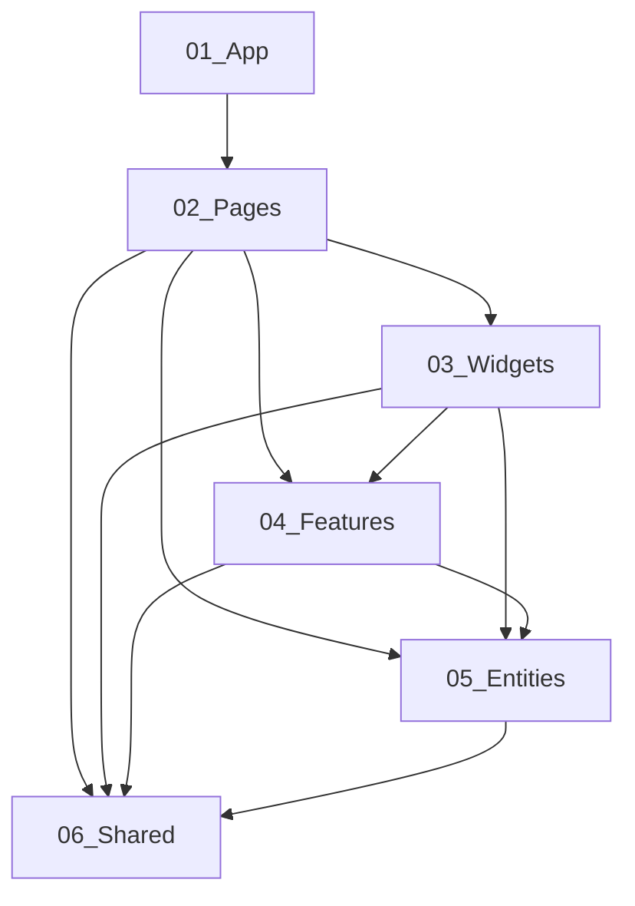
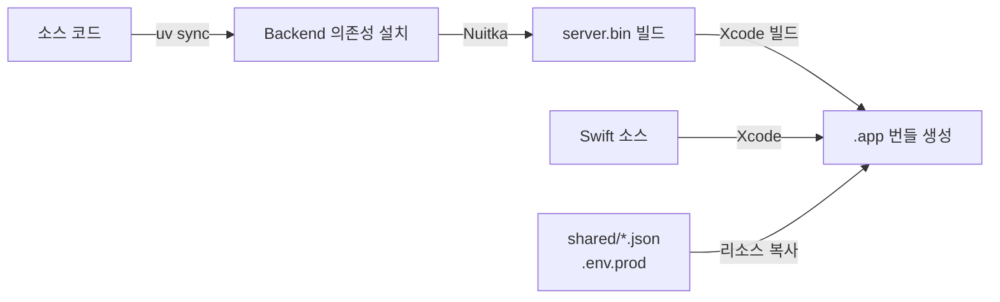

# 시스템 아키텍처 개요

Voyager는 macOS 앱과 Python FastAPI 백엔드가 결합된 로컬 파일 검색 시스템입니다. 사용자의 자연어 입력을 AI가 해석하여 정확한 파일 검색 조건으로 변환하고, 로컬 데이터베이스에서 빠르게 결과를 반환합니다.

## 시스템 아키텍처 다이어그램



## 구성 요소 상세

### 1. macOS 앱 (Voyager 타깃)

**역할**: 사용자 인터페이스와 전체 앱 상태 관리

**주요 기술**:
- **SwiftUI**: 선언적 UI 프레임워크로 반응형 인터페이스 구현
- **TCA (The Composable Architecture)**: 단방향 데이터 흐름과 예측 가능한 상태 관리
- **FSD (Feature-Sliced Design)**: 도메인 중심의 폴더 구조로 코드 조직화

**레이어 구조**:
- `01_App`: 앱 진입점, 전역 라이프사이클 관리
- `02_Pages`: 화면 단위 컨테이너 (FileManager, Onboarding, Settings)
- `03_Widgets`: 재사용 가능한 UI 섹션
- `04_Features`: 유즈케이스 중심 기능 (Composer, Updater, BetaAccess)
- `05_Entities`: 도메인 모델 (Entry, Collection)
- `06_Shared`: 공용 유틸리티, 클라이언트, 디자인 시스템

### 2. VoyagerHelper (Helper 타깃)

**역할**: 백엔드 프로세스 관리와 파일 인덱싱 수행

**주요 모듈**:
- **ProcessRunner**: 백엔드 프로세스 실행/모니터링/재시작
- **PortReservationService**: 동적 포트 예약 및 충돌 방지
- **Indexing 모듈**: 초기 인덱싱(전체 스캔)과 증분 인덱싱(변경 감지)
- **DatabaseManager**: GRDB 기반 SQLite 연결 풀 관리

**실행 모드**:
- **Source 모드**: 로컬 `uv` 환경에서 개발용으로 실행 (`uv run dev`)
- **Bundled 모드**: Nuitka로 빌드된 독립 바이너리 실행 (배포용)

### 3. FastAPI 백엔드

**역할**: 검색 API 제공과 AI 기반 쿼리 해석

**주요 모듈**:
- **Search Routes**: `/api/collection` 엔드포인트 제공
- **SearchConditionConverter**: LangChain 기반 LLM 호출로 자연어 → 조건 변환
- **ConditionBuilder**: 조건 배열 → SQL WHERE 절 변환
- **ScopeBuilder**: 검색 범위(경로) → SQL 조건 변환
- **Registry Loader**: JSON 레지스트리 로드 및 검증

**데이터 흐름**:
1. 자연어 쿼리 수신 (예: "최근 다운로드한 PDF")
2. LLM이 속성/연산자/값 추출 (예: `extension = pdf` + `date > 7일 전`)
3. 레지스트리 기반 SQL 생성
4. SQLite 쿼리 실행 및 결과 반환

## 데이터 흐름 상세 (사용자 액션 → 백엔드 응답)

### 검색 시나리오



### 인덱싱 시나리오



## 설계 원칙

### 1. 관심사 분리 (Separation of Concerns)

- **UI 레이어**: 순수하게 화면 렌더링과 사용자 입력 처리만 담당
- **비즈니스 로직**: TCA Reducer에서 상태 변화와 사이드 이펙트 관리
- **인프라 레이어**: API 클라이언트, 데이터베이스 접근은 별도 계층으로 분리
- **도메인 로직**: 백엔드에서 LLM 변환, SQL 생성 등 핵심 로직 처리

### 2. 단방향 데이터 흐름 (Unidirectional Data Flow)

```
User Action → TCA Action → Reducer → State Update → UI Re-render
                ↓
            Effect (Side Effect)
                ↓
        API Call / File Operation
                ↓
        Action Response → Reducer → State Update → UI Re-render
```

이 패턴으로 상태 변화를 예측 가능하게 만들고, 디버깅과 테스트를 용이하게 합니다.

### 3. 레이어 간 의존성 규칙



- 상위 레이어는 하위 레이어에 의존 가능
- 역방향 의존 금지 (Shared는 어디서든 사용 가능)
- 이 규칙으로 순환 의존성 방지와 모듈 독립성 유지

### 4. 환경 설정의 일관성

- **공통 키 체계**: macOS와 백엔드가 동일한 환경 변수 이름 사용
- **계층적 로딩**: `.env.{mode}` → `.env.{env}` 순서로 로드
- **시크릿 분리**: `.env.dev`는 로컬 개발용(시크릿 포함, Git 무시), `.env.prod`는 배포용(시크릿 제외)

### 5. AI/LLM 통합 전략

- **프롬프트 엔지니어링**: 레지스트리 기반으로 LLM이 일관된 조건 생성
- **Fallback 메커니즘**: LLM 변환 실패 시 수동 조건 입력 가능
- **비용 최적화**: 로컬 캐싱과 선택적 LLM 호출로 API 비용 절감

## 기술 통합 포인트

### macOS ↔ Helper 통신 (XPC)

- **방식**: XPC (Inter-Process Communication)
- **목적**: Helper 프로세스 생명주기 관리, 상태 브로드캐스트
- **데이터**: 백엔드 URL, 준비 상태, 인덱싱 진행률

### Helper ↔ Backend 통신 (HTTP + 파일 시스템)

- **방식**: HTTP REST API + SQLite 파일 공유
- **목적**: 검색 요청/응답, 메타데이터 저장
- **특징**: Helper가 백엔드 프로세스를 직접 실행하므로 동적 포트 예약 필요

### Backend ↔ LLM 통신 (OpenAI API)

- **방식**: LangChain 기반 OpenAI API 호출
- **목적**: 자연어 쿼리를 구조화된 검색 조건으로 변환
- **최적화**: 프롬프트에 레지스트리 컨텍스트 포함으로 정확도 향상

### Shared Registry (JSON)

- **파일**: `shared/system_property_registry.json`, `shared/property_condition_registry.json`
- **목적**: macOS와 백엔드가 동일한 속성/조건 정의 공유
- **배포**: Xcode 리소스와 Nuitka 빌드에 모두 포함

## 배포 아키텍처 개요

### 개발 환경 (Dev)

```
┌─────────────────────────────────────────────────────────────┐
│  macOS 앱 (Xcode Debug)                                      │
│  ├── Voyager.app (SwiftUI + TCA)                            │
│  └── VoyagerHelper.app (XPC)                                │
│       └── 백엔드: uv run dev (로컬 Python)                    │
└─────────────────────────────────────────────────────────────┘
```

- **특징**: 소스 코드 수정 시 즉시 반영, 디버깅 용이
- **요구사항**: 로컬에 Python 3.13 + uv 설치 필요
- **환경**: `.env.dev` 사용 (시크릿 포함)

### 프로덕션 환경 (Prod)

```
┌─────────────────────────────────────────────────────────────┐
│  Voyager.app (Release Build)                                │
│  ├── Voyager (SwiftUI + TCA)                                │
│  └── VoyagerHelper.app                                      │
│       ├── server.bin (Nuitka 빌드된 Python 바이너리)        │
│       ├── shared/*.json (레지스트리)                        │
│       └── .env.prod (설정 템플릿)                           │
└─────────────────────────────────────────────────────────────┘
```

- **특징**: 독립 실행 가능한 단일 앱 번들
- **백엔드**: Nuitka로 컴파일된 바이너리 (Python 인터프리터 불필요)
- **배포**: Mac App Store 또는 직접 배포 가능
- **환경**: `.env.prod` + 런타임 환경 변수 (시크릿은 Keychain 등으로 주입)

### 빌드 파이프라인



## 라이프사이클 흐름

### 앱 시작 시퀀스

1. **macOS 앱 시작**: `VoyagerApp.swift` 진입점 실행
2. **Helper 구동**: XPC로 Helper 프로세스 시작 요청
3. **환경 로딩**: `.env` 파일 로드 (SwiftDotenv)
4. **백엔드 실행**: ProcessRunner가 source/bundled 모드로 백엔드 시작
5. **포트 예약**: PortReservationService가 동적 포트 할당
6. **준비 확인**: 백엔드 헬스체크 후 상태 브로드캐스트
7. **초기 인덱싱**: 필요 시 InitialIndexingRunner 실행
8. **증분 인덱싱**: IncrementalIndexingWatcher 시작
9. **API 호출 가능**: 사용자 검색/조작 시작

### 앱 종료 시퀀스

1. **사용자 종료 요청**: Cmd+Q 또는 메뉴 선택
2. **상태 저장**: TCA Store의 지속 가능한 상태 저장
3. **Helper 종료**: 백엔드 프로세스 graceful shutdown
4. **리소스 정리**: 데이터베이스 연결 종료, 파일 핸들 해제
5. **앱 종료**: 프로세스 완전 종료

## 보안 아키텍처

### 시크릿 관리

- **커밋 금지**: `.env.dev`는 Git 무시 (시크릿 포함)
- **런타임 주입**: 프로덕션은 환경 변수나 Keychain에서 시크릿 로드
- **로그 마스킹**: API 키, 토큰은 로그에 노출되지 않음

### 파일 시스템 접근

- **샌드박스**: macOS 앱 샌드박스 정책 준수
- **권한 요청**: 사용자 홈 디렉터리 접근 시 권한 명시적 요청
- **최소 권한**: 필요한 경로만 접근, 나머지는 제한

### 데이터 보호

- **로컬 저장**: 모든 메타데이터는 로컬 SQLite에만 저장
- **외부 전송 금지**: 사용자 파일 정보는 외부로 전송되지 않음 (LLM은 쿼리 텍스트만 처리)

## 확장성 고려사항

### 향후 확장 가능 영역 (조정 필요)

1. **벡터 검색**: 임베딩 기반 의미 검색 추가
2. **클라우드 동기화**: iCloud Drive나 Dropbox 인덱싱
3. **플러그인 시스템**: 사용자 정의 속성/조건 추가
4. **팀 공유**: 검색 결과나 컬렉션 공유 기능

### 아키텍처적 준비

- **모듈화**: FSD 레이어 구조로 기능 추가가 용이
- **레지스트리 기반**: 새 속성 추가가 JSON 수정만으로 가능
- **TCA 패턴**: 새로운 Feature 추가가 표준화된 패턴으로 가능

## 관련 문서

- [macOS 앱 구조](macos-app.md): TCA + FSD 상세 구조
- [기술 스택](tech-stack.md): 사용 기술 상세 목록
- [소스 트리](source-tree.md): 디렉터리 구조
- [환경 설정](environment.md): ENV 변수 상세
- [Registry JSON](registries.md): 속성/조건 레지스트리 스펙
- [Helper ↔ Backend 부트스트랩](../integration/backend-bootstrap.md): 통합 상세
- [검색 기능](../features/search.md): 검색 기능 상세
- [인덱싱 기능](../features/indexing.md): 인덱싱 상세
