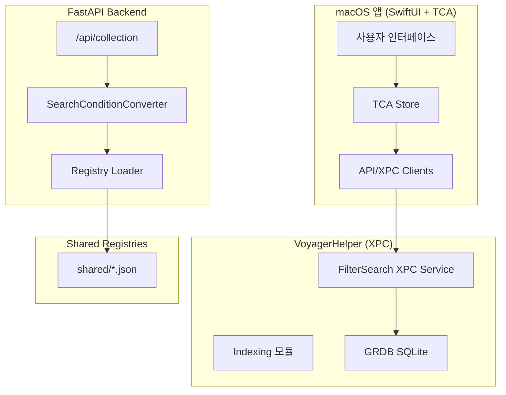
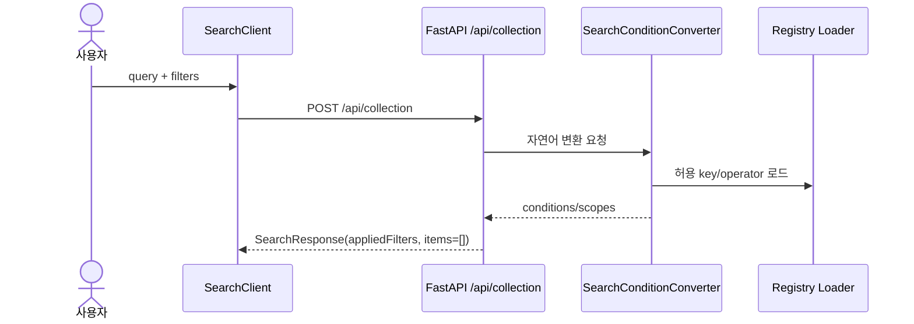

# 시스템 아키텍처 개요

Voyager는 macOS 앱(메인 앱 + Helper/XPC)과 Python FastAPI backend로 구성됩니다.

- macOS 런타임 검색: Helper DB/인덱싱 + XPC 검색 경로
- backend 검색 API: `/api/collection` convert-only(LLM 조건 변환/오케스트레이션)

## 시스템 아키텍처 다이어그램

## 구성 요소 상세

### 1) macOS 앱 (Voyager)

- SwiftUI + TCA 기반 상태 관리
- 사용자 검색 입력/필터 편집/결과 렌더링 담당
- Helper/XPC 및 backend API와 통신

### 2) VoyagerHelper

- 파일 인덱싱(초기/증분) 수행
- 로컬 SQLite(GRDB) 유지
- XPC 검색 서비스 제공

### 3) FastAPI backend

- `/api/collection` endpoint 제공
- 자연어 query를 `appliedFilters`로 변환
- 로컬 SQLite 검색 실행은 담당하지 않음(convert-only)

## backend 검색 흐름

## 설계 원칙

### 1) 관심사 분리

- UI/상태 관리는 macOS 앱
- 인덱싱/로컬 검색 런타임은 Helper
- LLM 조건 변환 API는 backend

### 2) 계약 중심 API

- backend는 필터 계약(`SearchCondition`, `SearchFilters`, `SearchResponse`)을 유지
- 현재는 점진 전환 단계로 `items=[]`를 반환

### 3) 레지스트리 SSOT

- `shared/system_property_registry.json`
- `shared/property_condition_registry.json`

## 환경/배포 요약

### 개발 환경

- backend: `cd apps/backend && uv run dev`
- macOS: Xcode scheme 기반 실행
- `.env.dev`/`.env.prod` 중심 로딩

### 배포 환경

- macOS 앱 릴리즈와 backend 서버 릴리즈는 분리
- backend 서버 설정은 서버 런타임 환경에서 관리

## 보안/운영

- 시크릿은 `.env.dev` 또는 CI/배포 환경 변수로만 주입
- `.env.prod`에는 시크릿을 커밋하지 않음
- 검색 실패는 HTTP status + 응답 `error`를 함께 점검

## 관련 문서

- [macOS 앱 구조](macos-app.md)
- [소스 트리](source-tree.md)
- [환경 설정](environment.md)
- [Registry JSON](registries.md)
- [검색 기능](../features/search.md)
- [인덱싱 기능](../features/indexing.md)
