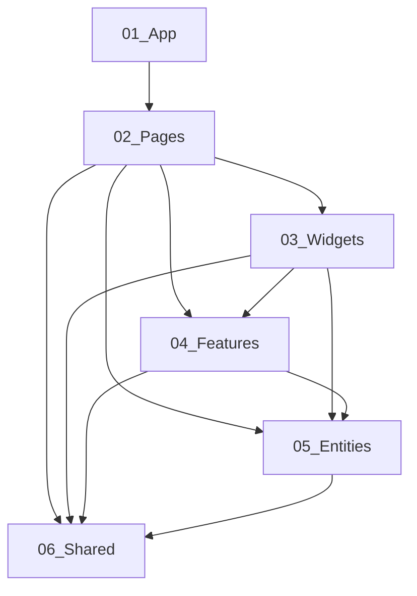

# 소스 트리

Voyager 프로젝트는 모노레포 구조로 구성되어 있으며, macOS 앱(프론트엔드)과 Python FastAPI 백엔드로 이루어진 로컬 파일 검색 시스템입니다. 이 문서는 각 디렉터리의 목적과 구조적 결정의 근거를 상세히 설명합니다.

## 개요

```
voyager-app/
├─ apps/
│  ├─ backend/                 # FastAPI 백엔드 서비스
│  │  ├─ src/
│  │  │  ├─ app/                # 엔트리포인트/라우터/CLI
│  │  │  ├─ core/               # 검색/LLM/메타데이터 로직
│  │  │  ├─ infra/              # DB/스키마/리포지토리
│  │  │  └─ utils/              # 공유 유틸리티
│  │  ├─ tests/                 # 테스트 파일
│  │  ├─ notebooks/             # Jupyter 노트북 (실험/분석)
│  │  └─ README.md
│  └─ macos/
│     └─ Voyager/               # macOS 앱 + Helper
│        ├─ Voyager/            # 메인 SwiftUI 앱 (TCA + FSD)
│        ├─ VoyagerHelper/      # Helper 앱 (백엔드 실행/인덱싱)
│        ├─ VoyagerTests/       # 단위 테스트
│        ├─ VoyagerUITests/     # UI 테스트
│        ├─ Shared/             # 타깃 간 공유 코드
│        └─ README.md
├─ docs/                        # 문서 (PRD/아키텍처/기능)
├─ shared/                      # 레지스트리 JSON 파일
├─ scripts/                     # 빌드/CI 스크립트
├─ .agents/rules/               # 에이전트/자동화 규칙
├─ .agents/skills/              # AI 에이전트 스킬 정의(실체)
└─ .claude/skills -> ../.agents/skills  # 호환용 심볼릭 링크
```

---

## apps/backend/ - FastAPI 백엔드

백엔드는 Python 기반의 FastAPI 서비스로, 파일 검색 API와 LLM 기반 조건 변환을 담당합니다.

### 디렉터리 구조

```
apps/backend/
├─ src/
│  ├─ app/                      # 애플리케이션 레이어
│  │  ├─ main.py                # FastAPI 엔트리포인트
│  │  ├─ cli.py                 # CLI 명령어
│  │  ├─ config.py              # 설정 로더
│  │  ├─ server.py              # 서버 실행 로직
│  │  └─ search/                # 검색 도메인
│  │     ├─ routes.py           # API 라우트
│  │     ├─ services.py         # 비즈니스 로직
│  │     ├─ schemas.py          # Pydantic 스키마
│  │     └─ __init__.py
│  ├─ core/                     # 핵심 도메인 로직
│  │  ├─ metadata/              # 메타데이터 처리
│  │  │  ├─ registry_loader.py    # 레지스트리 로더
│  │  │  └─ __init__.py
│  │  └─ llm/                   # LLM 통합
│  │     ├─ search_condition_converter.py  # 검색 조건 변환
│  │     ├─ langchain_provider.py          # LangChain 프로바이더
│  │     └─ prompts/                       # 프롬프트 템플릿
│  └─ infra/                    # 인프라스트럭처 레이어
│     └─ __init__.py
├─ tests/                       # 테스트
│  ├─ test_search_service_convert_only.py
│  ├─ test_system_property_registry.py
│  └─ __pycache__/
├─ notebooks/                   # Jupyter 노트북
│  └─ voy-*/                    # 이슈별 실험 노트북
├─ pyproject.toml               # 프로젝트 설정
├─ .python-version              # Python 버전
└─ .pre-commit-config.yaml      # pre-commit 설정
```

### 구조적 결정의 근거

**레이어 분리 (app/core/infra/utils)**

- `app/`: HTTP 요청/응답, 라우팅, CLI 등 외부 세계와의 인터페이스
- `core/`: 순수한 비즈니스 로직, 외부 의존성 없음
- `infra/`: DB, 외부 API 등 기술적 인프라
- `utils/`: 공유 유틸리티 함수

이 분리는 "의존성 역전 원칙"을 따릅니다. `core`는 `infra`에 의존하지 않고, `infra`가 `core`의 인터페이스를 구현합니다.

**파일 네이밍 규칙**

- 모듈: `snake_case.py` (e.g., `condition_builder.py`)
- 테스트: `test_*.py` 또는 `*_test.py`
- 클래스: `PascalCase` (e.g., `SearchConditionConverter`)
- 함수/변수: `snake_case` (e.g., `build_condition`)

**임포트 패턴**

```python
# 절대 임포트 권장
from app.search.services import SearchService
from core.metadata.registry_loader import load_system_property_registry

# 상대 임포트는 같은 패키지 내에서만
from .schemas import QuerySearchRequest
```

---

## apps/macos/Voyager/ - macOS 앱

macOS 앱은 두 개의 타깃으로 구성됩니다: 메인 앱(Voyager)과 Helper 앱(VoyagerHelper).

### Voyager 타깃 (메인 앱)

TCA(The Composable Architecture) 기반의 SwiftUI 앱으로, FSD(Feature-Sliced Design) 스타일의 폴더 구조를 사용합니다.

```
apps/macos/Voyager/Voyager/
├─ 01_App/                      # 앱 레이어 (엔트리포인트/라이프사이클)
│  ├─ Ui/
│  │  ├─ VoyagerApp.swift       # @main 엔트리포인트
│  │  ├─ AppMenuCommands.swift  # 앱 메뉴 명령
│  │  ├─ EditMenuCommands.swift # 편집 메뉴 명령
│  │  └─ ViewMenuCommands.swift # 보기 메뉴 명령
│  ├─ Reducer/
│  │  └─ AppLifecycleFeature.swift  # 앱 라이프사이클 리듀서
│  ├─ Lib/
│  │  └─ AppDelegate.swift      # 앱 델리게이트
│  └─ Api/
│     ├─ HelperAppClient.swift  # Helper 앱 클라이언트
│     └─ HelperStateClient.swift # Helper 상태 클라이언트
├─ 02_Pages/                    # 페이지 레이어 (화면 컨테이너)
│  ├─ FileManager/              # 파일 관리자 페이지
│  │  ├─ Ui/                    # 뷰
│  │  ├─ Reducer/               # 리듀서
│  │  ├─ Api/                   # 클라이언트
│  │  └─ Lib/                   # 유틸리티
│  ├─ Onboarding/               # 온보딩 페이지
│  │  ├─ Ui/
│  │  ├─ Reducer/
│  │  ├─ Api/
│  │  └─ Model/                 # 모델
│  └─ Settings/                 # 설정 페이지
│     ├─ Ui/
│     ├─ Reducer/
│     └─ Api/
├─ 03_Widgets/                  # 위젯 레이어 (재사용 UI 섹션)
│  └─ .gitkeep                  # 현재 비어있음
├─ 04_Features/                 # 기능 레이어 (유즈케이스)
│  ├─ Composer/                 # 컴포저 기능
│  │  ├─ Reducer/
│  │  ├─ Api/
│  │  └─ Ui/
│  ├─ UpdateVersion/            # 업데이트 기능
│  │  ├─ Reducer/
│  │  └─ Api/
│  └─ BetaAccess/               # 베타 접근 기능
│     ├─ Reducer/
│     └─ Ui/
├─ 05_Entities/                 # 엔티티 레이어 (도메인)
│  ├─ Entry/                    # 파일 엔트리 도메인
│  │  ├─ Model/                 # Entry 모델
│  │  ├─ Reducer/               # EntriesFeature
│  │  ├─ Api/                   # EntryClient
│  │  ├─ Ui/                    # Entry 뷰
│  │  └─ Lib/                   # 유틸리티
│  ├─ Collection/               # 컬렉션 도메인
│  │  ├─ Model/
│  │  ├─ Reducer/
│  │  └─ Api/
│  └─ Settings/                 # 설정 도메인
│     ├─ Api/
│     └─ Config/
└─ 06_Shared/                   # 공유 레이어
   ├─ Api/                      # 공유 클라이언트
   ├─ Config/                   # 디자인 시스템/설정
   ├─ Lib/                      # 공유 유틸리티
   └─ Model/                    # 공유 모델
```

### FSD 레이어 의존성 규칙



**의존성 방향**: 위 레이어는 아래 레이어에 의존할 수 있지만, 역방향 의존은 금지됩니다.

### 세그먼트 네이밍 규칙

각 슬라이스(도메인) 내에서 파일 역할에 따라 세그먼트를 분리합니다:

| 세그먼트   | 목적                          | 예시                                     |
| ---------- | ----------------------------- | ---------------------------------------- |
| `Api/`     | 클라이언트/네트워크/외부 통신 | `EntryClient.swift`                      |
| `Model/`   | 도메인 모델/타입              | `Entry.swift`, `EntryActionRecord.swift` |
| `Reducer/` | TCA 리듀서                    | `EntriesFeature.swift`                   |
| `Ui/`      | SwiftUI 뷰                    | `EntryListView.swift`                    |
| `Lib/`     | 유틸리티/헬퍼                 | `EntryDropDelegate.swift`                |
| `Config/`  | 설정/상수                     | `SettingsKeys.swift`                     |

### 파일 네이밍 규칙

- **Swift 파일**: `PascalCase.swift` (e.g., `EntryClient.swift`)
- **리듀서**: `*Feature.swift` (e.g., `EntriesFeature.swift`)
- **클라이언트**: `*Client.swift` (e.g., `EntryClient.swift`)
- **뷰**: `*View.swift` (e.g., `EntryListView.swift`)
- **모델**: `PascalCase.swift` (e.g., `Entry.swift`)
- **유틸리티**: `*Utils.swift` 또는 `*+Category.swift` (e.g., `EntryTagUtils.swift`)

### TCA 구성 패턴

**State/Action 분리 + typealias 주입** (권장 패턴):

```swift
// Model/FileManagerState.swift
@ObservableState
struct FileManagerState: Equatable {
  var entries: [Entry] = []
  var selectedIds: Set<UUID> = []
}

// Model/FileManagerAction.swift
@CasePathable
enum FileManagerAction: Sendable {
  case onAppear
  case entryTapped(UUID)
  case searchQueryChanged(String)
}

// Reducer/FileManagerFeature.swift
@Reducer
struct FileManagerFeature {
  typealias State = FileManagerState
  typealias Action = FileManagerAction

  var body: some ReducerOf<Self> {
    Reduce { state, action in
      // 리듀서 로직
    }
  }
}
```

---

## apps/macos/Voyager/VoyagerHelper/ - Helper 앱

Helper 앱은 백엔드 프로세스를 실행하고 모니터링하며, 파일 인덱싱을 수행하는 XPC 서비스 역할을 합니다.

```
apps/macos/Voyager/VoyagerHelper/
├─ Infrastructure/              # 인프라스트럭처
│  ├─ Indexing/                 # 인덱싱 관련
│  │  ├─ InitialIndexingRunner.swift
│  │  ├─ IncrementalIndexingWatcher.swift
│  │  ├─ IncrementalIndexingEventPlanner.swift
│  │  ├─ IncrementalIndexingEventExecutor.swift
│  │  ├─ IncrementalIndexingValidator.swift
│  │  ├─ XattrMetadataReader.swift
│  │  ├─ InitialIndexingRecordBuilder.swift
│  │  ├─ MetadataJSONEncoder.swift
│  │  └─ IndexingRecovery.swift
│  ├─ Database/                 # 데이터베이스
│  │  ├─ DatabaseManager.swift
│  │  ├─ DatabaseMigrations.swift
│  │  ├─ IndexingDatabasePragmas.swift
│  │  ├─ Schema/                # 스키마 정의
│  │  │  ├─ EntriesSchema.swift
│  │  │  └─ IndexingStateSchema.swift
│  │  ├─ Records/               # 레코드 타입
│  │  │  └─ EntryRecord.swift
│  │  └─ Migrations/            # SQL 마이그레이션
│  │     └─ 20260120_v001.sql
│  ├─ HelperStateBroadcaster.swift
│  └─ HelperFolderAccessListener.swift
├─ Assets.xcassets/             # 에셋
├─ Info.plist                   # Info.plist
├─ VoyagerHelperApp.swift       # @main 엔트리포인트
```

---

## docs/ - 문서

AI 에이전트와 개발자를 위한 문서를 포함합니다.

```
docs/
├─ index.md                     # 문서 인덱스/진입점
├─ development.md               # 개발 가이드
├─ deployment.md                # 배포 가이드
├─ testing.md                   # 테스트 가이드
├─ troubleshooting.md           # 문제 해결
├─ architecture/                # 아키텍처 문서
│  ├─ overview.md               # 시스템 개요
│  ├─ source-tree.md            # 소스 트리 (본 문서)
│  ├─ macos-app.md              # macOS 앱 구조
│  ├─ tech-stack.md             # 기술 스택
│  ├─ coding-standards.md       # 코딩 표준
│  ├─ environment.md            # 환경 설정
│  └─ registries.md             # 레지스트리 시스템
├─ features/                    # 기능 문서
│  ├─ search.md                 # 검색 기능
│  ├─ indexing.md               # 인덱싱 기능
│  ├─ onboarding.md             # 온보딩
│  ├─ settings.md               # 설정
│  ├─ entries-collections.md    # 엔트리/컬렉션
│  ├─ composer.md               # 컴포저
│  └─ update.md                 # 업데이트
├─ macos/                       # macOS 특화 문서
│  └─ voyager-helper.md         # Helper 문서
└─ integration/                 # 통합 문서
   └─ backend-bootstrap.md      # 백엔드 부트스트랩
```

---

## shared/ - 공유 레지스트리

프론트엔드와 백엔드가 공유하는 JSON 레지스트리 파일들입니다.

```
shared/
├─ system_property_registry.json    # 시스템 속성 레지스트리
└─ property_condition_registry.json # 속성 조건 레지스트리
```

이 파일들은 검색 조건 빌딩에 사용되는 메타데이터를 정의합니다.

---

## scripts/ - 빌드 및 CI 스크립트

```
scripts/
├─ build/                       # 빌드 스크립트
│  └─ copy-bundled-env-files.sh     # 환경 파일 복사
├─ ci/                          # CI 스크립트
│  ├─ build-archive.sh              # 아카이브 빌드
│  ├─ create-dmg.sh                 # DMG 생성
│  ├─ create-sparkle-zip.sh         # Sparkle ZIP 생성
│  ├─ export-macos-app.sh           # macOS 앱보내기
│  ├─ generate-latest-json.sh       # latest.json 생성
│  ├─ generate-sparkle-appcast.sh   # Sparkle appcast 생성
│  ├─ notarize-and-staple-dmg.sh    # 공증/스테이플
│  ├─ resolve-sparkle-baseline.sh   # 베이스라인 해결
│  ├─ resolve-sparkle-baseline-versions.py
│  ├─ resolve-version-from-tag.sh   # 태그에서 버전 추출
│  └─ rewrite-sparkle-appcast-urls.py
└─ xcodes.sh                    # Xcode 버전 관리
```

---

## .agents/rules/ - 에이전트 실행 규칙

사람용 튜토리얼이 아니라 AI 에이전트가 직접 실행할 때 참고하는 계약형 규칙입니다.

```
.agents/rules/
├─ README.md                    # 로드 순서와 운영 원칙
├─ 00-core/                     # 항상 적용되는 전역 규칙
│  ├─ 00-execution-contract.md
│  ├─ 01-safety-and-secrets.md
│  ├─ 02-verification.md
├─ 10-routing/                  # 작업 경로 기반 규칙 라우팅
│  └─ 00-routing.md
├─ 20-backend/                  # 백엔드 도메인 규칙
│  ├─ 00-backend-rules.md
│  ├─ 01-api-and-schemas.md
│  └─ 02-migrations-and-config.md
├─ 30-macos/                    # macOS 도메인 규칙
│  ├─ 00-macos-rules.md
│  └─ 01-http-and-env.md
└─ 99-agent/                    # 규칙 작성/품질 관리
   └─ 00-rule-authoring.md
```

---

## .agents/skills/ - AI 에이전트 스킬

OpenCode/Claude 에이전트를 위한 스킬 정의입니다.
`.claude/skills`는 이 디렉터리를 가리키는 호환용 심볼릭 링크입니다.

```
.agents/skills/
├─ commit-message/              # 커밋 메시지 생성
│  ├─ SKILL.md
│  └─ scripts/
├─ pr-review/                   # PR 리뷰
│  └─ SKILL.md
├─ test-runner/                 # 테스트 실행
│  └─ SKILL.md
├─ bug-triage/                  # 버그 트리아지
│  └─ SKILL.md
├─ changelog/                   # 변경 로그
│  └─ SKILL.md
└─ voyager-dev/                  # Voyager macOS TCA/FSD 통합 스킬
   └─ SKILL.md
```

---

## 구조적 원칙 요약

### 1. 모노레포 구조

- `apps/`: 애플리케이션 코드 (backend, macos)
- `docs/`: 문서
- `shared/`: 공유 데이터
- `scripts/`: 자동화 스크립트
- `.agents/rules/`: IDE/에이전트 규칙
- `.agents/skills/`: AI 스킬(실체)
- `.claude/skills`: `.agents/skills/`를 가리키는 호환용 심볼릭 링크

### 2. 백엔드 레이어 분리

- `app/`: 외부 인터페이스 (HTTP/CLI)
- `core/`: 비즈니스 로직
- `infra/`: 기술 인프라
- `utils/`: 공유 유틸리티

### 3. 프론트엔드 FSD + TCA

- `01_App/`: 앱 엔트리포인트
- `02_Pages/`: 화면 컨테이너
- `03_Widgets/`: 재사용 UI 섹션
- `04_Features/`: 유즈케이스
- `05_Entities/`: 도메인 모델
- `06_Shared/`: 공유 컴포넌트

### 4. 파일 네이밍 일관성

- **Python**: `snake_case.py`, `PascalCase` 클래스
- **Swift**: `PascalCase.swift`, `PascalCase` 타입
- **문서**: `kebab-case.md`
- **스크립트**: `kebab-case.sh`

### 5. 의존성 방향

- 위 레이어 → 아래 레이어 의존 가능
- 역방향 의존 금지
- 순환 의존 금지

---

## 관련 문서

- [시스템 아키텍처 개요](overview.md) - 전체 시스템 구조
- [macOS 앱 구조](macos-app.md) - FSD/TCA 상세 가이드
- [기술 스택](tech-stack.md) - 사용 기술 목록
- [코딩 표준](coding-standards.md) - 코드 작성 규칙
