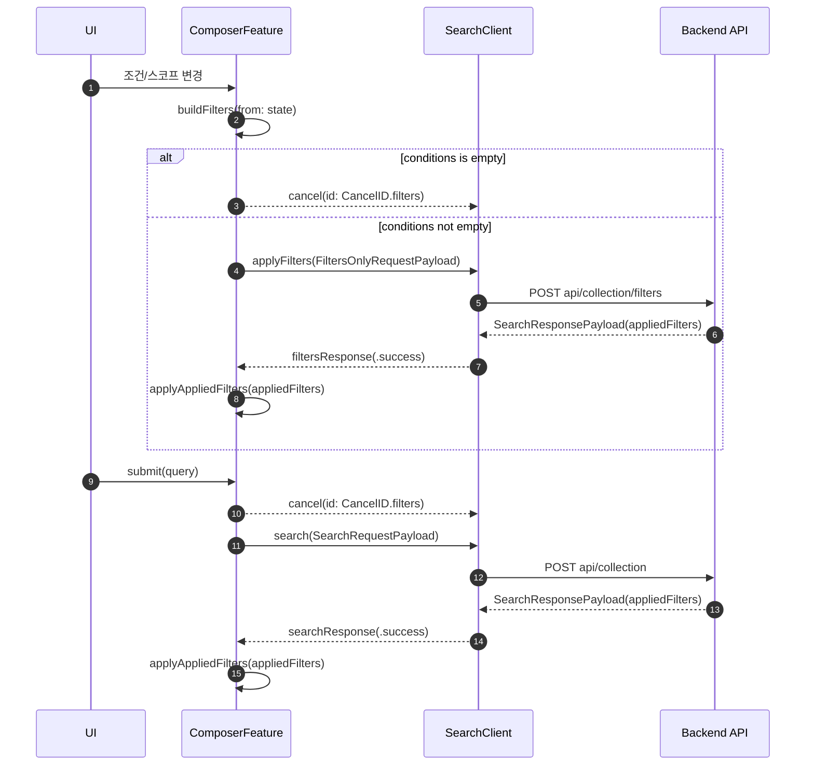

# 조건 컴포저

조건 컴포저(Composer)는 사용자가 “검색”을 만들기 위해 입력하는 두 축(자연어 query + 구조화된 filters)을 UI 상태로 관리하고, 이를 백엔드 검색 API로 전송하는 프론트엔드 기능입니다.

## Composer의 범위

Composer가 하는 일

- 검색 query 입력/제출(`submit`)
- 스코프(검색 경로 범위) 관리(`scopes`)
- 조건(속성/연산자/값) 관리(`conditions`)
- 조건/스코프 변경 시 “필터만 적용” 요청으로 결과 및 `appliedFilters` 반영

Composer가 하지 않는 일

- 백엔드 프로세스 부트스트랩/헬스체크
- 실제 검색 결과를 화면에 렌더링하는 페이지 레이아웃(Composer는 payload + 상태를 책임)

## 핵심 개념: “서버가 해석한 필터가 정답”

Composer는 사용자가 만든 필터를 그대로 믿지 않고, 백엔드가 반환하는 `appliedFilters`를 다시 UI 상태에 반영합니다.

- 이유: 레지스트리 기반으로 연산자/값이 정규화되거나, legacy key가 canonical key로 치환되거나, 서버가 적용 불가능한 조건을 제거/조정할 수 있음
- 결과: 사용자가 입력한 것과 UI에 “적용된 필터”가 다를 수 있음(정상 동작)

## 구성 요소

### 조건 속성 선택

- 레지스트리(`registryClient`)에서 속성 목록을 로드하고, 카테고리/검색 텍스트 기반으로 탐색합니다.
- UI에서 숨김 처리(`uiHidden`)된 속성은 제외합니다.
- 이미 추가된 속성은 중복 추가를 막고 안내 메시지를 표시합니다.

관련 코드

- `apps/macos/Voyager/Voyager/04_Features/Composer/Reducer/ConditionPropertyPickerFeature.swift`

### 연산자 선택

- 선택한 속성에 대해 가능한 연산자 목록을 보여주고 선택 결과를 부모(Composer)에 전달합니다.
- 연산자 선택 시, 값 입력 UI 종류(`operatorValueUIKind`), 값 개수(`operatorValueArity`), 값 타입(`valueType`)은 레지스트리 기반으로 결정됩니다.

관련 코드

- `apps/macos/Voyager/Voyager/04_Features/Composer/Reducer/OperatorPickerFeature.swift`
- `apps/macos/Voyager/Voyager/04_Features/Composer/Reducer/ComposerFeature.swift`

### 값 입력/검증

- 값 입력은 `ValuePickerFeature`에서 수행되며, commit 시점에 `ValueNormalizerUtils.normalize(kind:rawValues:editingIndex:)`로 정규화/검증합니다.
- 실패 시 `errorMessage`를 세팅하고, `resetIndices`에 해당하는 입력을 비웁니다.

대표적인 오류 메시지(현재 구현 기준)

- `Value is required.` (빈 값)
- `Enter valid number.` / `Enter valid numbers.` (숫자 파싱 실패)
- `Enter valid date.` (날짜 파싱 실패)
- `From must be ≤ To.` (범위 역전)

관련 코드

- `apps/macos/Voyager/Voyager/04_Features/Composer/Reducer/ValuePickerFeature.swift`
- `apps/macos/Voyager/Voyager/04_Features/Composer/Lib/ValueNormalizerUtils.swift`

## 요청 흐름(검색 submit vs 필터 applyFilters)

Composer는 두 가지 API 요청을 구분해서 실행합니다.

### 1) 검색 제출(자연어 query)

- 액션: `ComposerFeature.Action.submit`
- API: POST `api/collection`
- 동작:
  - 입력 query를 trim 후 빈 값이면 요청하지 않음
  - 현재 UI 상태에서 `SearchFiltersPayload`를 만들고(`buildFilters(from:)`) query + filters로 검색
  - 검색 요청을 시작할 때, 진행 중인 필터 요청은 취소

### 2) 필터만 적용(조건/스코프만)

- 액션: `ComposerFeature.Action.applyFilters` 및 스코프/조건 변경 후 내부적으로 `applyFiltersIfNeeded(...)`
- API: POST `api/collection/filters`
- 동작:
  - 현재 UI 상태에서 `SearchFiltersPayload` 생성
  - 생성된 payload의 `conditions`가 비어 있으면 요청을 스킵하고 in-flight 필터 요청 취소

### 취소/중복 방지 정책

Composer는 TCA cancellation ID를 사용해 “마지막 요청만 유효”하도록 만듭니다.

- 검색: `ComposerFeature.CancelID.search` + `cancelInFlight: true`
- 필터: `ComposerFeature.CancelID.filters` + `cancelInFlight: true`
- submit 시 `.cancel(id: CancelID.filters)`로 필터 요청을 선제 취소
- applyFilters 시 `.cancel(id: CancelID.search)`로 검색 요청을 선제 취소



## Request Payload 스펙(프론트 기준 SSOT)

### 타입

- `SearchFiltersPayload`
  - `scopes: [String]`
  - `conditions: [SearchConditionPayload]`
- `SearchConditionPayload`
  - `propertyKey: String`
  - `operator: String`
  - `value: JSONValue?`

관련 코드

- `apps/macos/Voyager/Voyager/04_Features/Composer/Api/SearchClient.swift`

### 예시(JSON)

아래는 “값이 있는 조건”과 “값이 없는 조건(arity=0)”이 섞여 있을 때의 형태 예시입니다.

```json
{
  "filters": {
    "scopes": [
      "/Users/me/Documents"
    ],
    "conditions": [
      {
        "propertyKey": "name",
        "operator": "contains",
        "value": "report"
      },
      {
        "propertyKey": "is_directory",
        "operator": "is_true",
        "value": null
      },
      {
        "propertyKey": "size_bytes",
        "operator": "between",
        "value": [1024, 1048576]
      }
    ]
  }
}
```

## condition 포함 규칙(ComposerFeature.buildFilters)

`buildFilters(from:)`는 UI state의 `conditions`를 그대로 보내지 않습니다. 다음 규칙을 통과하는 조건만 `SearchConditionPayload`로 포함합니다.

- `condition.isActive == true`인 조건만 포함
- `operatorCode`가 없는 조건은 제외
- `operatorValueArity == 0`인 조건은 `value: nil`로 포함(값 입력을 요구하지 않음)
- 그 외:
  - `values`가 없거나 비어 있으면 제외
  - `ConditionValueEncoder.encode(...)`가 실패(nil)하면 제외

관련 코드

- `apps/macos/Voyager/Voyager/04_Features/Composer/Reducer/ComposerFeature.swift`

## 값 인코딩 규칙(ConditionValueEncoder)

조건의 `values: [String]`는 API 전송 전에 `JSONValue`로 변환됩니다.

1) `operatorValueUIKind`가 list 계열인 경우 우선

- `listText` => `JSONValue.array([.string...])`
- `listNumber` => 모든 값이 `Double`로 파싱될 때만 `JSONValue.array([.number...])` (하나라도 실패하면 nil)

2) 그 외에는 `valueType` 기반 인코딩

- `number` => 1개면 `JSONValue.number`, 여러 개면 `JSONValue.array(number...)`
- `boolean` => `"true"|"false"`만 허용, `JSONValue.bool`
- `date`/`datetime` => `ValueNormalizerUtils.formatDateOnlyString(...)`로 날짜-only 정규화 시도 후 `JSONValue.string`(여러 개면 array)
- `string`/`string_list`/`categorical`/`unknown` => 기본 `JSONValue.string` 또는 `JSONValue.array`
  - 단, `operatorCode`가 `in` 또는 `anyof`인 경우 강제로 array

관련 코드

- `apps/macos/Voyager/Voyager/04_Features/Composer/Lib/ConditionValueEncoder.swift`
- `apps/macos/Voyager/Voyager/04_Features/Composer/Lib/ValueNormalizerUtils.swift`

## appliedFilters 반영(서버 → UI 상태 보정)

### 언제 반영되나

- 검색 성공: `searchResponse(.success)`
- 필터 성공: `filtersResponse(.success)`

두 경우 모두 `applyAppliedFilters(response.appliedFilters, ...)`가 호출됩니다.

### 어떤 규칙으로 보정되나(AppliedFiltersUtils)

`AppliedFiltersUtils.resolve(...)`는 다음을 수행합니다.

- `appliedFilters.scopes`가 있으면 그것을 사용하고, 없으면 현재 UI state(`fallbackScopes`)를 유지
- `appliedFilters.conditions`가 있으면 그것을 기준으로 새로운 `Condition` 배열을 재구성
- propertyKey는 레지스트리의 `registryClient.resolveKey(...)` 결과에 따라 처리

`registryClient.resolveKey(...)`의 결과별 동작

- `canonical(...)`: 그대로 사용(정상)
- `legacy(original, normalized)`: legacy key를 `normalized`로 치환(사용자 입력/서버 응답의 key가 바뀔 수 있음)
- `unknown(original)`: 알 수 없는 key로 판단
  - UI에서 보이되 “활성(false)” 상태인 `Condition`을 만들어 남김
  - label은 `Unknown (<key>)` 형태
  - operator는 payload의 `operator`를 그대로 노출

이 동작은 “서버가 적용한 필터(사실상 정답)”를 UI에 재투영하기 위한 것입니다.

관련 코드

- `apps/macos/Voyager/Voyager/04_Features/Composer/Lib/AppliedFiltersUtils.swift`
- `apps/macos/Voyager/Voyager/04_Features/Composer/Reducer/ComposerFeature.swift`

## 계약 주의사항(현재 구현의 함정)

백엔드 검색 응답은 top-level `SearchResponse`이며, 일부 실패가 HTTP 200에서도 `error` 필드로 표현될 수 있습니다.

- 현재 macOS는 `SearchResponsePayload`에 `error` 필드를 모델링하지 않습니다.
- `JSONDecoder`는 알 수 없는 필드를 무시하므로, 서버가 `error`를 포함해도 디코딩은 성공할 수 있습니다.
- 결과적으로 “서버는 실패를 말했는데 UI는 성공(또는 empty)처럼 보이는” 상황이 발생할 수 있습니다.

관련 코드

- `apps/macos/Voyager/Voyager/04_Features/Composer/Api/SearchClient.swift`
- `.cursor/rules/00-monorepo/03-error-handling-policy.mdc`

## 디버깅 플레이북

### 증상: 필터를 바꿨는데 결과가 변하지 않는다

- `buildFilters(from:)`에서 조건이 제외되고 있을 수 있습니다.
  - `operatorCode` 미선택
  - `values` 비어 있음
  - `ConditionValueEncoder.encode(...)` 실패(예: `listNumber`에 숫자 아닌 값 포함)

### 증상: 값을 입력했는데 저장/적용이 되지 않는다

- `ValuePickerFeature.commit`에서 `ValueNormalizerUtils.normalize(...)`가 에러를 반환했을 수 있습니다.
- UI에서는 `errorMessage`가 표시되고, `resetIndices`가 빈 값으로 리셋됩니다.

### 증상: 조건의 propertyKey/label이 갑자기 바뀐다

- 서버 `appliedFilters`를 반영하면서 `legacy -> canonical` 치환이 발생했을 수 있습니다.
- `AppliedFiltersUtils.resolveKey(...)`의 `legacy(_, normalized)` 경로를 확인하세요.

### 증상: Unknown(...) 조건이 나타난다

- 레지스트리에 없는 key가 `appliedFilters.conditions`로 내려왔습니다.
- `AppliedFiltersUtils`는 해당 조건을 `isActive: false`로 만들어 UI에 남깁니다.

## QA 체크리스트(재현 가능한 단계)

- submit vs filters 취소
  - 조건 1개 추가 후 기다려 `isLoadingFilters`가 켜지는지 확인
  - 즉시 query를 입력하고 submit → 필터 요청이 취소되고 `isLoadingSearch`만 남는지 확인
- 조건이 비어 있을 때 filters 요청 스킵
  - 모든 조건 삭제 → `applyFiltersIfNeeded`가 `.cancel(id: CancelID.filters)`로 끝나는지 확인
- arity=0 조건
  - arity가 0인 operator를 선택(예: 토글/none 타입)
  - 값 입력 없이도 `value: null`로 전송되는지(로그/디버거) 확인
- listNumber 인코딩 실패
  - `listNumber` 조건에 `1, a, 3` 같은 값을 입력
  - 값 정규화/인코딩 실패 시 조건이 payload에서 제외되는지 확인
- appliedFilters로 UI 보정
  - 필터 적용 후, 서버가 반환한 `appliedFilters`에 의해 조건 순서/label/value가 바뀌는지 확인
- Unknown key 처리
  - (테스트/모킹) `appliedFilters.conditions`에 레지스트리에 없는 `propertyKey`를 포함
  - UI에 `Unknown (<key>)` 조건이 나타나고 비활성 상태인지 확인

## Related Files (SSOT)

- `apps/macos/Voyager/Voyager/04_Features/Composer/Reducer/ComposerFeature.swift`
- `apps/macos/Voyager/Voyager/04_Features/Composer/Api/SearchClient.swift`
- `apps/macos/Voyager/Voyager/04_Features/Composer/Lib/ConditionValueEncoder.swift`
- `apps/macos/Voyager/Voyager/04_Features/Composer/Lib/AppliedFiltersUtils.swift`
- `apps/macos/Voyager/Voyager/04_Features/Composer/Reducer/ValuePickerFeature.swift`
- `apps/macos/Voyager/Voyager/04_Features/Composer/Lib/ValueNormalizerUtils.swift`
