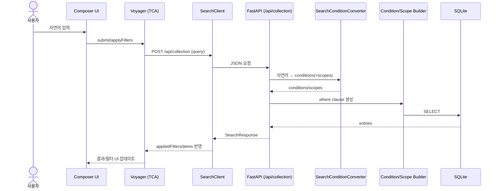

# 검색 기능

## 개요

Voyager의 검색은 "자연어"를 바로 SQL로 바꾸는 것이 아니라,

1) 자연어 → 구조화된 필터(`conditions` + `scopes`)로 변환하고
2) 필터 → SQL WHERE 절로 변환해
3) 로컬 SQLite(인덱싱 결과)를 조회

하는 3단계 파이프라인입니다.

이 문서의 목표는 다음을 한 번에 이해할 수 있게 하는 것입니다.

- 프론트(UI)가 어떤 페이로드로 어떤 API를 호출하는지
- 백엔드가 자연어를 어떤 규칙으로 조건 배열로 바꾸는지(LLM 변환)
- 레지스트리 기반으로 SQL이 어떻게 생성되는지(조건/스코프 빌더)
- 실패가 어떻게 표현되는지(`error` 필드, 200 응답 가능)

## 용어

- `query`: 사용자가 입력한 자연어 문자열
- `scopes`: 검색 범위(경로) 목록. "이 폴더 및 하위" 의미로 동작
- `conditions`: 검색 조건 배열. 각 항목은 `{propertyKey, operator, value}`
- `appliedFilters`: 서버가 "정규화/보정"해서 실제로 적용한 필터
- Registry: `system_property_registry.json` / `property_condition_registry.json`

## 전체 흐름 (UI → Backend → DB)



참고 코드

- UI/TCA: `apps/macos/Voyager/Voyager/04_Features/Composer/Reducer/ComposerFeature.swift`
- HTTP Client: `apps/macos/Voyager/Voyager/04_Features/Composer/Api/SearchClient.swift`
- Backend Routes: `apps/backend/src/app/search/routes.py`
- Backend Service: `apps/backend/src/app/search/services.py`

## API

### 엔드포인트

- `POST /api/collection`
  - 자연어 검색(LLM 변환 포함)
  - 선택적으로 기존 필터(`filters`)를 함께 보내 "query + 기존 필터"를 결합
- `POST /api/collection/filters`
  - 필터만 적용(LLM 호출 없음)

관련 코드

- `apps/backend/src/app/search/routes.py`
- `apps/backend/src/app/search/schemas.py`

### 요청 스키마

Backend 기준(Pydantic)

- `QuerySearchRequest`
  - `query: str` (trim 후 공백만이면 422)
  - `filters: SearchFilters | null`
- `FilterSearchRequest`
  - `filters: SearchFilters`
- `SearchFilters`
  - `scopes: string[]` (default: `[]`)
  - `conditions: SearchCondition[]` (default: `[]`)
- `SearchCondition`
  - `propertyKey: string`
  - `operator: string` (`eq`, `gt`, `cn`, `any`, `exists`, `empty` 등)
  - `value: string | number | boolean | array | null`

프론트 기준(Swift)

- 요청 페이로드는 `SearchClient` 내부 모델로 인코딩됩니다.
  - `SearchRequestPayload` → `POST /api/collection`
  - `FiltersOnlyRequestPayload` → `POST /api/collection/filters`

관련 코드

- `apps/macos/Voyager/Voyager/04_Features/Composer/Api/SearchClient.swift`

### 요청 예시

자연어만

```bash
curl -X POST http://localhost:8000/api/collection \
  -H "Content-Type: application/json" \
  -d '{"query":"최근 다운로드한 PDF"}'
```

자연어 + 기존 필터(스코프/조건)

```bash
curl -X POST http://localhost:8000/api/collection \
  -H "Content-Type: application/json" \
  -d '{
    "query": "최근 다운로드한 PDF",
    "filters": {
      "scopes": ["/Users/you/Downloads"],
      "conditions": [
        {"propertyKey": "extension", "operator": "any", "value": ["pdf"]}
      ]
    }
  }'
```

필터만

```bash
curl -X POST http://localhost:8000/api/collection/filters \
  -H "Content-Type: application/json" \
  -d '{
    "filters": {
      "scopes": ["/Users/you/Downloads"],
      "conditions": [
        {"propertyKey": "extension", "operator": "any", "value": ["pdf"]}
      ]
    }
  }'
```

## 응답/에러 처리

### 응답 스키마

Backend는 `SearchResponse`를 top-level JSON으로 반환합니다.

- `itemCount: int`
- `appliedFilters: { scopes: string[], conditions: SearchCondition[] }`
- `items: SearchItem[]`
- `error: { code: string, details?: string } | null`

관련 코드

- `apps/backend/src/app/search/schemas.py`

### 중요한 동작: 200이어도 실패일 수 있음

이 검색 API는 일부 실패를 HTTP status code로 표현하지 않고, `error` 필드로 표현합니다.
즉, **HTTP 200 + error != null** 조합이 가능합니다.

현재 구현에서 주요 에러 코드

- `LLM_CONVERSION_FAILED`
  - LLM 변환 실패(게이트웨이/모델/프롬프트/파싱 문제 등)
  - 이 경우 서버는 "기존 filters"(있다면)를 그대로 `appliedFilters`로 반환하고, `items=[]`로 응답합니다.
- `CONDITION_BUILD_FAILED`
  - 조건/레지스트리 불일치 또는 value shape 문제 등으로 SQL 생성 실패
- `SEARCH_EXECUTION_FAILED`
  - DB 실행/런타임 예외

참고(프론트에서의 현재 상태)

- `SearchClient.swift`의 응답 모델은 `error` 필드를 디코딩하지 않습니다(unknown key는 무시).
- 따라서 "LLM_CONVERSION_FAILED" 같은 상세 에러 메시지는 UI에서 아직 직접 표시되지 않습니다.
- 대신 `itemCount==0`/`items` 비어 있음으로만 관찰되는 케이스가 있습니다.

관련 코드

- `apps/macos/Voyager/Voyager/04_Features/Composer/Api/SearchClient.swift`
- `apps/macos/Voyager/Voyager/04_Features/Composer/Reducer/ComposerFeature.swift`

### appliedFilters의 의미

서버는 요청으로 받은 `filters`를 그대로 사용하기도 하지만,
LLM 변환 결과 또는 정규화 결과에 따라 "실제 적용된 필터"를 `appliedFilters`로 반환합니다.

클라이언트는 응답의 `appliedFilters`를 기준으로 UI 상태를 보정합니다.

- 스코프/조건을 서버가 해석한 결과로 재정렬/정규화
- 유효하지 않은 조건이 제거되거나, 값 형태가 보정된 결과를 반영

관련 코드

- `apps/macos/Voyager/Voyager/04_Features/Composer/Reducer/ComposerFeature.swift`

## LLM 변환(자연어 → conditions/scopes)

### 구성 요소

- 변환기: `SearchConditionConverter`
- 캐시 포함 변환기: `CachedSearchConditionConverter`

관련 코드

- `apps/backend/src/core/llm/search_condition_converter.py`
- `apps/backend/src/core/llm/prompts/compose_filter_system.md`

### 프롬프트 구조(핵심)

변환기는 LLM에게 다음 "제약"을 강하게 겁니다.

- 출력은 JSON only
- `keys=...`와 `ops=...`로 전달된 범위 내에서만 조건을 만들기
- `scopes=[...]`가 프롬프트에 있을 때만 scopes를 반환하기

프롬프트 입력(user prompt)의 라인 구조는 다음 형태입니다.

```text
q=<user natural language>
keys=<type:comma-separated-keys|...>
ops=<type=comma-separated-operators|...>
conditions=<existing conditions as JSON>         (optional)
scopes=<existing scopes as JSON or inferred>     (optional)
```

### 키 후보 선정 규칙

LLM이 사용할 수 있는 `propertyKey` 목록은 "레지스트리"에서 가져오되,
쿼리 텍스트와 기존 조건을 기반으로 후보를 좁힙니다.

- 기본 후보: `CORE_KEYS` + (쿼리에서 alias로 매칭된 키) + (기존 조건의 propertyKey)
- `ui_hidden=true`인 키는 후보에서 제외

예시

- `name_full`은 `ui_hidden=true`이므로 조건 생성에 사용되지 않습니다.
- 파일명 검색은 `name_stem`을 사용합니다.

관련 코드

- `apps/backend/src/core/llm/search_condition_converter.py`
- `shared/system_property_registry.json`

### 스코프 처리 규칙

스코프는 2가지 입력으로 결정됩니다.

1) 클라이언트가 명시적으로 `filters.scopes`를 보내면 그 값을 우선
2) scopes가 없으면, 변환기가 쿼리 텍스트에서 일부 패턴을 감지해 scopes를 프롬프트에 주입
   - `downloads`/`documents`/`desktop`/`home directory` 등

관련 코드

- `apps/backend/src/core/llm/search_condition_converter.py`

### 변환 규칙(프롬프트에 명시된 룰)

프롬프트 템플릿에 하드코딩된 규칙 일부는 다음과 같습니다.

- 파일명 검색: `name_stem cn "%text%"`
- 확장자: `extension any ["pdf", "jpg", ...]` (점 제외, 소문자)
- 날짜: `YYYY-MM-DD`만 사용
- 크기: `1KB=1024`, `1MB=1048576`, `1GB=1073741824`
- downloaded/modified/created 키는 각각 `downloaded_date`/`modification_date`/`creation_date`로 매핑
- `rx`는 정규식이 아니라 SQL LIKE 패턴만 허용 (`%`, `_`)

관련 코드

- `apps/backend/src/core/llm/prompts/compose_filter_system.md`

### 캐싱

`CachedSearchConditionConverter`는 다음 조건에서만 캐시를 사용합니다.

- `existing_conditions` 또는 `existing_scopes`가 없는 경우(쿼리 단독)
- 캐시 크기 기본값: 100
- eviction: 단순 FIFO

관련 코드

- `apps/backend/src/core/llm/search_condition_converter.py`

## 레지스트리 기반 SQL 생성

### 1) 레지스트리

검색 조건은 레지스트리에 의해 "허용 가능한 조합"으로 제한됩니다.

- `shared/system_property_registry.json`
  - `propertyKey`의 타입/설명/alias/ui_hidden/db_indexed 등을 정의
- `shared/property_condition_registry.json`
  - 연산자(`operator`)의 value shape, SQL 변환 규칙(sql_kind/sql_operator) 등을 정의

관련 코드

- `apps/backend/src/core/metadata/registry_loader.py`

### 2) ScopeBuilder (scopes → SQL)

`scopes`는 DB의 `dir_path` 컬럼을 기준으로 변환됩니다.

- 각 scope는 "그 디렉터리" 또는 "하위"로 매칭
- 예: `/Users/you/Downloads` → `dir_path = ... OR dir_path LIKE .../%`
- scope는 정규화됩니다.
  - `~` 확장
  - 절대 경로화
  - 중복 제거
  - 상위 scope가 있으면 하위 scope 제거(쿼리 가벼워짐)

관련 코드

- `apps/backend/src/core/search/scope_builder.py`

### 3) ConditionBuilder (conditions → SQL)

`ConditionBuilder`는 다음 원칙으로 SQL WHERE fragment를 생성합니다.

- `ui_hidden=true`인 키는 거부(에러)
- 레지스트리에서 지원하는 operator만 허용
- 모든 값은 bind parameter로 처리하여 SQL injection을 방지

필드 선택

- `db_indexed=true`인 키는 DB 컬럼을 직접 사용
- 아니면 `original_metadata` JSON에서 `json_extract` + `CAST`로 조회

타입/연산자에 따라 내부적으로 DATE() 캐스팅, json_each 기반 array membership 등이 사용됩니다.

관련 코드

- `apps/backend/src/core/search/condition_builder.py`

### 4) executor (실행)

executor는 다음과 같이 where clause를 조립하고 실행합니다.

- `where = <scope_clause> AND <condition_clause>`
- SQLAlchemy `text(...).bindparams(...)`로 파라미터 바인딩
- `SQLModel select(model)`로 조회
- DB 세션은 sync이므로 `asyncio.to_thread`로 실행

관련 코드

- `apps/backend/src/core/search/executor.py`

## 디버깅/운영 팁

### 1) 실패를 해석하는 법

- 네트워크/HTTP 오류
  - 클라이언트에서 throw(예: non-2xx)
- 200이지만 결과가 비어 있음
  - 실제로는 서버가 `error`를 포함했을 수 있음(현재 UI는 상세를 표시하지 않음)

### 2) 재현 방법

- 서버 단독 실행 후 curl로 재현하는 것이 가장 빠릅니다.
- LLM 변환이 필요 없는 경우 `/api/collection/filters`를 사용하면 원인을 분리하기 쉽습니다.

## 테스트/검증

Backend는 레지스트리/조건 빌더/실행기를 테스트로 검증합니다.

- `apps/backend/tests/test_system_property_registry.py`
- `apps/backend/tests/test_condition_builder.py`
- `apps/backend/tests/test_execute_search.py`
