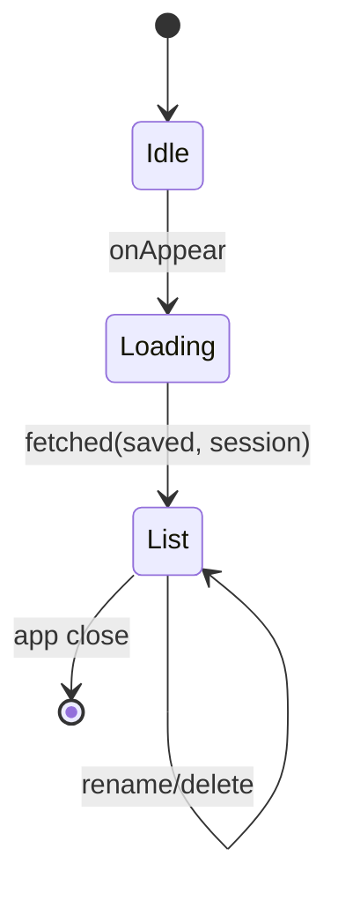
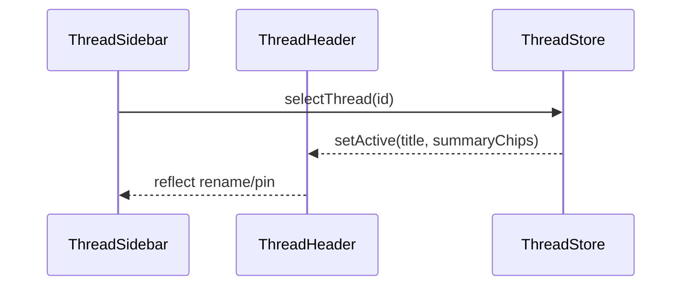
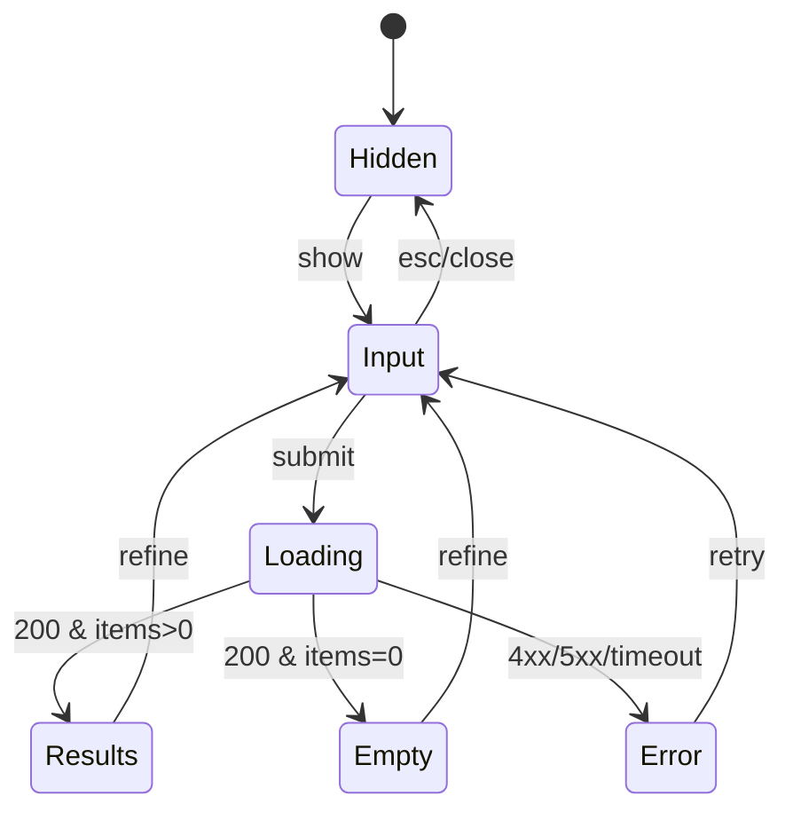
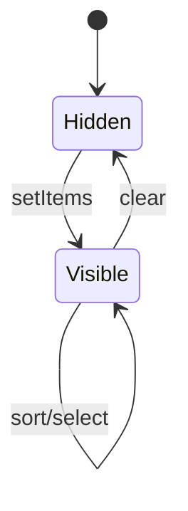
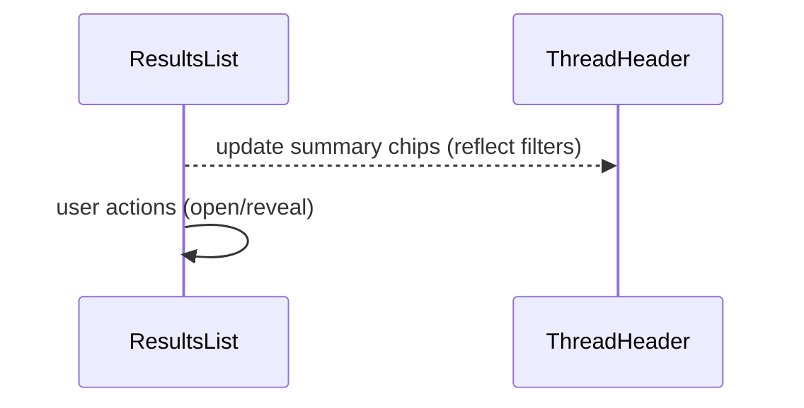
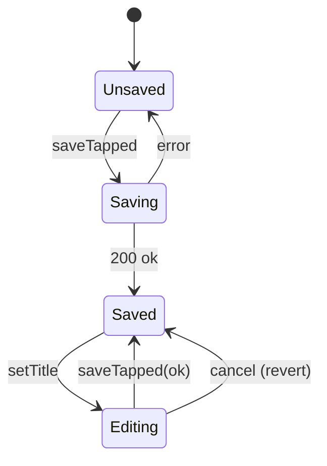
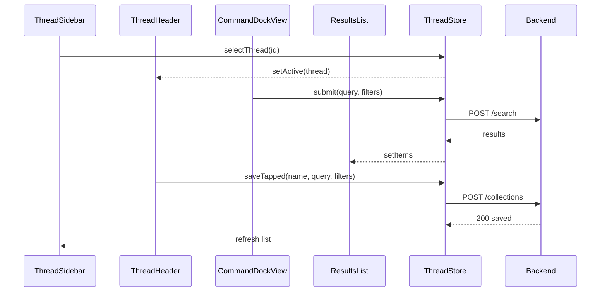

# Component Library (초안 자리표시자)

아래 핵심 컴포넌트는 SwiftUI + TCA 구조를 전제로 합니다. 파일 경로는 현실 소스 트리에 정렬합니다.

## Architecture Primer (TCA)

```swift
// Naming: FeatureName{State, Action, Environment, Reducer}
// Location: apps/macos/Voyager/Voyager/Features/FileManager/{Feature}/

struct FeatureState: Equatable {
    // 화면 상태(뷰에 바인딩되는 값)
}

enum FeatureAction: Equatable {
    // 사용자 상호작용/효과/서브피처 액션
}

struct FeatureEnvironment {
    // 서비스 의존성 (예: BackendClient, Clock)
}

let featureReducer = Reducer<FeatureState, FeatureAction, FeatureEnvironment> {
    state, action, env in
    // 상태 전이 및 이펙트
}
```

공통 모델 (UI 전용)

```swift
struct ThreadSummary: Equatable, Identifiable { // UI Thread (Saved/Session)
    var id: UUID
    var title: String
    var isPinned: Bool
    var lastUpdatedAt: Date?
    var kind: ThreadKind // .saved / .session
}

enum ThreadKind: Equatable { case saved, session }

struct FilterChip: Equatable, Identifiable { // 단순 칩 모델
    var id: UUID
    var key: String
    var value: String
    var isActive: Bool
}

struct SearchResultItem: Equatable, Identifiable {
    var id: UUID
    var path: String
    var name: String
    var size: Int64?
    var modifiedAt: Date?
    var uti: String?
    var score: Double?
}
```

---

## ThreadSidebar

- Purpose: Thread(저장/세션) 탐색/관리(UI의 1급 개념) 및 Active Thread 전환
- Location: `.../Features/FileManager/ThreadSidebar/`

Props / State / Action
```swift
struct ThreadSidebarState: Equatable {
    var saved: [ThreadSummary] = []
    var session: [ThreadSummary] = []
    var activeID: UUID?
    var filterText: String = ""
}

enum ThreadSidebarAction: Equatable {
    case onAppear
    case selectThread(UUID)
    case newFromActive
    case rename(UUID, String)
    case delete(UUID)
    case pin(UUID, Bool)
    case setFilterText(String)
}
```

Interactions
- 선택/열기, 이름 변경(인라인), 삭제(확인), 핀 토글, 필터(클라이언트 측)
- New from Active → Saved Thread 생성(`POST /collections`, 정의만 저장)

Accessibility
- 리스트 항목 라벨에 제목/상태 포함, 핀 토글은 토글 role 지정

Performance
- 2천 개 항목까지 스크롤 성능 확보(VStack 대신 `List`/`ScrollView` + lazy)

Tests
- select/rename/pin/delete 액션 전이, 필터 동작, Active 반영

State Machine


Sequence with Other Components


---

## CommandDockView

- Purpose: 쿼리/필터 입력, 제출, 상태 전이(Idle/Input/Loading/Results/Empty/Error)
- Location: `.../Features/FileManager/CommandDock/`

Props / State / Action
```swift
struct DockState: Equatable {
    var isVisible: Bool = false
    var query: String = ""
    var filters: [FilterChip] = []
    var isLoading: Bool = false
    var errorMessage: String?
}

enum DockAction: Equatable {
    case show(Bool)
    case setQuery(String)
    case addFilter(FilterChip)
    case removeFilter(UUID)
    case submit
    case submitResponse(Result<[SearchResultItem], DockError>)
    case dismissError
}

enum DockError: Equatable { case timeout, server(String), invalidFilters }
```

Interactions
- ESC로 닫기 → 포커스 복귀, 디바운스 제출, 칩 추가/삭제, 저장 트리거(UF1 연계)

Accessibility
- 입력/버튼/상태 라벨/Hint 지정, 포커스 링/순서 고정

Performance
- 디바운스 250–300ms, 결과 렌더 1프레임 내 반영 목표

Tests
- 상태 전이(Idle→Input→Loading→Results/Empty/Error), 에러 처리, 칩 편집

State Machine


---

## ResultsList

- Purpose: 검색 결과 표시(리스트/그리드) 및 항목 액션(Open/Reveal/Copy Path)
- Location: `.../Features/FileManager/Results/`

Props / State / Action
```swift
struct ResultsState: Equatable {
    var items: [SearchResultItem] = []
    var selection: Set<UUID> = []
    var sortKey: SortKey = .score
    var sortOrder: SortOrder = .descending
}

enum SortKey { case score, modified, name, size }
enum SortOrder { case ascending, descending }

enum ResultsAction: Equatable {
    case setItems([SearchResultItem])
    case setSelection(Set<UUID>)
    case setSort(SortKey, SortOrder)
    case openSelected
    case revealInFinder
}
```

Interactions
- 키보드 내비(↑/↓, Enter/Space), 정렬/필터(상단 바와 연동), 컨텍스트 메뉴

Accessibility
- 행 라벨에 파일명/유형/수정일 포함, 액션은 메뉴/단축키 병행 제공

Performance
- 가상화 고려(아이템 1만 개까지는 단계적 최적화 계획)

Tests
- 정렬/선택/액션, 빈/에러/로딩 상태 연동(DockState와 계약)

State Machine


Sequence with Other Components


---

## FiltersBar

- Purpose: 필터 칩 추가/제거/토글 및 정렬 컨트롤 제공
- Location: `.../Features/FileManager/FiltersBar/`

Props / State / Action
```swift
struct FiltersBarState: Equatable {
    var chips: [FilterChip] = []
}

enum FiltersBarAction: Equatable {
    case addChip(FilterChip)
    case removeChip(UUID)
    case toggleChip(UUID)
}
```

---

## ThreadHeader

- Purpose: Active Thread의 제목/요약 필터 칩/저장 상태 표시 및 편집
- Location: `.../Features/FileManager/ThreadHeader/`

Props / State / Action
```swift
struct ThreadHeaderState: Equatable {
    var title: String
    var isSaved: Bool
    var summaryChips: [FilterChip]
}

enum ThreadHeaderAction: Equatable {
    case setTitle(String)
    case saveTapped // name/query/filters만 백엔드에 영속
    case openInList
}
```

State Machine


Component Interaction Overview


---

## HUD/Toast & LEE(Loading/Empty/Error)

- Purpose: 전역 알림/상태 표준 컴포넌트
- Location: `.../Features/Common/`

Guidelines
- Loading: 진행 텍스트와 인디케이터("Searching…")
- Empty: 메시지 + 힌트("No results. Try adjusting your query or filters.")
- Error: 사용자 친화적 메시지("Can’t reach the service…") + 재시도

Tests
- 상태 전환 시 ARIA/VoiceOver 라벨 변경 반영, 토스트 자동 소멸 타이밍
