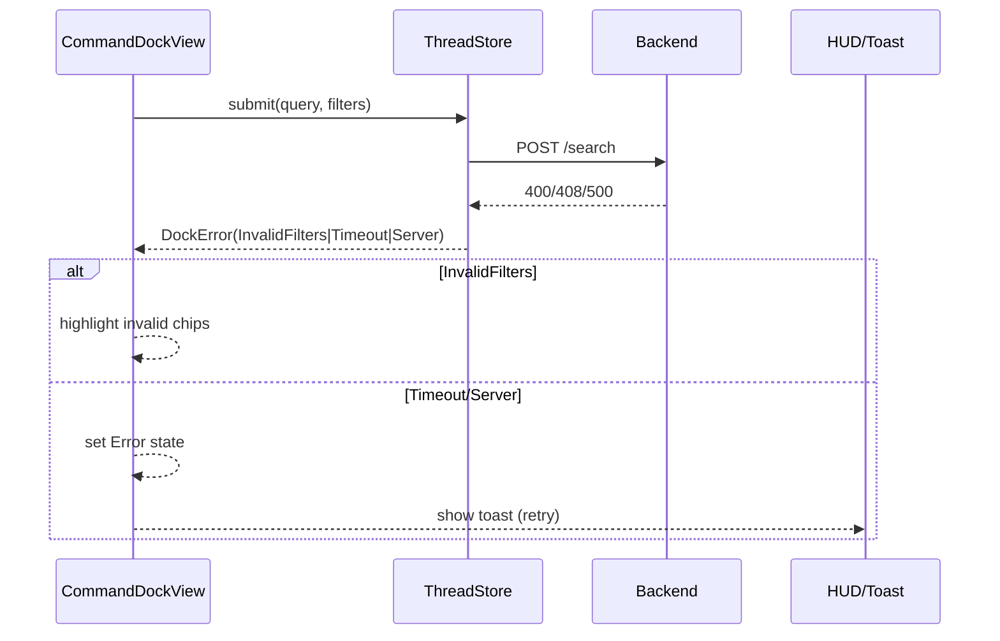
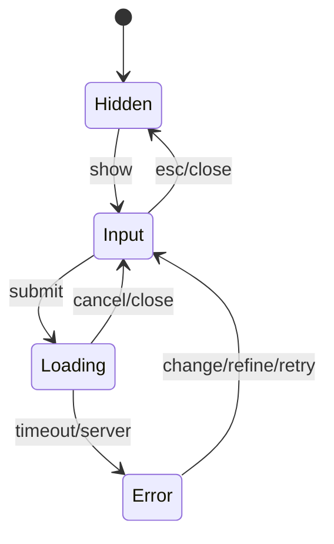

# Error Handling & Propagation

본 섹션은 컴포넌트 간 오류 전파, 사용자 표시(Toast/Inline), 재시도 규칙, 취소/동시성, 접근성/로그를 정의합니다.

## Error Taxonomy (UI)
- `InvalidFilters`(400): 필터 형식·값 오류 → Dock 입력/필터 칩 인라인 오류로 표시
- `Timeout`(408/504): 지연/네트워크 불가 → Toast + Dock Error 상태
- `ServerError`(5xx): 서버 내부 오류 → Toast + Dock Error 상태
- `NotFound/Conflict`(404/409): 현재 범위에서 의미 없음 → Context에 맞는 안내(대개 Toast)
- `ClientError`(로컬): 취소/파싱 실패 등 → 조용한(quiet) 처리, 필요 시 안내

## Propagation Rules
- 발생원: 대부분 `CommandDockView` 제출 → `ThreadStore`(effect) → 백엔드 호출 → 응답/오류 회수
- 전파 경로: BackendError → ThreadStore → Dock(Error state) → HUD/Toast(필요 시)
- 상호작용: ResultsList는 오류 상태에서 비활성, ThreadHeader는 상태 유지(저장 동작엔 영향 없음)

## UI Presentation
- Inline(우선): `InvalidFilters` → 문제 칩 하이라이트/툴팁, 설명 텍스트(로케일 번역)
- Toast(단기): `Timeout/ServerError` → 상단/우상단 3–5초 표시, “Retry”/“Details” 버튼
- Sticky(드문): 반복 실패/중요 작업 시 지속형 Toast(수동 닫기) 사용
- Modal(지양): 파괴적 작업 확정/충돌 해결 등 Execution Plan 범위에서만 사용(후속)

## Retry Rules
- 수동 재시도: Toast의 “Retry” 클릭 → 동일 파라미터로 재요청
- 자동 재시도(선택): `Timeout` 1회 한정(지수 백오프+jitter: 800–1200ms)
- 쿼리 변경 시: 기존 in‑flight 요청은 취소(Cancel)하고 새로운 요청으로 교체

## Cancellation & Concurrency
- Debounce 제출 중 닫기(ESC) → 요청 취소, 응답이 도착해도 무시(requestId 비교)
- 여러 요청 경합 → 마지막 요청만 유효(Latest‑Wins), 이전 응답은 폐기
- 상태 정합: Error → 사용자가 입력을 수정하면 즉시 Input로 전이(자동 클리어)

## Accessibility & i18n
- Live Region: Error/Empty 전환 시 SR(스크린리더) 라이브 영역에 요약 문구 낭독
- Focus: Toast 나타나도 포커스는 Dock/입력 필드에 유지(키보드 흐름 보존)
- Strings: 모든 메시지는 번역 키 기반(예: `err.timeout`, `hint.adjustFilters`)

## Telemetry / Logging (로컬)
- 구조화 필드: `route`, `status`, `duration_ms`, `error.code`, `trace_id`
- 민감 데이터 마스킹: 경로/사용자 입력 일부 마스킹 또는 해시 처리
- 재시도/취소 이벤트 로깅(디버그)

## Test Scenarios (GWT)
- Invalid filters → 칩 하이라이트 및 제출 불가
- Timeout → Toast + Retry 동작, 재시도 성공 시 Results로 전환
- ESC 닫기 중 응답 도착 → 상태 불변(무시) 검증
- 연속 제출(빠른 입력) → Latest‑Wins, 이전 응답 폐기 검증

## Error State Machine (Dock)

