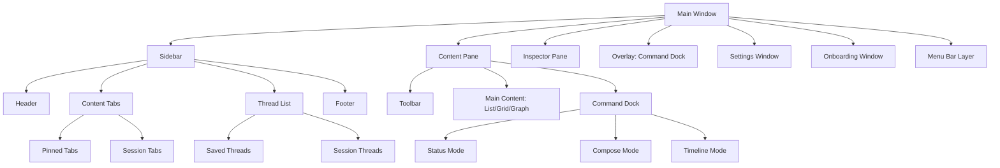
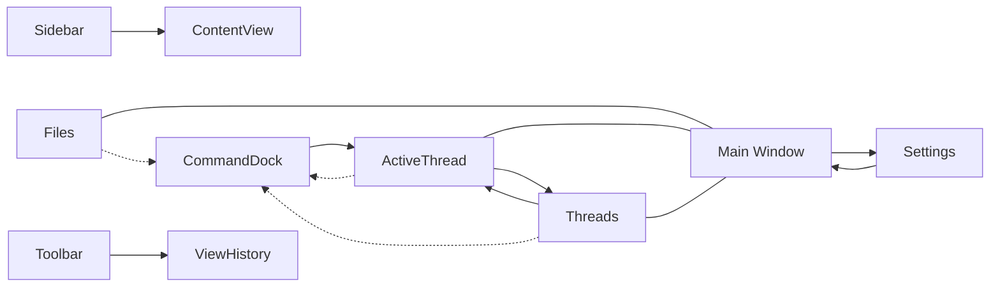
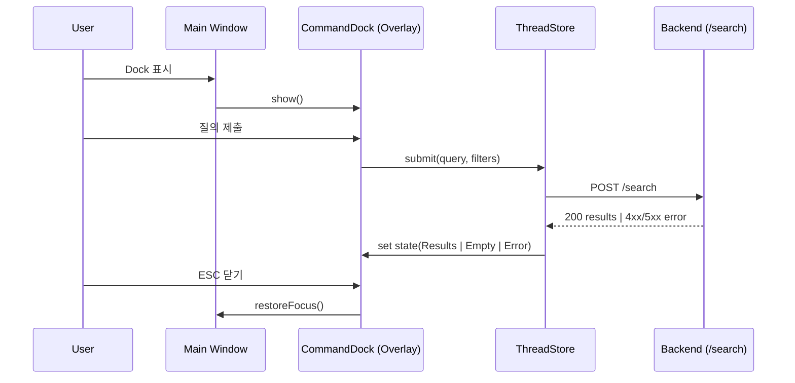

# Information Architecture (IA)

## Screen Inventory

-설명
- Sidebar의 주 개념은 "Thread"입니다. Thread는 사용자에게 직접 노출되는 1급 엔티티이며 Saved/Session 상태로 구분됩니다. "Collection"은 Thread를 구성하는 개념적 정의(쿼리/필터/규칙)로만 사용됩니다.
- Command Dock은 Main Window 어디에서든 오버레이로 표시됩니다.
- Settings/Onboarding은 별도 윈도우입니다.

## Navigation Map

설명
- Command Dock은 Files/Collections/SearchResults 어디서든 점선(오버레이)으로 진입하며, 제출 시 SearchResults로 전환됩니다.
- SearchResults는 컬렉션으로 저장할 수 있고(신규/업데이트), 저장된 Collections에서 다시 열어 조회할 수 있습니다.
- Settings는 Preferences(별도 윈도우)이며 종료 시 Main Window의 이전 컨텍스트로 복귀합니다.

## IA Focus & Overlay Sequence

## Navigation Structure

- Primary Navigation: Sidebar → Thread List(저장/세션), Content Tabs(고정/세션)
- Secondary Navigation: Toolbar(Back/Forward, Inspector 토글, Files에서 breadcrumb), 컨텍스트 액션(Files/Results), Filters/Sort(Results 전용)
- Breadcrumb Strategy: Files 뷰에만 경로 breadcrumb 노출. Active Thread/Threads는 제목 또는 질의 요약/필터 칩을 헤더에 표시.
- Key Behavior: 검색/대화의 현재 컨텍스트는 항상 "Thread"로 표현됩니다. Thread는 개념적으로 Collection 정의(쿼리/필터/규칙)를 내포하며 Session → Saved로 승격됩니다.

## Terminology

- Thread (User‑Facing): 사용자에게 표시되는 1급 엔티티. 쿼리/필터/규칙(=Collection 정의)을 내포하며 Session/Saved 상태를 가진다.
- Collection (Conceptual): Thread를 구성하는 개념적 정의. UI 표면에서는 용어를 드러내지 않으며, 설명/도움말/설정 수준에서만 사용.

## Thread Naming & Title Summary Rules

- 기본 원칙
  - 최초 제출 시 제목은 사용자의 “요청(request)”과 활성 필터의 요약으로 자동 설정됩니다.
  - 사용자가 제목을 수정하면 자동 요약은 비활성화되고 수동 제목을 유지합니다.

- 요약 생성 규칙(초안)
  - 입력 질의에서 핵심 키워드만 추려 40–60자 내로 축약합니다.
  - 활성 필터를 칩 순서대로 붙입니다. 예: `PDF · modified>2024 · Documents`
  - 구분자는 `·`를 사용(로케일에 따라 `,` 대체 가능). 공백/중복 제거.
  - 제목 내 줄바꿈/컨트롤 문자는 제거하고 공백으로 치환합니다.
  - 사용자 편집 전까지 결과/필터 변경 시 제목 자동 갱신(편집 후에는 갱신 중지).

- 유효성/정규화(macOS 파일명과 무관)
  - 선행/후행 공백 제거, 다중 공백 1개로 축약, NFC 정규화.
  - 이모지 허용. 제어문자/비가시 문자는 제거.

- 중복 처리
  - 동일 제목이 Thread List에 이미 존재하면 뒤에 번호 접미사: ` (2)`, ` (3)` …
  - 번호는 저장 시점(autosave/upsert) 기준으로 결정.

## Thread List Ordering & Pin Policy

- 섹션 구조
  - 상단: Pinned Threads(있을 경우), 하단: Recent Threads(나머지)
  - UI는 “저장/세션”을 드러내지 않으며 내부 플래그로만 구분합니다.

- 정렬 규칙
  - Recent Threads: 최근 업데이트 시간(`lastUpdatedAt`) 내림차순
  - Pinned Threads: 사용자가 지정한 순서(드래그로 재정렬 가능)
  - 동일 타임스탬프일 경우: 제목 오름차순(로케일 정렬)

- 핀 정책
  - 핀 상태는 클라이언트 로컬에만 보관(백엔드 비영속)
  - 키보드 토글 지원(예: `⌘P` 후보). 토글 시 즉시 상단 섹션 이동/제거
  - 핀 목록의 순서는 사용자가 재정렬한 순서를 유지(로컬 보존)

- 검색/필터 동기화
  - Active Thread에서 필터/정렬 변경은 즉시 뷰에 반영되지만, 백엔드에는 정의(query/filters)만 저장됩니다.
  - 리스트 정렬/핀 상태는 로컬만 반영(영속 저장 대상 아님).

## Thread Lifecycle & Storage Flags

- 생성(Create): 첫 제출 시 Active Thread 생성 및 autosave(create)로 `id` 배정
- 갱신(Update): 제목/쿼리/필터 변경 시 upsert(배치/디바운스)
- 규칙 저장(Optional): 특정 Intent를 RuleSpec으로 저장(후속), 재실행은 로컬 엔진 수행
- 폐기(Delete): 후속 설계(현재는 로컬 제거만 가능). 백엔드 삭제 API는 추후

## API Mapping (UI Thread ↔ API collections)

- UI의 "Thread"는 API 레이어의 `collections`와 매핑됩니다. UI 용어는 Thread를 유지하되, 네트워크 호출은 `collections`를 사용합니다.
- Session Thread(임시): 비영속 상태. 저장 시 `POST /collections`로 승격하여 Saved Thread가 됩니다.
- Saved Thread(저장): `GET /collections`로 조회, `POST /collections`로 업데이트(이름/쿼리/필터 등).
- Search 결과: `POST /search` 응답을 현재 Active Thread의 뷰로 표시합니다.
 - 참조: docs/prd/6-architecture-and-integration.md

## Persistence Policy (MVP)

- Backend에 영속 저장하는 값은 "Thread 정의"에 한정합니다: `name`, `query`, `filters`.
- 아래 항목은 영속 저장하지 않습니다(클라이언트/로컬 전용):
  - 정렬/선택/스크롤/뷰 모드 등 UI 상태
  - Plan/Apply/Undo 실행 기록과 결과(로컬 저널만, TTL 기반)
  - Rename/Move/Tag/Open/Reveal 등의 파일 액션 결과
  - Pin 상태(초기엔 클라이언트 정렬 용, 서버 동기화는 후속 고려)
