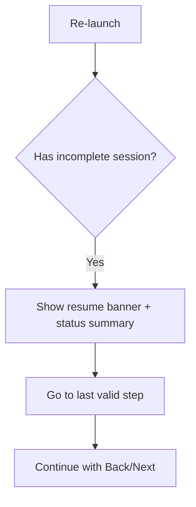
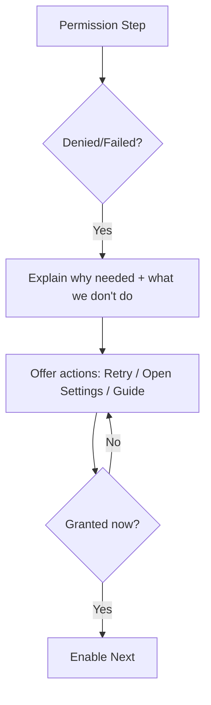

# Voyager Onboarding Window UI/UX Specification

- 관련 이슈: `VOY-111`
- 상태: Draft

## Introduction

이 문서는 `Voyager Onboarding Window`의 사용자 경험 목표, 정보 구조(IA), 핵심 사용자 흐름, 및 UI/상호작용 사양을 정의합니다. 목적은 온보딩이 **권한/베타 접근/인덱싱 프리셋**을 사용자에게 신뢰 가능하게 안내하고, 중단·재개·완료까지 일관된 경험으로 연결되도록 돕는 것입니다.

## Overall UX Goals & Principles

### Target User Personas

- **Privacy-first 사용자(Indie Founder/Developer 포함)**: “왜 이 권한이 필요한가 / 데이터가 외부로 나가지 않는가”를 먼저 확인하고 안심한 뒤 진행한다. 언제든 권한을 되돌리거나 재설정할 수 있다는 통제감을 원한다.
- **Power User**: 빠르게 끝내고 바로 핵심 기능(검색/탐색)을 쓰고 싶다. 불필요한 설명보다 명확한 상태 표시(Granted/Denied)와 단축키/즉시 가치 메시지를 선호한다.
- **Beta Early Adopter**: 베타 접근(초대/동의/주의사항 등)을 이해하고, 실패하더라도 재시도 루프에서 길을 잃지 않길 원한다.

### Usability Goals

- **신뢰 형성(Trust)**: 권한 요청 화면에서 20초 내에 “왜 필요한지/무엇을 하지 않는지(비전송·로컬 처리)”를 이해한다.
- **완료 가능성(Completion)**: 사용자가 마음만 먹으면 2–3분 내에 온보딩을 완료하고 파일 관리자 창 1개가 자동으로 열린다.
- **재시도 가능성(Retry)**: 베타 기간에는 권한 거절/실패 시에도 사용자가 **재시도/가이드**를 통해 다시 시도할 수 있고, 진행이 막힌 이유를 스스로 진단할 수 있다.
- **재개 가능성(Resume)**: 앱이 종료/재실행되어도 마지막 유효 단계에서 재개되며, 상단 요약 영역에서 현재 권한/프리셋 적용 상태를 즉시 확인한다.

### Design Principles

1. **Trust-first transparency**: 권한·데이터 사용을 “짧고 명확하게” 설명하고, 상세 근거는 펼쳐보기로 제공한다.
2. **Blocking, but kind**: 핵심 기능 품질 보장을 위해 온보딩은 완전 블로킹으로 유지하되, 거절/실패 시 사용자가 선택 가능한 다음 행동(재시도/설정 열기/가이드 보기)을 항상 제공한다.
3. **Immediate status feedback**: 권한 상태/프리셋 상태를 뱃지로 즉시 표시하고, 사용자가 “지금 무엇이 부족한지” 한눈에 알 수 있게 한다.
4. **Progressive disclosure**: 기본 경로는 짧게, 예외/고급 설명은 필요할 때만 노출한다.
5. **macOS-native**: System Settings 딥링크, 표준 컴포넌트, 키보드 내비게이션 등 macOS 사용성을 우선한다.

## Change Log

| Date | Version | Description | Author |
| --- | --- | --- | --- |
| 2026-01-03 | v0.1 | Initial draft (VOY-111 onboarding window spec) | ux-expert |
| 2026-01-03 | v0.2 | Replace Notifications permission with optional launch-at-login setting | po |
| 2026-01-03 | v0.3 | Add initial indexing kick-off after FDA is granted | po |
| 2026-01-03 | v0.4 | Move indexing kick-off to Permissions (CBT); keep preset editing for OBT | po |
| 2026-01-03 | v0.5 | Make indexing non-blocking + placeholder only (target `/`) | po |

---

## Information Architecture (IA)

### Site Map / Screen Inventory

```mermaid
graph TD
  A[App Launch] --> B{Onboarding required?}
  B -->|No| FM[File Manager Window]
  B -->|Yes| OW[Onboarding Window]
  OW --> S1[Welcome]
  S1 --> S2[Beta Access]
  S2 --> S3[Permissions: Full Disk Access]
  S3 --> S4[Indexing Preset (OBT)]
  S4 --> S5[Complete]
  S5 --> FM
```

**Screen Inventory (Onboarding Window):**
- `Welcome`
- `Beta Access`
- `Permission (Full Disk Access)`
- `Indexing Preset (OBT) — read-only preview`
- `Complete`

### Navigation Structure

- **Primary Navigation:** `Back` / `Next` (wizard-style). `Next`는 완료 조건 충족 시에만 활성화된다.
- **Step Navigation (optional):** 좌측 stepper(스텝 목록)를 제공하되,
  - 앞으로(미완료 스텝) 점프는 금지한다.
  - 뒤로(완료된 스텝) 이동은 허용한다.
- **Re-entry Strategy:** 앱 재실행 시 마지막 유효 스텝부터 재개하며, 상단 요약 영역에 “재개 안내”를 표시한다.

---

## User Flows

### UF1 — 최초 실행: 온보딩 완료 후 파일 관리자 창 자동 오픈

**User goal:** 권한·베타 접근·인덱싱 프리셋을 설정하고, 파일 관리자 창으로 진입한다.

```mermaid
flowchart TD
  A[Launch] --> B{Onboarding required?}
  B -->|Yes| C[Show Onboarding Window]
  C --> D[Welcome]
  D --> E[Beta Access]
  E --> F[Permissions]
  F --> G[Start Initial Indexing (placeholder; target `/`)]
  G --> H[Indexing Preset Preview]
  H --> I[Complete]
  I --> J[Open 1 File Manager Window]
```

**Edge Cases & Error Handling:**
- 권한 거절/실패: `Next` 비활성화 + “왜 막혔는지” 설명 + `Retry`/`Open System Settings` 제공.
- 완료 후 전환 실패: `Retry Open Window` 제공 + 실패 사유 요약.

**Notes:** 베타 기간에는 “실패/거절”이 충분히 발생 가능한 정상 케이스로 취급한다(사용자 비난 금지, 진단/재시도 안내 우선).

### UF2 — 중단 후 재실행: 마지막 유효 스텝에서 재개

**User goal:** 중단된 온보딩을 이어서 끝낸다.



**Edge Cases & Error Handling:**
- 온보딩 버전 불일치/상태 로드 실패: “안전하게 초기화” 안내 후 `Welcome`으로 시작.

### UF3 — 권한 거절/실패: 재시도 루프에서 이탈 방지

**User goal:** 거절/실패 이유를 이해하고 재시도하거나 설정에서 해결한다.



---

## Wireframes & Mockups

**Primary Design Files:** TBD (Figma/Sketch 링크)

### Key Screen Layouts

#### Onboarding Shell (공통 프레임)

**Purpose:** 모든 스텝에서 동일한 구조로 “현재 위치/상태/다음 행동”을 제공해 불안을 줄인다.

**Key Elements:**
- 상단: `Step x/5` + progress bar
- 상단 요약: `Beta`, `Full Disk Access`, `OBT Preset` 상태 뱃지
- 본문: 스텝별 콘텐츠(카드/폼/가이드)
- 하단: `Back` / `Next` + 보조 액션(도움말/가이드)

**Interaction Notes:**
- 재개 시: 상단에 “이전에 중단된 온보딩을 이어서 진행합니다.” 배너 표시(닫기 가능).
- `Next`는 “무엇이 부족한지” tooltip/설명 텍스트로 보완한다(비활성화 이유를 숨기지 않기).

**Design File Reference:** TBD

#### Welcome

**Purpose:** “왜 권한이 필요한지/안전한지”를 가장 먼저 납득시키고, 전체 스텝이 짧음을 보여준다.

**Key Elements:**
- 1문장 가치 제안: “권한을 설정하면 빠른 검색이 즉시 가능해집니다.”
- Trust 카드: “로컬 처리/비전송/언제든 재설정 가능”
- 스텝 미리보기(5단계)

**Interaction Notes:** `Next`는 즉시 가능.

**Design File Reference:** TBD

#### Beta Access

**Purpose:** 베타 접근 조건/동의/실패 시 다음 행동을 명확히 한다.

**Key Elements:**
- 베타 안내(무엇이 베타인지/제한/피드백 링크 등)
- 상태 영역: `Active` / `Not Active` / `Check failed`
- CTA: `Retry` (필요 시) + 다음 단계로 진행 조건 안내

**Interaction Notes:**
- “베타 접근”은 **서버 검증(Server verification)** 으로 판정한다.
- 네트워크/서버 오류로 검증이 실패하면 `Check failed` 상태로 전환하고, `Retry`로 재시도 루프를 제공한다.
- 베타 기간 정책에 따라, 검증이 `Active`가 되기 전까지는 다음 단계로 진행할 수 없다(완전 블로킹 유지).

**Design File Reference:** TBD

#### Permission (Full Disk Access)

**Purpose:** 핵심 권한을 “안전하고 명확하게” 요청하고, 상태를 즉시 확인 가능하게 한다.

**Key Elements:**
- `Full Disk Access` 카드: 상태 + `Open System Settings` + 간단 경로 안내
- (선택) `Launch at Login` 토글: 로그인 시 Voyager 자동 실행 설정(온보딩 완료/품질 보장과는 무관)
- (플레이스홀더) 초기 인덱싱 안내: “백그라운드에서 `/`부터 인덱싱이 진행됩니다(향후 제공)”
- Trust 카드: 권한 범위/비전송/재설정 가능 안내(접기/펼치기)

**Interaction Notes:**
- `Next`는 FDA가 `Granted`일 때만 활성화.
- 초기 인덱싱은 **블로킹 요소가 아니다.**(백그라운드에서 진행 예정)
- VOY-111 범위에서는 초기 인덱싱 엔드포인트를 실제로 호출하지 않고, UI/상태는 플레이스홀더만 제공한다.
- (결정) 실제 인덱싱 실행 주체는 **backend 바이너리**이며, `VoyagerHelper`가 백그라운드에서 이를 실행한다. FDA는 “권한을 가진 프로세스가 직접 파일에 접근”할 때만 유효하므로, Voyager가 FDA를 “받아서 위임”하는 방식은 불가능하다.
- 권한 요청 UX:
  - macOS의 `Full Disk Access`는 시스템 “허용(Allow)” 팝업이 뜨는 방식이 아니라, 사용자가 **System Settings에서 직접 토글**해야 한다.
  - CTA `Open System Settings`는 `Privacy & Security > Full Disk Access` 화면으로 이동시킨다.
  - 기본 안내: 목록에서 `Voyager`를 켠다. (목록에 없으면 `+`로 `Voyager.app` 추가)
  - 고급(연동 후 검증 결과에 따라): backend가 `VoyagerHelper` 실행 체인으로 동작하므로, 필요 시 `VoyagerHelper.app`도 Full Disk Access에 추가/활성화해야 할 수 있다.
    - 경로 예시: `Voyager.app/Contents/Helpers/VoyagerHelper.app`
- 거절/실패 시: 비활성화 이유 + 해결 액션을 같은 화면에서 제공(다른 화면으로 던지지 않기).

**Design File Reference:** TBD

#### Indexing Preset (OBT) — read-only preview

**Purpose:** 인덱싱 프리셋이 무엇을 하는지 보여주고, “왜 필요한지”를 연결한다.

**Key Elements:**
- 프리셋 요약: 포함/제외 경로(읽기 전용 리스트)
- 상태: `Applied` / `Not applied` (CBT에서는 프리뷰만 제공. 편집/적용은 OBT에서 제공)
- 안내: “편집은 추후 제공됩니다(현재는 읽기 전용)”

**Interaction Notes:**
- 이 스텝은 “인덱싱 범위(프리셋) 설정”을 위한 UI 자리이며, 실제 편집/적용 기능은 OBT에서 제공한다.
- 프리셋 편집 UI는 비활성화(“편집은 추후 제공” 안내).

**Design File Reference:** TBD

#### Complete

**Purpose:** 설정 완료를 축하하고, 파일 관리자 창으로 자연스럽게 전환한다.

**Key Elements:**
- 완료 요약(모든 상태 뱃지 green)
- CTA: `Start using Voyager` (파일 관리자 창 1개 오픈)

**Interaction Notes:** 자동 전환 실패 시 `Retry` 제공.

**Design File Reference:** TBD

---

## Component Library / Design System

**Design System Approach:** 기존 Voyager 스타일 + macOS-native 컴포넌트 우선. 온보딩은 “복잡한 커스텀”보다 명확한 상태/가이드를 우선한다.

### Core Components

#### OnboardingShell

**Purpose:** 온보딩 윈도우의 공통 레이아웃(헤더/요약/바디/푸터)을 일관되게 제공한다.

**Variants:** stepper 포함/미포함.

**States:** normal / resume-banner-visible / error-banner-visible.

**Usage Guidelines:** 모든 스텝은 `OnboardingShell` 안에서만 렌더링한다.

#### StatusBadge

**Purpose:** 권한/프리셋 상태를 한 줄로 요약해 현재 부족한 요소를 즉시 인지시킨다.

**Variants:** `Beta`, `FDA`, `OBT`.

**States:** `Granted` / `Needs Action` / `Denied` / `Unknown`.

**Usage Guidelines:** 텍스트 + 색 + 아이콘(중복 신호)로 표현하고, VoiceOver 라벨에 상태를 포함한다.

#### PermissionCard

**Purpose:** 권한 1개를 “설명 + 상태 + 해결 행동”으로 묶어 제공한다.

**Variants:** FDA(설정 열기).

**States:** idle / requesting / granted / denied / failed-to-open-settings.

**Usage Guidelines:** 실패는 카드 내부의 인라인 알림으로 처리하고, `Next` 비활성화 이유와 일치해야 한다.

#### LaunchAtLoginToggle

**Purpose:** (선택) 로그인 시 Voyager 자동 실행 설정을 온보딩 중에 빠르게 켜고 끌 수 있게 한다.

**Variants:** on / off.

**States:** idle / toggling / failed.

**Usage Guidelines:** 이 토글은 온보딩 진행(Next 활성화)과 무관하며, 실패 시 인라인 알림과 “System Settings > Login Items” 안내를 제공한다.

#### InlineAlert

**Purpose:** 사용자를 막는 이유(권한 거절/설정 열기 실패/전환 실패)를 짧게 설명하고, 즉시 가능한 액션을 제공한다.

**Variants:** warning / error / info.

**States:** visible / dismissed.

**Usage Guidelines:** “무엇을 해야 하는지”가 문장에 포함되어야 한다.

---

## Branding & Style Guide

**Brand Guidelines:** TBD (Voyager 기존 스타일 가이드가 있으면 링크)

### Color Palette

| Color Type | Hex Code | Usage |
| --- | --- | --- |
| Primary | (system) | Primary CTA / highlights (accentColor) |
| Secondary | (system) | Secondary actions / neutral emphasis |
| Accent | (system) | Badges / progress accents |
| Success | (system) | Granted 상태, 완료 요약 |
| Warning | (system) | Needs Action, 주의 안내 |
| Error | (system) | Denied/실패 상태 |
| Neutral | (system) | Text, borders, backgrounds |

### Typography

- **Primary:** San Francisco (system)
- **Monospace:** SF Mono (system)

### Iconography

**Icon Library:** SF Symbols

---

## Accessibility Requirements

**Standard:** Apple Human Interface Guidelines (practical) + 키보드/VoiceOver 우선.

**Key Requirements**

**Visual:**
- 상태 색상만으로 의미를 전달하지 않는다(아이콘/텍스트 병행).
- 다크 모드에서 배지/인라인 알림 가독성 유지.

**Interaction:**
- 키보드만으로 `Back`/`Next`/CTA에 접근 가능해야 한다.
- 포커스 순서: Header → Body → Footer 순으로 예측 가능하게 유지.
- VoiceOver 라벨에 “권한명 + 상태 + 다음 행동”이 포함되어야 한다.

---

## Decisions (Locked for VOY-111)

- `Beta Access`는 **서버 검증(Server verification)** 으로 판정한다. 검증 실패/네트워크 오류 시 `Retry` 및 가이드만 제공하고, 메인 윈도우는 표시하지 않는다(완전 블로킹).
- `Indexing Preset (OBT)`의 “Open OBT” 버튼은 **MVP에서 제거**한다(읽기 전용 프리뷰 + “편집은 추후 제공” 안내만).
- 초기 인덱싱은 **CBT 범위**이며 백그라운드에서 `/`부터 실행될 예정이다. 단, **VOY-111에서는 엔드포인트 호출은 플레이스홀더만** 두고 실제 인덱싱 요청은 후속 이슈로 분리한다.
- 온보딩 윈도우 닫기(빨간 버튼/⌘W)는 **앱 종료 확인 모달**을 표시한다. `Quit` 선택 시 앱이 종료되고, 다음 실행에서 온보딩이 재개된다.
- 완료 후 파일 관리자 첫 오픈 경로는 `SettingsFeature.getDefaultTabPath()` 정책을 따른다(기본값은 `NSHomeDirectory()`).

## Acceptance Criteria (Locked for VOY-111)

- 앱 실행 직후 온보딩이 필요한 상태라면 `Onboarding Window`만 표시되고 `File Manager Window`는 생성되지 않는다.
- 온보딩이 필요 없으면 기존처럼 `File Manager Window`가 열린다.
- 온보딩은 `Welcome → Beta Access → Permissions(FDA) → Indexing Preset(OBT) → Complete` 순서로 진행된다.
- `Beta Access` 스텝은 서버 검증으로 `Active`/`Not Active`/`Check failed`를 표시한다.
  - `Active`가 되기 전까지 `Next`는 비활성화된다.
  - 네트워크/서버 오류로 `Check failed`가 되면 `Retry`로 재시도할 수 있고, 가이드만 제공한다(스킵/우회 없음).
- `Permissions` 스텝에서 FDA가 `Granted`일 때만 `Next`가 활성화된다.
- `Permissions` 스텝에서 (선택) `Launch at Login` 토글을 제공하며, 온보딩 진행을 막지 않는다.
- 앱 재실행 시 미완료 세션이 있으면 마지막 유효 스텝에서 재개되고 “이전에 중단된 온보딩을 이어서 진행합니다.” 안내가 표시된다.
- `Indexing Preset(OBT)`은 읽기 전용이며 편집 UI는 제공하지 않는다(“Open OBT” 버튼 없음).
- (플레이스홀더) FDA 승인 후 백그라운드 인덱싱이 `/`부터 실행될 예정임을 안내한다. 이 안내는 온보딩 진행을 막지 않는다.
- 온보딩 윈도우 닫기(빨간 버튼/⌘W) 시 “앱 종료 확인” 모달이 표시된다.
  - `Cancel`을 선택하면 온보딩이 유지된다.
  - `Quit`을 선택하면 앱이 종료되고, 다음 실행에서 온보딩이 재개된다.
- `Complete`에서 완료 플래그 저장 후 파일 관리자 창 1개를 자동 오픈한다(실패 시 `Retry` 제공).
- 완료 후 자동 오픈되는 파일 관리자 창의 초기 경로는 `SettingsFeature.getDefaultTabPath()`를 따른다.
