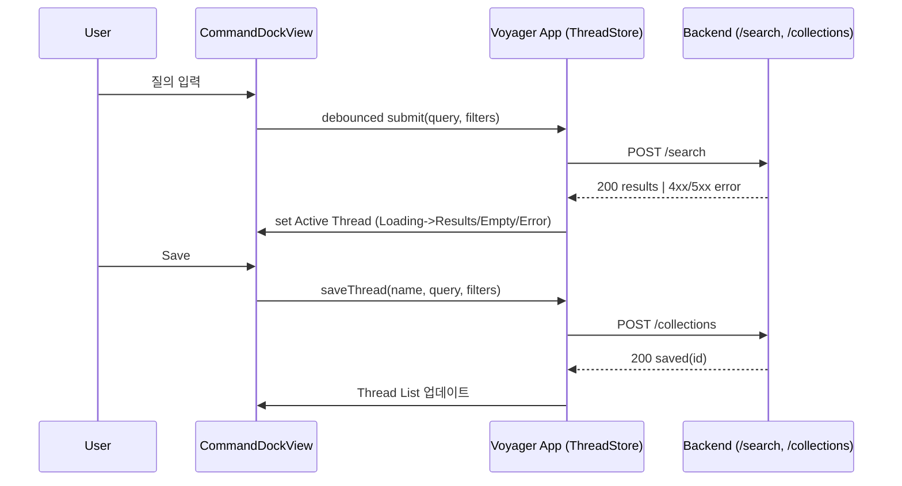
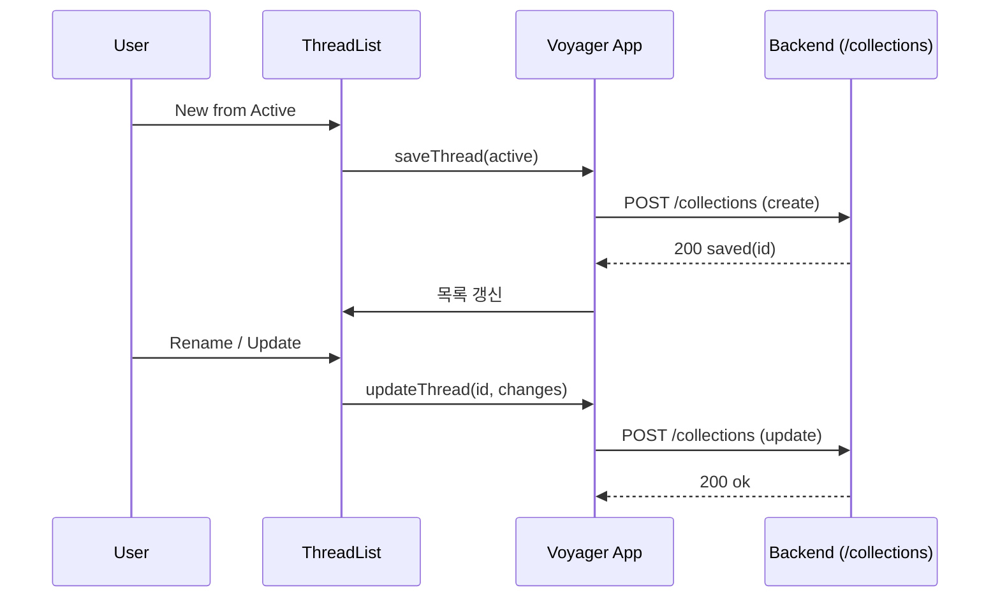
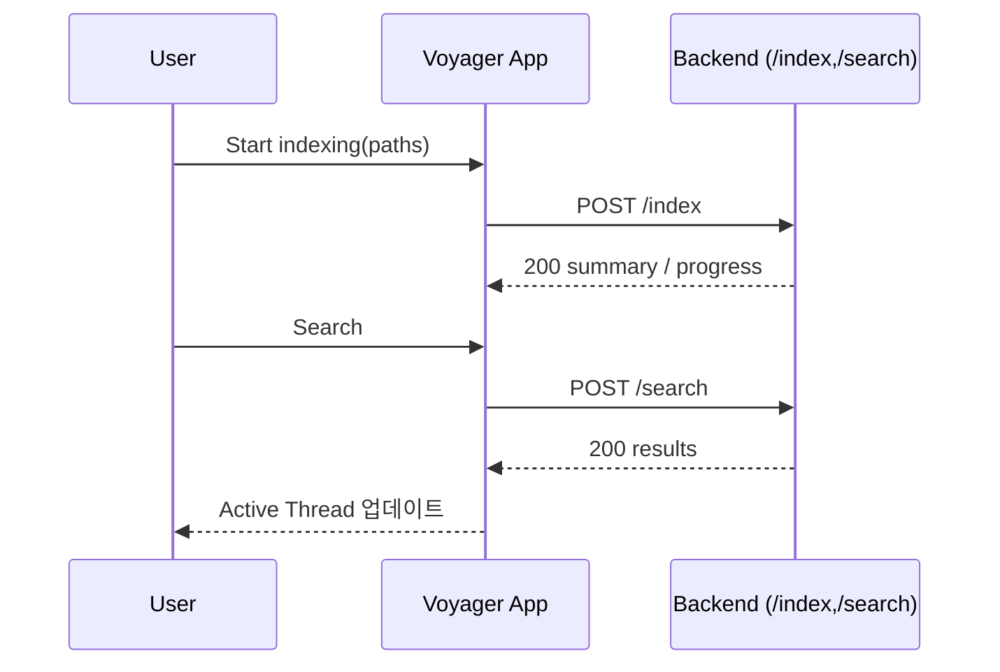

# User Flows

아래 플로우는 구현의 기준선이 되는 세부 절차, 상태 전이, 오류 처리, 접근성, 성능 기준을 포함합니다. UI 용어는 Thread이며, API 용어는 collections를 사용합니다.

## UF1 — Command Dock 검색 → Active Thread 결과 → Thread 저장/열기

- Goal: 어디서든 Dock으로 검색하고 결과를 Active Thread로 표시, 유용하면 저장하여 재방문
- Preconditions: Main Window 활성, 네트워크 가능, 백엔드 기동(로컬 dev 허용)
- Triggers: Command Dock 오버레이 호출(키/메뉴/버튼)

Primary Path
1) 사용자가 Dock에 질의/필터를 입력한다.
2) 앱은 디바운스(≈250–300ms) 후 `POST /search` 요청을 보낸다.
3) 응답 수신 전까지 Active Thread는 Loading 상태를 표시한다.
4) 200 응답이면 결과 리스트/그리드로 전환하고, 필터 칩/정렬을 동기화한다.
5) 사용자가 “저장(Save)”을 선택하면 `POST /collections`로 Thread 정의를 저장한다(이름/쿼리/필터만; 다른 상태/결과는 로컬 전용).
6) 저장 성공 시 Thread List에 항목이 추가되고, Active Thread 제목을 업데이트한다.

Sequence (system interaction)

UI States
- Idle → Input → Loading → Results | Empty | Error
- 헤더: Active Thread 제목, 서브헤더: 필터 칩(요약)

Edge Cases & Errors
- Empty: 결과 0건 → 빈 상태 메시지와 검색 힌트
- Timeout/500: 사용자 친화적 오류 메시지 + 재시도 버튼 + 로깅
- Invalid filters(400): 유효성 메시지, 잘못된 칩 하이라이트

Accessibility
- 입력 필드/버튼/상태 라벨에 접근성 라벨 제공, 포커스 순서 고정, ESC 닫기 시 원 포커스 복귀

Performance Budgets
- /search p50 < 800ms(소규모 데이터), UI 상태 전이는 1프레임 이내 반영

Acceptance Criteria
- AC1: Dock 표시/숨김 및 포커스 이동, ESC 닫기 후 기존 포커스 복귀
- AC2: 입력 중 Loading 표시, 응답 종류에 따른 상태 전이 결과 보임
- AC3: Save 시 Thread List에 항목 추가, 제목 반영

E2E Test Scenarios (GWT)
- testDockTogglesAndRestoresFocus
  - Given Main Window가 파일 리스트에 포커스를 두고 실행 중일 때
  - When 사용자가 Dock을 표시하고 ESC로 닫는다
  - Then Dock이 닫히고 포커스가 파일 리스트로 복귀한다

- testSearchDisplaysResultsAndSavesThread
  - Given Backend가 /search 요청에 유효한 결과를 반환하는 상태이고 Active Thread가 열려 있을 때
  - When 사용자가 Dock에서 질의 제출 후 Save를 누른다
  - Then 결과가 리스트/그리드로 표시되고, Saved Thread가 Thread List에 추가된다

- testSearchTimeoutShowsErrorAndRetry
  - Given Backend가 일시적으로 지연되거나 500을 반환하는 상태일 때
  - When 사용자가 Dock에서 질의를 제출한다
  - Then Error 메시지와 재시도 컨트롤이 표시되고, 재시도 시 정상 흐름이 복구된다

Suggested test methods (VoyagerUITests)
- `testDockTogglesAndRestoresFocus()`
- `testSearchDisplaysResultsAndSavesThread()`
- `testSearchTimeoutShowsErrorAndRetry()`

---

## UF2 — Thread 관리(생성/이름변경/삭제/핀)

- Goal: Active Thread의 정의(이름/쿼리/필터)를 저장/업데이트하고 목록에서 열람/관리
- Preconditions: Thread List 노출, 저장/세션 구분 가능

Primary Path
1) New from Active: 현재 Active Thread를 저장 → `POST /collections`
2) Open: Thread List에서 선택 → Active Thread로 로드
3) Rename/Update: 제목/쿼리/필터 변경 → `POST /collections`(업데이트; 정의만 저장)
4) Pin/Unpin: 고정 토글(클라이언트 상태, 후속 서버 반영 옵션)
5) Delete: 삭제 확인 후 제거(후속 API 설계; 현재는 로컬 제거 가능)

Sequence (management)

Variants
- Rename 충돌: 동일 이름 존재 → 제안 이름/덮어쓰기 선택
- Delete 보호: 최근 사용/핀 설정 시 추가 확인

Acceptance Criteria
- 저장/열기/이름변경 동작이 Thread List와 Active Thread에 즉시 반영
- 핀 고정 시 상단 섹션 고정, 정렬은 최근 업데이트 기준 유지

E2E Test Scenarios (GWT)
- testSaveActiveThreadAndOpenFromList
  - Given Active Thread가 존재하고 Thread List가 열려 있을 때
  - When 사용자가 New from Active를 실행한다
  - Then Saved Threads 섹션에 새 항목이 추가되고 선택 시 Active Thread로 로드된다

- testRenameAndReflectsInActiveAndList
  - Given Saved Thread가 선택된 상태에서
  - When 사용자가 제목을 변경한다
  - Then Thread List와 Active Thread 헤더에 새 제목이 즉시 반영된다

- testPinUnpinAffectsOrdering
  - Given 여러 Saved Thread가 있을 때
  - When 특정 Thread를 Pin/Unpin 한다
  - Then 핀 고정 시 상단 섹션에 고정되고, Unpin 시 최근 업데이트 정렬로 돌아간다

- testDeleteWithConfirmation
  - Given Saved Thread가 선택된 상태에서
  - When 사용자가 Delete를 선택하고 확인한다
  - Then Thread가 목록에서 제거되고 Active Thread가 안전한 기본 상태로 전환된다

Suggested test methods (VoyagerUITests)
- `testSaveActiveThreadAndOpenFromList()`
- `testRenameAndReflectsInActiveAndList()`
- `testPinUnpinAffectsOrdering()`
- `testDeleteWithConfirmation()`

---

## UF3 — Backend 경로 인덱싱 → 검색 반영 확인

- Goal: 지정 경로 인덱싱 후 검색 결과가 반영되는지 확인
- Preconditions: 경로 접근 권한, 백엔드 기동

Primary Path
1) Paths 선택 후 인덱싱 요청 → `POST /index`
2) 인덱싱 완료 요약 수신(초기 동기) 또는 진행 상황 확인(후속 비동기)
3) Dock에서 질의 실행 → `POST /search`
4) Active Thread 결과에 인덱싱 반영 확인

Sequence (index-to-search)

Edge Cases
- Long‑running: 진행 표시/취소 처리, 중복 요청 방지
- Permission: 읽기 불가 파일은 스킵 + 요약에 오류 수
- Idempotency: 동일 경로 반복 시 upsert로 일관성 유지

Acceptance Criteria
- /index 성공 후 동일 조건 검색 시 결과 차이가 반영됨
- 오류가 있어도 전체 프로세스는 지속되고 사용자 안내가 제공됨

E2E Test Scenarios (GWT)
- testIndexThenSearchReflectsResults
  - Given 선택 경로가 인덱싱 대상이며 Backend가 기동된 상태일 때
  - When 사용자가 인덱싱을 요청하고 완료 후 동일 조건으로 검색한다
  - Then Active Thread 결과에 인덱싱된 항목이 반영된다

- testIndexPermissionIssuesAreSummarized
  - Given 일부 파일이 권한 문제로 읽기 불가한 경로일 때
  - When 인덱싱을 수행한다
  - Then 요약에 실패 개수가 포함되고, 검색은 성공한 항목만 반영된다

- testReindexIsIdempotent
  - Given 동일 경로를 연속으로 인덱싱할 때
  - When 두 번째 인덱싱을 수행한다
  - Then 중복 없이 업데이트만 반영되며 검색 결과는 일관성을 유지한다

Suggested test methods (VoyagerUITests + Backend smoke)
- `testIndexThenSearchReflectsResults()`
- `testIndexPermissionIssuesAreSummarized()`
- `testReindexIsIdempotent()`
