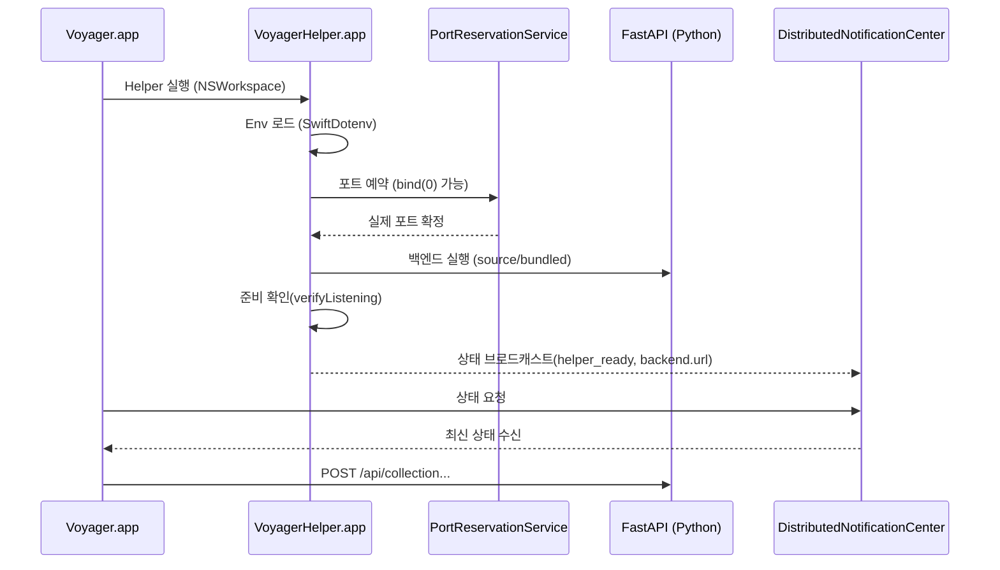

# Helper ↔ Backend 부트스트랩

이 문서는 macOS 앱(Voyager)과 Helper(VoyagerHelper)가 Python 백엔드를 **어떤 순서/규칙으로 실행하고**,
그 결과를 **어떻게 앱에 전달하여 API base URL을 확정하는지**를 "통합 관점"에서 정리합니다.

> 상세 구현(인덱싱/DB/재시작 루프/알림 payload)은 `docs/macos/voyager-helper.md`가 SSOT입니다.

관련 문서

- 환경 변수 로딩/키 목록: `docs/architecture/environment.md`
- Helper 상세(프로세스/인덱싱/DB): `docs/macos/voyager-helper.md`
- 트러블슈팅: `docs/troubleshooting.md`

---

## 1) 왜 Helper가 백엔드를 띄우는가

Voyager는 "앱(UI)"과 "백엔드(검색)" 사이에 **Helper**를 둡니다.

- macOS 앱은 UI/상태 관리에 집중
- Helper는 시스템 권한/프로세스 관리/인덱싱/포트 예약 같은 운영 책임을 담당
- 백엔드는 FastAPI로 검색 API를 제공

이 구조 덕분에:

- 개발(소스 모드)에서는 `uv run dev`로 즉시 반영
- 배포(번들 모드)에서는 Nuitka 바이너리로 Python 없이도 실행
- 백엔드가 죽어도 Helper가 재시작하고 앱은 상태 브로드캐스트로 복구 가능

---

## 2) 큰 흐름 요약

---

## 3) 실행 모드: source vs bundled

Helper는 `BACKEND_MODE`에 따라 "어떤 방식으로" 백엔드를 실행할지 결정합니다.

### 3.1 source 모드

- 목적: 로컬 개발
- 실행: `/usr/bin/env` + `uv run dev`(또는 `uv run prod`)
- 조건:
  - `uv`가 PATH에서 실행 가능해야 함
  - `.env.source` / `.env.dev` 등 로컬 dotenv 파일이 있어야 함(환경에 따라)

관련 코드

- `apps/macos/Voyager/VoyagerHelper/Infrastructure/ProcessRunner.swift`
- `apps/backend/src/app/cli.py`

### 3.2 bundled 모드

- 목적: 배포(Release)
- 실행: 앱 번들 리소스에 포함된 바이너리 실행
  - 경로 예: `{VoyagerHelper.app}/Contents/Resources/server/{PUBLIC_BACKEND_PROCESS_NAME}`

번들링 관련 스크립트(참고)

- `scripts/build/build-backend-binary.sh`
- `scripts/build/compile-nuitka-binary.sh`
- `scripts/build/copy-bundled-env-files.sh`

관련 코드

- `apps/macos/Voyager/VoyagerHelper/Infrastructure/ProcessRunner.swift`

---

## 4) 환경 변수 로딩(누가, 언제, 어떤 우선순위로)

이 프로젝트의 중요한 포인트는 "dotenv는 두 군데에서 로딩"된다는 점입니다.

### 4.1 Helper의 dotenv 로딩(Swift)

- Helper는 부팅 과정에서 `.env.{BACKEND_MODE}` + `.env.{APP_ENV}`를 로딩합니다.
- source 모드에서는 `.env` 파일 탐색을 위해 `VOYAGER_PROJECT_ROOT`가 필요할 수 있습니다.

관련 코드

- `apps/macos/Voyager/VoyagerHelper/Infrastructure/Environment.swift`

### 4.2 Backend의 dotenv 로딩(Python)

Python 백엔드는 `load_config()` 호출 시점에 dotenv를 로딩합니다.

- 로딩 순서(override=False, 즉 "먼저 로드된 값" 우선)
  1) 프로세스 환경 변수
  2) `.env.{BACKEND_MODE}`
  3) `.env.{APP_ENV}`

즉, Helper가 프로세스 환경 변수로 값을 전달하면 백엔드가 `.env`를 다시 읽더라도 override 되지 않습니다.

관련 코드

- `apps/backend/src/app/config.py`

---

## 5) 포트 예약과 준비 확인

### 5.1 왜 포트 예약이 필요한가

개발/배포 환경에서 포트 충돌을 피하기 위해, Helper는 "백엔드 실행 전에" 포트를 확보합니다.

- `PUBLIC_BACKEND_PORT=0`을 권장
  - OS가 실제 사용 가능한 포트를 할당
- Helper는 확보한 포트로 백엔드를 실행하고, 성공하면 그 포트를 상태로 브로드캐스트합니다.

관련 코드

- `apps/macos/Voyager/VoyagerHelper/Infrastructure/PortReservationService.swift`

### 5.2 준비 확인(ready check)

Helper는 "프로세스가 떴다"가 아니라 "실제로 listen 중"인지 확인합니다.

- `verifyListening(host:port:isRunning:shouldStop:)`
- TCP connect 가능 여부로 준비 상태 판단

이 단계가 통과되어야 앱이 안전하게 API 호출을 시작할 수 있습니다.

---

## 6) 상태 브로드캐스트: 앱이 base URL을 얻는 방식

Helper는 `DistributedNotificationCenter`를 사용해 상태를 브로드캐스트합니다.

- 요청 알림: `Notification.Name.voyagerHelperStateRequest`
- 응답/갱신 알림: `Notification.Name.voyagerHelperStateDidUpdate`
- payload는 `schema_version=2`로 관리

앱은 이 브로드캐스트를 수신하여 다음을 확정합니다.

- 백엔드 endpoint (`host`, `port`, `url`)
- 백엔드 준비 여부
- Helper 준비 여부

관련 코드

- `apps/macos/Voyager/VoyagerHelper/Infrastructure/HelperStateBroadcaster.swift`
- `apps/macos/Voyager/Shared/Notifications/HelperStateNotifications.swift`

---

## 7) 실패/재시작 전략(요약)

Helper는 백엔드 종료를 감지하고, 지수 백오프로 재시도합니다.

- backoff: `[1, 2, 4, 8, 16]` 초
- 안정 기동 기준: `wasReady && uptime >= 2s`이면 attempt 카운터 리셋
- 재시도 초과 시: Helper 종료

관련 코드

- `apps/macos/Voyager/VoyagerHelper/Infrastructure/HelperLifecycle.swift`

---

## 8) QA 체크리스트

- source 모드에서 Helper가 `uv run dev`를 정상 실행하는가(PATH/uv 문제)
- `PUBLIC_BACKEND_PORT=0`에서 Helper가 실제 포트를 확보하고 브로드캐스트하는가
- 앱이 Helper 상태를 수신한 뒤 `SearchClient`의 base URL이 올바르게 설정되는가
- 백엔드를 강제 종료했을 때 Helper가 재시작하고 앱이 복구되는가

---

## 9) 트러블슈팅 빠른 링크

- "백엔드가 뜨지 않음": `docs/troubleshooting.md`
- "포트 연결 실패": `docs/troubleshooting.md`
- Helper/Backend 상세 디버깅: `docs/macos/voyager-helper.md`
