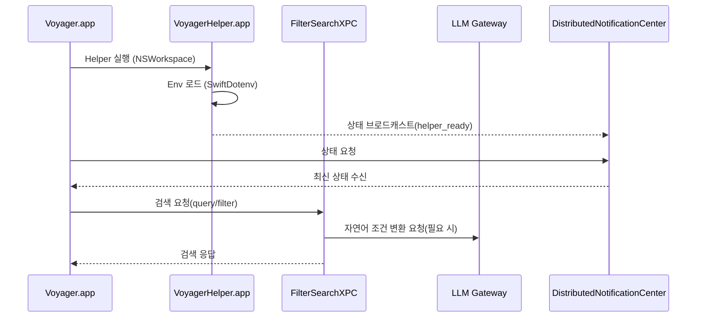

# Helper ↔ Search 런타임 부트스트랩

이 문서는 macOS 앱(Voyager)과 Helper(VoyagerHelper)가 검색 런타임(XPC + Gateway)을
어떤 순서로 준비하고 앱과 동기화하는지 통합 관점에서 정리합니다.

> 상세 구현(인덱싱/DB/알림 payload)은 `docs/macos/voyager-helper.md`를 SSOT로 봅니다.

관련 문서

- 환경 변수 로딩/키 목록: `docs/architecture/environment.md`
- Helper 상세(인덱싱/DB): `docs/macos/voyager-helper.md`
- 트러블슈팅: `docs/troubleshooting.md`

---

## 1) 왜 Helper가 필요한가

Voyager는 "앱(UI)"과 "검색 런타임" 사이에 **Helper**를 둡니다.

- macOS 앱은 UI/상태 관리에 집중
- Helper는 시스템 권한/인덱싱/로컬 DB 운영 책임을 담당
- 필터 검색 실행은 XPC 서비스가 담당하고, 자연어 조건 변환은 Gateway 호출을 사용

이 구조 덕분에 앱은 로컬 백엔드 프로세스에 의존하지 않고, Helper 준비 상태만으로 검색 플로우를 시작할 수 있습니다.

---

## 2) 큰 흐름 요약

---

## 3) 실행 정책

로컬 FastAPI 백엔드 프로세스 실행은 제거되었습니다.

- macOS 앱은 Helper/XPC를 통해 검색 실행
- 서버 백엔드(`apps/backend`)는 앱 번들과 분리된 별도 배포 단위

---

## 4) 환경 변수 로딩(누가, 언제, 어떤 우선순위로)

이 프로젝트의 중요한 포인트는 "dotenv는 두 군데에서 로딩"된다는 점입니다.

### 4.1 Helper의 dotenv 로딩(Swift)

- Helper는 부팅 과정에서 `.env.{APP_ENV}`를 로딩합니다.
- source 모드에서는 `.env` 파일 탐색을 위해 `VOYAGER_PROJECT_ROOT`가 필요할 수 있습니다.

관련 코드

- `apps/macos/Voyager/Shared/EnvironmentLoader.swift`

### 4.2 Backend의 dotenv 로딩(Python)

Python 백엔드는 `load_config()` 호출 시점에 dotenv를 로딩합니다.

- 로딩 순서(override=False, 즉 "먼저 로드된 값" 우선)
  1) 프로세스 환경 변수
  2) `.env.{APP_ENV}`

즉, Helper가 프로세스 환경 변수로 값을 전달하면 백엔드가 `.env`를 다시 읽더라도 override 되지 않습니다.

관련 코드

- `apps/backend/src/app/config.py`

---

## 5) 준비 상태 브로드캐스트

Helper는 `DistributedNotificationCenter`를 사용해 준비 상태를 브로드캐스트합니다.

---

## 6) 상태 브로드캐스트: 앱이 base URL을 얻는 방식

Helper는 `DistributedNotificationCenter`를 사용해 상태를 브로드캐스트합니다.

- 요청 알림: `Notification.Name.voyagerHelperStateRequest`
- 응답/갱신 알림: `Notification.Name.voyagerHelperStateDidUpdate`
- payload는 `schema_version=3`로 관리

앱은 이 브로드캐스트를 수신하여 `helper_ready`와 `helper_bundle_version`을 확정합니다.

관련 코드

- `apps/macos/Voyager/VoyagerHelper/Infrastructure/HelperStateBroadcaster.swift`
- `apps/macos/Voyager/Shared/Notifications/HelperStateNotifications.swift`

---

## 6) 실패 처리(요약)

- 검색 실패는 Gateway/Helper/XPC 계층 오류를 구분해 처리합니다.
- 사용자 메시지는 "backend 실행 확인" 대신 실제 실패 계층(Gateway/Helper/DB) 기준으로 안내합니다.

---

## 7) QA 체크리스트

- Helper 부팅 후 `helper_ready` 상태를 앱이 정상 수신하는가
- XPC 검색(query/filter)이 정상 동작하는가
- Gateway 실패 시 오류 코드/문구가 backend 의존 표현 없이 표시되는가

---

## 8) 트러블슈팅 빠른 링크

- "백엔드가 뜨지 않음": `docs/troubleshooting.md`
- "포트 연결 실패": `docs/troubleshooting.md`
- Helper/Backend 상세 디버깅: `docs/macos/voyager-helper.md`
