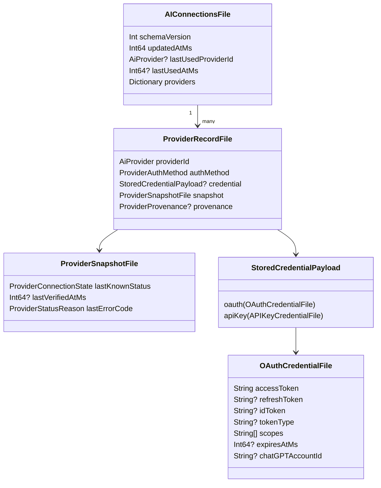
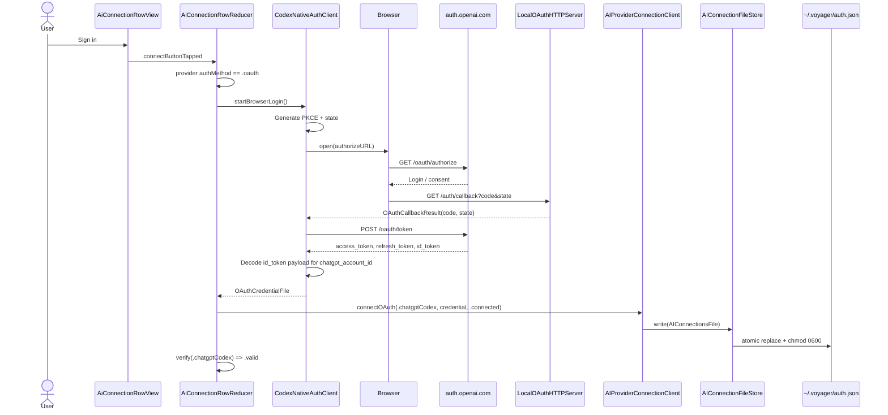
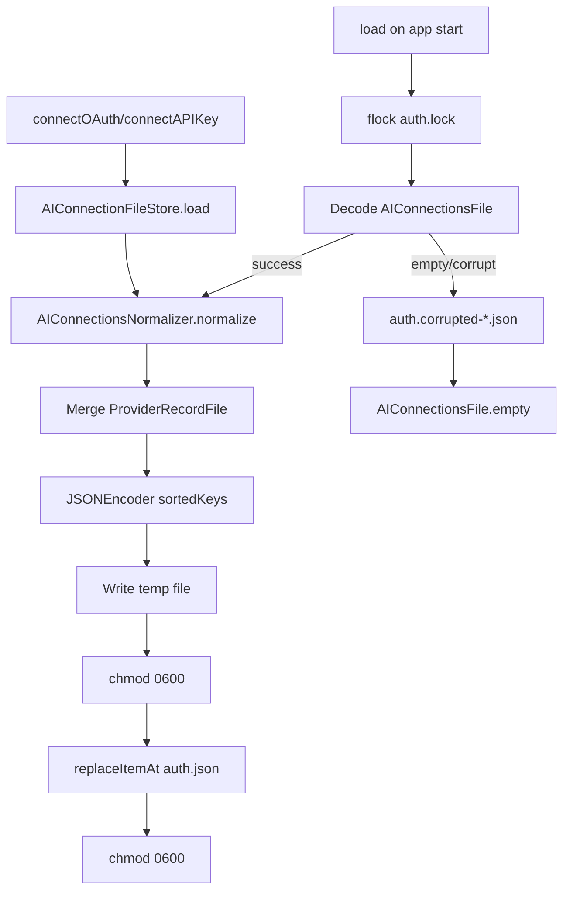
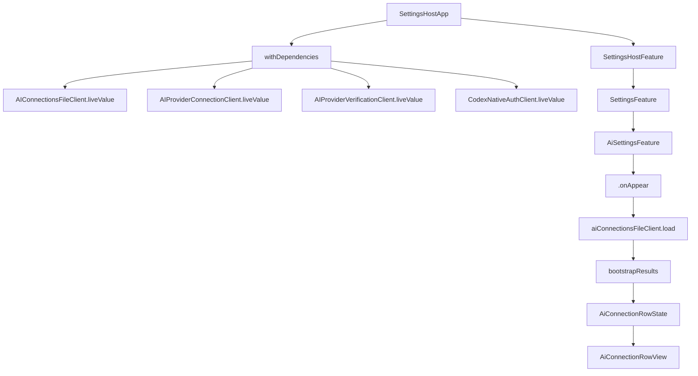
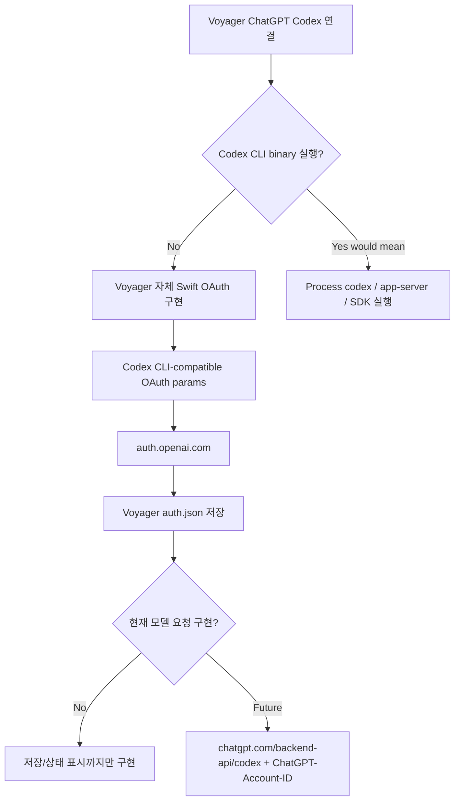

# Codex OAuth / 토큰 저장 아키텍처

이 문서는 Voyager macOS의 `ChatGPT Codex` 연결이 어떤 OAuth 계약을 사용하고, 토큰이 어디에 저장되며, Settings UI가 저장 상태를 어떻게 읽는지 설명한다.

핵심 결론은 다음과 같다.

- Voyager는 **Codex CLI 바이너리를 실행하지 않는다**.
- Voyager는 OpenAI Codex CLI가 사용하는 **ChatGPT OAuth 호환 계약**을 앱 안에서 직접 구현한다.
- 토큰은 Codex CLI의 `~/.codex/auth.json`이 아니라 Voyager 전용 `~/.voyager/auth.json`에 저장한다.
- 현재 Voyager의 `chatgptCodex` 연결은 OAuth credential 저장/복원/상태 표시까지 구현되어 있고, 실제 모델 요청용 `chatgpt.com/backend-api/codex` 호출 어댑터는 아직 별도 구현 대상이다.

## 용어 정리

| 용어                       | 의미                                                                                            |
| -------------------------- | ----------------------------------------------------------------------------------------------- |
| `ChatGPT Codex` provider   | Voyager의 `AiProvider.chatgptCodex`. OAuth만 허용한다.                                          |
| Codex CLI-compatible OAuth | Codex CLI와 같은 `client_id`, scope, PKCE, `originator=codex_cli_rs` 등을 사용하는 OAuth 흐름.  |
| Codex CLI                  | OpenAI의 실제 CLI 프로그램. Voyager는 이 바이너리를 spawn하거나 embed하지 않는다.               |
| OpenAI Platform API        | `https://api.openai.com/v1/...` API key / organization / project 컨텍스트를 타는 공개 API 경로. |
| ChatGPT backend-api        | ChatGPT 로그인 기반 Codex가 사용하는 `https://chatgpt.com/backend-api/...` 계열 경로.           |

## 현재 구현 요약


현재 연결 성공 후 저장되는 데이터는 다음 목적을 가진다.

1. Settings UI에서 `ChatGPT Codex`가 연결되었음을 복원한다.
2. access token / refresh token / id token / ChatGPT account id를 Voyager credential schema로 보존한다.
3. 이후 ChatGPT backend-api / Codex-compatible adapter가 생기면 같은 credential을 사용할 수 있게 한다.

## 저장 위치

토큰 파일 위치는 `AIConnectionFSLocation`이 정의한다.

| Scope         | Payload path                    | Lock path                       | 생성 경로                                          |
| ------------- | ------------------------------- | ------------------------------- | -------------------------------------------------- |
| Home/default  | `~/.voyager/auth.json`          | `~/.voyager/auth.lock`          | `AIConnectionFileStore.withDefaultHome()`          |
| Project/local | `<repoRoot>/.voyager/auth.json` | `<repoRoot>/.voyager/auth.lock` | `AIConnectionFileStore.withRepoRoot(repoRootURL:)` |

SettingsHost는 `SettingsHostApp`에서 다음 live dependency를 주입한다.

- `AIConnectionsFileClient.liveValue`
- `AIProviderConnectionClient.liveValue`
- `AIProviderVerificationClient.liveValue`
- `CodexNativeAuthClient.liveValue`

이 `liveValue`들은 모두 default home store를 사용하므로 SettingsHost에서 연결하면 기본 저장 위치는 다음이다.

```text
~/.voyager/auth.json
```

Project-local store는 테스트나 repo-root 기반 실행을 위한 명시적 opt-in 경로다. 현재 SettingsHost production wiring은 `liveValue`를 쓰므로 project-local store를 사용하지 않는다.

> 현재 상태: `liveForRepoRoot(...)`, `withRepoRoot(...)`, `AiConnectionRootResolver`는 per-repo credential을 가능하게 하는 API 표면이지만, production call site는 없다. per-project AI credential 정책을 제품으로 확정하기 전까지는 home store가 실사용 경로다.

## 파일 스키마

상위 schema는 `AIConnectionsFile`이다.



예시 형태는 다음과 같다. 실제 토큰 값은 로그나 문서에 출력하면 안 된다.

```json
{
    "schemaVersion": 1,
    "updatedAtMs": 1760000000000,
    "lastUsedProviderId": "chatgptCodex",
    "lastUsedAtMs": 1760000000000,
    "providers": {
        "chatgptCodex": {
            "providerId": "chatgptCodex",
            "authMethod": "oauth",
            "credential": {
                "kind": "oauth",
                "accessToken": "<redacted>",
                "refreshToken": "<redacted>",
                "idToken": "<redacted>",
                "tokenType": "Bearer",
                "scopes": ["openid", "profile", "email", "offline_access", "api.connectors.read", "api.connectors.invoke"],
                "expiresAtMs": 1760003600000,
                "chatGPTAccountId": "<account-id>"
            },
            "snapshot": {
                "lastKnownStatus": "connected",
                "lastVerifiedAtMs": 1760000000000,
                "lastErrorCode": "none"
            }
        }
    }
}
```

## OAuth 연결 흐름



### Authorize URL 계약

`CodexOAuthConfig.default`는 Codex CLI와 같은 계열의 OAuth shape를 따른다.

| Field          | Value                                                                                          |
| -------------- | ---------------------------------------------------------------------------------------------- |
| issuer         | `https://auth.openai.com`                                                                      |
| authorize path | `/oauth/authorize`                                                                             |
| token path     | `/oauth/token`                                                                                 |
| redirect URI   | `http://localhost:1455/auth/callback`                                                          |
| client id      | `app_EMoamEEZ73f0CkXaXp7hrann`                                                                 |
| scopes         | `openid profile email offline_access api.connectors.read api.connectors.invoke`                |
| extra params   | `id_token_add_organizations=true`, `codex_cli_simplified_flow=true`, `originator=codex_cli_rs` |

`id_token`은 인증 판단 자체에 쓰지 않고, `https://api.openai.com/auth.chatgpt_account_id` claim을 읽어 `chatGPTAccountId`로 저장하는 데 사용한다.

## 저장/로드/정규화 흐름



저장 계층의 주요 안전장치는 다음이다.

- `AIConnectionFileStore`는 `actor`다.
- 파일 작업은 `auth.lock`에 `flock(LOCK_EX)`를 잡고 수행한다.
- 쓰기는 temp file을 만든 뒤 replace한다.
- payload와 quarantine file은 `0600` 권한으로 제한한다.
- decode 실패/빈 파일은 `auth.corrupted-<timestamp>.json`으로 격리한다.

### 왜 `auth.lock`이 필요한가?

Swift `actor`는 같은 프로세스 안의 동시 접근을 직렬화하지만, SettingsHost, 향후 Voyager main app, 테스트/CLI성 도구처럼 **서로 다른 프로세스**가 같은 `auth.json`을 읽고 쓸 가능성은 막지 못한다. `auth.lock`은 그 cross-process read-modify-write race를 막기 위한 POSIX advisory lock 파일이다.

즉 `auth.lock` 자체가 credential을 담는 파일은 아니다. `auth.json`을 안전하게 읽고 쓰기 위한 잠금 파일이다.

## SettingsHost bootstrap 흐름



`AiSettingsFeature.bootstrapResults(from:)`는 저장된 `ProviderRecordFile`을 row 상태로 변환한다.

- provider record 없음 → `notVerified`
- credential 있음 + snapshot `connected` → row `connected`
- credential 없음 → `missingCredential`
- snapshot `connectionFailed` → row `connectionFailed`

## Verification과 실제 API 호출의 차이

`AiConnectionRuntimeClient.verifyProvider`는 provider별로 다르게 동작한다.

```mermaid
flowchart LR
    Verify[verifyProvider(provider, credential)] --> HasCredential{credential exists?}
    HasCredential -->|no| Missing[invalid missingCredential]
    HasCredential -->|yes| Secret{secret non-empty?}
    Secret -->|no| Invalid[invalid invalidAPIKey]
    Secret -->|yes| Provider{provider}
    Provider -->|chatgptCodex| CodexValid[valid without network]
    Provider -->|openai| OpenAI[POST api.openai.com/v1/chat/completions]
    Provider -->|anthropic| Anthropic[POST api.anthropic.com/v1/messages]
```

중요한 점:

- `chatgptCodex`는 현재 **Platform API smoke request를 하지 않는다**.
- `openai` provider만 `https://api.openai.com/v1/chat/completions`로 smoke test를 한다.
- 따라서 Codex OAuth 연결 확인은 OpenAI Platform API organization/project를 요구하지 않는다.

## Codex CLI를 쓰는가?

정확한 표현은 다음이다.



Voyager는 다음을 하지 않는다.

- `codex` CLI executable 실행
- `codex app-server` 실행
- `@openai/codex-sdk` 호출
- `~/.codex/auth.json` 읽기/쓰기

Voyager가 하는 것은 다음이다.

- Codex CLI가 쓰는 OAuth authorize/token shape와 호환되는 요청을 만든다.
- 반환된 OAuth tokens를 Voyager schema로 저장한다.
- `chatGPTAccountId`를 저장해서 향후 ChatGPT backend-api 호출에 사용할 수 있게 한다.

따라서 “Codex CLI를 쓴다”보다는 **“Codex CLI-compatible OAuth/backend contract를 앱 내부에서 구현한다”**가 정확하다.

## Codex CLI / ChatGPT backend-api와의 관계

OpenAI Codex CLI는 auth mode에 따라 backend가 달라진다.

| Auth mode             | Backend 성격                 | Base URL                                |
| --------------------- | ---------------------------- | --------------------------------------- |
| API key / Platform    | 공개 OpenAI API              | `https://api.openai.com/v1`             |
| ChatGPT OAuth / Codex | ChatGPT backend-api contract | `https://chatgpt.com/backend-api/codex` |

Codex CLI ChatGPT backend 요청은 보통 다음 헤더를 사용한다.

```http
Authorization: Bearer <access_token>
ChatGPT-Account-ID: <chatgpt_account_id>
```

현재 Voyager는 `chatGPTAccountId`를 저장하지만, 아직 `https://chatgpt.com/backend-api/codex`로 모델 요청을 보내는 adapter는 없다. 이 부분이 실제 Codex 사용을 위한 다음 구현 경계다.

Codex OAuth 구현을 확인할 때의 1차 레퍼런스는 Swift AI SDK가 아니라 Codex CLI와 Codex-compatible 오픈소스 클라이언트다. 확인해야 하는 계약은 다음이다.

- `auth.openai.com` OAuth + PKCE
- Codex CLI 계열 `client_id`, authorize extra params, `originator`
- `api.connectors.read`, `api.connectors.invoke` scopes
- `id_token`, `access_token`, `refresh_token` 저장 방식
- `id_token` claim에서 `chatgpt_account_id` 추출
- ChatGPT/Codex backend 호출 시 `Authorization: Bearer <access_token>` + `ChatGPT-Account-ID` 사용

구현 참고 우선순위는 다음과 같이 둔다.

| 우선순위 | Reference              | 확인 목적                                                                          |
| -------- | ---------------------- | ---------------------------------------------------------------------------------- |
| 1        | `openai/codex`         | 공식 Codex CLI OAuth/client id/scope/originator/backend routing canonical          |
| 2        | `anomalyco/opencode`   | compact TypeScript 구현. OAuth params, account id extraction, backend rewrite 확인 |
| 3        | `cline/cline`          | IDE/client 통합에서의 Codex OAuth config, PKCE, refresh, backend 호출 확인         |
| 4        | `tailcallhq/forgecode` | account id claim fallback, `backend-api/codex/responses` 보존, header cross-check  |

특히 `openai/codex`의 `codex-rs/login` 계층은 OAuth authorize/token/refresh/persist 동작의 canonical source이고, `codex-rs/backend-client` 계층은 `ChatGPT-Account-ID`와 ChatGPT backend routing을 확인할 기준이다.

## Swift AI SDK와 Codex OAuth

VoyagerEntitiesAi는 현재 third-party Swift AI SDK를 의존하지 않는다. `Package.swift` 기준으로 AI SDK dependency는 없고, OpenAI/Anthropic smoke verification과 Codex OAuth는 `URLSession`, `CryptoKit`, `Network` 기반으로 직접 구현되어 있다.

조사한 Swift OpenAI 계열 SDK들은 대부분 공개 OpenAI Platform API용이다. 기본 endpoint도 Codex CLI의 ChatGPT OAuth backend가 아니라 `api.openai.com` 계열이다.

| SDK 계열              | 기본 endpoint / base URL                           | 인증 모델                                                                         | Codex OAuth 반영 여부 |
| --------------------- | -------------------------------------------------- | --------------------------------------------------------------------------------- | --------------------- |
| MacPaw/OpenAI         | `https://api.openai.com/v1`                        | API key, optional organization/custom headers                                     | 없음                  |
| OpenAISwift           | `https://api.openai.com` + `/v1/*`                 | API key Bearer                                                                    | 없음                  |
| dylanshine/openai-kit | OpenAI Platform API 구성 객체                      | API key, optional organization                                                    | 없음                  |
| OpenDive/OpenAIKit    | `https://api.openai.com/v1`                        | API key, organization/project                                                     | 없음                  |
| AIProxySwift          | `https://api.openai.com` 또는 proxy backend        | API key 직접 사용 또는 AIProxy backend 보호                                       | 없음                  |
| teunlao/swift-ai-sdk  | `https://api.openai.com/v1` 등 provider별 base URL | API key/provider token 기반. OpenAI provider는 optional organization/project 지원 | 없음                  |

즉 외부 Swift SDK를 그대로 쓰면 일반적으로 `https://api.openai.com/v1` + API key/org/project 모델로 붙는다. 반면 Voyager의 `chatgptCodex`는 ChatGPT 로그인 기반 credential을 저장하고, 향후 모델 요청은 Codex CLI ChatGPT mode와 같은 `https://chatgpt.com/backend-api/codex` contract로 붙어야 한다.

`teunlao/swift-ai-sdk`는 Vercel AI SDK 스타일의 Swift port에 가까운 통합 SDK다. OpenAI provider에서 Responses API와 `gpt-*-codex` 같은 Codex-named Platform model은 다룰 수 있지만, 확인한 구현은 `Authorization: Bearer <OPENAI_API_KEY>`와 `https://api.openai.com/v1` 기반이다. repository 안의 OAuth 코드는 MCP transport용이며, ChatGPT 로그인 OAuth나 `chatgpt.com/backend-api/codex` 호출 구현은 확인되지 않았다.

따라서 이 SDK 조사는 Codex OAuth 구현 근거가 아니라, “일반 Swift AI SDK를 붙이는 것만으로는 ChatGPT Codex OAuth가 해결되지 않는다”는 제외 근거로만 사용한다. Codex OAuth 구현 세부사항은 위의 Codex CLI / ChatGPT backend-api 계약과 Codex-compatible 오픈소스 클라이언트를 기준으로 확인해야 한다.

기존 VOY-218 이력에서 언급된 `OpenAIAdapter`, `AnthropicAdapter`, `AIHTTPClient`, `SSEStreamReader` 등은 third-party SDK가 아니라 deferred custom adapter layer에 가깝다. 현재 코드의 `AiAdapterDescriptor(adapterName: "OpenAIAdapter")`도 실제 SDK/adapter dispatch가 아니라 향후 연결 지점을 나타내는 descriptor 수준이다.

## 관련 소스

| Concern                        | Source                                                                                                    |
| ------------------------------ | --------------------------------------------------------------------------------------------------------- |
| SettingsHost dependency wiring | `apps/macos/Hosts/SettingsHost/SettingsHostApp.swift`                                                     |
| Settings AI bootstrap          | `apps/macos/Packages/02_Pages/Settings/Sources/VoyagerPagesSettings/Reducer/AiSettingsFeature.swift`      |
| Per-row connect flow           | `apps/macos/Packages/02_Pages/Settings/Sources/VoyagerPagesSettings/Reducer/AiConnectionRowReducer.swift` |
| OAuth config                   | `apps/macos/Packages/05_Entities/Ai/Sources/VoyagerEntitiesAi/Api/CodexOAuthConfig.swift`                 |
| OAuth native client            | `apps/macos/Packages/05_Entities/Ai/Sources/VoyagerEntitiesAi/Api/CodexNativeAuthClient.swift`            |
| Connection persistence client  | `apps/macos/Packages/05_Entities/Ai/Sources/VoyagerEntitiesAi/Api/AIProviderConnectionClient.swift`       |
| Runtime verification           | `apps/macos/Packages/05_Entities/Ai/Sources/VoyagerEntitiesAi/Api/AiConnectionRuntimeClient.swift`        |
| File client                    | `apps/macos/Packages/05_Entities/Ai/Sources/VoyagerEntitiesAi/Api/AIConnectionsFileClient.swift`          |
| File store                     | `apps/macos/Packages/05_Entities/Ai/Sources/VoyagerEntitiesAi/Lib/AIConnectionFileStore.swift`            |
| Path rules                     | `apps/macos/Packages/05_Entities/Ai/Sources/VoyagerEntitiesAi/Lib/AIConnectionFSLocation.swift`           |
| Persisted schema               | `apps/macos/Packages/05_Entities/Ai/Sources/VoyagerEntitiesAi/Model/AIConnectionsFile.swift`              |
| Credential payload             | `apps/macos/Packages/05_Entities/Ai/Sources/VoyagerEntitiesAi/Model/StoredCredentialPayload.swift`        |

## 관련 문서

- [시스템 개요](../architecture/overview.md)
- [macOS 앱 구조](../architecture/macos-app.md)
- [Helper ↔ Backend 부트스트랩](backend-bootstrap.md)
- Product spec: `docs/canonical/PRODUCT/05_FEATURE_SPECS/set/flows/ai_provider_connection_flow.md`
